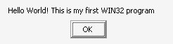

# Chapter 1 - Hello, Win32

Years back I wanted to write programs for Windows and couldn't find a tutorial that started at the beginning. I had to trudge through reference books, API lists and code samples written for people who already knew what they were doing. This tutorial is the one I wish I'd had. We'll build a small paint program called **DrawLite**, one chapter at a time, using nothing but C and the Windows API. No MFC, no frameworks, no libraries you have to hunt down.

In this lesson you will

- pick a compiler and get it working,
- write your first Windows program,
- learn what `wWinMain` and `MessageBoxW` do.

## Before we begin

You need a PC running Windows 10 or 11, and you should know the basics of C: variables, functions, pointers, `#include`. You don't need to know anything about Windows programming. That's what we're here for.

Every chapter is a folder that you can build on its own. This one is `chapters/01-hello-win32`. Chapter 2 starts from a copy of chapter 1 and adds to it, chapter 3 starts from chapter 2, and so on. If you get stuck, you can always open the next folder and see how I did it. (The old version of this tutorial used git tags for this. Folders are easier to browse on GitHub, and you don't have to know git to read them.)

## Pick a compiler

You get to choose. All three of these build every chapter in the tutorial, so use whatever you like. If you have no preference, use the first.

### Option 1: Visual Studio 2022

Download **Visual Studio 2022 Community** from Microsoft. It is free. In the installer, tick the workload **Desktop development with C++**. That installs the compiler, the Windows SDK and CMake support.

Start Visual Studio, choose **Open a local folder** and pick `chapters/01-hello-win32`. Visual Studio sees `CMakeLists.txt` and sets everything up on its own. Pick `drawlite.exe` in the toolbar's start-up item drop down and press **F5**.

(If you'd rather make a project by hand, you can: New Project, *Windows Desktop Application*, delete the generated files, add `main.c`. But CMake means the same files work for every compiler, so I'd stick with it.)

### Option 2: MinGW-w64 (MSYS2)

If you prefer GCC, install [MSYS2](https://www.msys2.org). Open the **MSYS2 UCRT64** shell and type

```text
pacman -S mingw-w64-ucrt-x86_64-gcc mingw-w64-ucrt-x86_64-cmake mingw-w64-ucrt-x86_64-ninja
```

Then, from the chapter folder

```text
cd chapters/01-hello-win32
cmake -S . -B build -G Ninja
cmake --build build
./build/drawlite.exe
```

### Option 3: The command line, no CMake

You don't need any build system for this chapter. It's one file.

With Visual Studio installed, open **Developer Command Prompt for VS 2022** and type

```text
cd chapters\01-hello-win32
cl /utf-8 /DUNICODE /D_UNICODE src\main.c user32.lib /Fe:hello.exe /link /SUBSYSTEM:WINDOWS
```

With MinGW-w64

```text
gcc -municode -mwindows -DUNICODE -D_UNICODE src/main.c -o hello.exe -luser32
```

Those two lines cover everything we'll need from a compiler, so it's worth looking at what they say. `-DUNICODE` (or `/DUNICODE`) tells the Windows headers we want the wide character version of the API. `/SUBSYSTEM:WINDOWS` and `-mwindows` say this is a GUI program, so Windows shouldn't open a black console window next to it. `-municode` tells MinGW to look for `wWinMain` instead of plain `main`. And `user32.lib` or `-luser32` is the library that holds the function we are about to call.

From chapter 4 onwards the programs get bigger and CMake does all of this for us.

## The code

Here it is. All of it.

```text
 8  #include <windows.h>
 9
10  int WINAPI
11  wWinMain(HINSTANCE hInstance, HINSTANCE hPrevInstance, PWSTR lpCmdLine, int nCmdShow)
12  {
13      UNREFERENCED_PARAMETER(hInstance);
14      UNREFERENCED_PARAMETER(hPrevInstance);
15      UNREFERENCED_PARAMETER(lpCmdLine);
16      UNREFERENCED_PARAMETER(nCmdShow);
17
18      MessageBoxW(NULL, L"Hello World! This is my first WIN32 program",
19          L"Chapter 1", MB_OK);
20
21      return 0;
22  }
```

Build it and run it. You should see this.



Congratulations! You have just written your first Windows application.

## Breaking it up

Lets break down the code.

### The entry point

Every C program starts at `main`. Every Windows GUI program starts at `WinMain`. Ours is the Unicode version, `wWinMain` [line 11].

```c
int WINAPI
wWinMain(HINSTANCE hInstance,       // Handle to this program, a number Windows gave it
         HINSTANCE hPrevInstance,   // Always NULL these days. A leftover from Windows 3.1
         PWSTR lpCmdLine,           // The command line, without the program's name
         int nCmdShow);             // How the user wants the window shown (maximised, minimised...)
```

Windows calls this function when your program starts. You don't call it yourself. When it returns, your program ends, and the number you return [line 21] is the exit code.

`WINAPI` is a calling convention. It tells the compiler how arguments are passed to and cleaned up after the function. You don't need to know more than that. If you leave it out in a 32 bit program it crashes. On 64 bit there is only one convention and it expands to nothing, but write it anyway.

### Handles

`HINSTANCE` is our first handle. A handle is a number Windows gives you to refer to something it owns: a program, a window, a bitmap, a pen. You never look inside it. You just hand it back when you want something done to that thing. Think of the ticket you get at a coat check. You don't know where your coat is, and you don't need to. You hand over the ticket and you get the coat. We'll meet a lot of handles.

### Unused parameters

We don't use any of the four parameters in this program. The compiler would warn us about it, and warnings are better left at zero. `UNREFERENCED_PARAMETER` [lines 13 to 16] is a macro that does nothing, except to tell the compiler "yes, I know. I meant that."

### MessageBoxW

The real work is one function call.

```text
18      MessageBoxW(NULL, L"Hello World! This is my first WIN32 program",
19          L"Chapter 1", MB_OK);
```

```c
int MessageBoxW(HWND hWnd,          // The window that owns the box. NULL means none
                LPCWSTR lpText,     // The message
                LPCWSTR lpCaption,  // The title bar text
                UINT uType);        // What buttons and icon to show
```

`MB_OK` gives us a single OK button. Try `MB_OKCANCEL`, `MB_YESNO` or `MB_OK | MB_ICONINFORMATION` and see what happens. `MessageBoxW` also returns a value, telling you which button was pressed. We ignore it here.

The function doesn't return until the user closes the box. While it waits, it handles all the messages the box needs to move, repaint and respond to clicks. Remember that. In chapter 2 we will have to do that work ourselves.

### That W

`MessageBoxW`, `wWinMain`, `PWSTR`, `L"..."`. They all have a W in them. W stands for *wide*, meaning the text is made of 16 bit characters (UTF-16) instead of 8 bit ones. That lets a program show any language. The old way, with 8 bit characters, was the **A** (ANSI) version, `MessageBoxA`. Windows still has both, but the A versions only translate your text and call the W versions underneath. So we go directly to the source and use W everywhere. A string literal with an `L` in front, `L"Hello"`, is a wide string.

(If you read old Win32 code you will see plain `MessageBox` and `TEXT("...")`. Those are macros that pick A or W depending on whether `UNICODE` is defined. We define it, so they'd pick W anyway. We write the W out in full, so there is nothing to guess.)

## Adding functionality

Try changing the message box so it asks a question, and prints the answer.

1. Change the buttons to `MB_YESNO | MB_ICONQUESTION`.
2. Save the return value in an `int`.
3. Compare it with `IDYES` and show a second message box that says what the user picked.

## Exercise

Make the program ask "Do you want to see this message again?". If the user clicks Yes, show the box again. Keep going until they click No.

*Hint: A `do ... while` loop and the return value of `MessageBoxW`.*

## That's it

That was short. Next we will make a window of our own, and find out what all this talk of messages is about.

[Chapter 2: A window of your own](../02-a-window-of-your-own/README.md)
