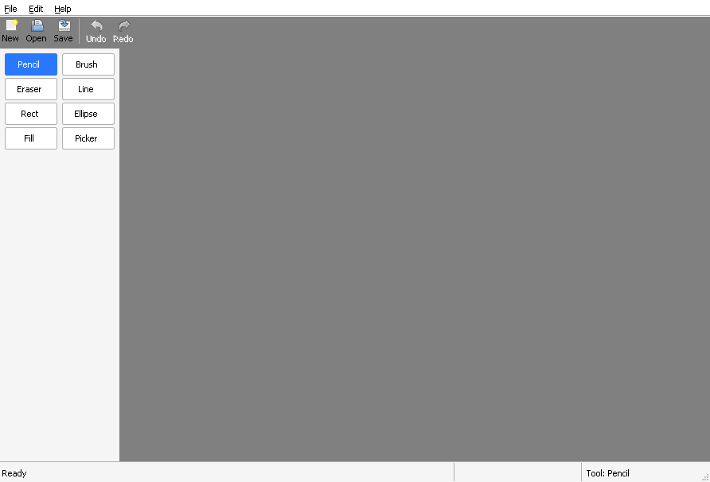

# Chapter 5 - Toolbar and status bar

[< Chapter 4: Housekeeping](../04-housekeeping/README.md)

Time for DrawLite to start looking like a paint program. In this chapter it gets a toolbar along the top, a column of tool buttons down the left, and a status bar along the bottom. They're all made with the **common controls**, a set of ready-made windows that Windows provides.

In this lesson you will

- create a toolbar and a status bar,
- lay out child windows so they follow the main window as it resizes,
- build a tool palette out of radio buttons,
- handle a window being moved to a monitor with a different DPI.

## Before we begin

A lot is new. Three new modules: `src/tools.c` (the list of tools), `src/palette.c` (the buttons on the left) and `src/uiutil.c` (a few helpers for fonts and DPI). Their headers come with them. `mainwindow.c` grows the most. The resources gain an Edit menu and `Ctrl+Z` and `Ctrl+Y` shortcuts, and `CMakeLists.txt` now links `gdi32` and `comctl32`. Build and run.

```text
cmake -S . -B build && cmake --build build
```

(Compiler trouble? See [chapter 1](../01-hello-win32/README.md).)



Click the tool buttons. The status bar on the right says which one you picked. Nothing draws yet, because there's no canvas. That's coming.

## Child windows

Up to now, our program has had one window. A toolbar is a window too, and so is a button, and so is the status bar. They're **child windows**. A child sits inside its parent, moves with it, and is clipped to it. When you click a child, it tells its parent by sending it a message. That's how the buttons in chapter 3's About box worked (the dialog was the parent, and `WM_COMMAND` told it which button was pressed).

So building this chapter's screen means making a handful of children, and then telling each where to sit. We keep their handles in the struct from chapter 4.

```text
13  // Struct: MainWindow
14  // Everything the main window needs to remember.
15  typedef struct MainWindow
16  {
17      HINSTANCE hInstance;    // The application instance
18      HWND hwnd;              // The window itself
19      HWND hToolbar;          // Toolbar along the top
20      HWND hStatusbar;        // Status bar along the bottom
21      HWND hPalette;          // Tool palette down the left
22      HFONT hFont;            // Font used by the controls. We own it.
23      ToolId tool;            // The tool that is currently selected
24  } MainWindow;
```

## Breaking it up

### Creating children in WM_CREATE

The right place to make child windows is `WM_CREATE`. It arrives after `WM_NCCREATE`, once the window exists but before anyone can see it.

```text
110  static LRESULT CALLBACK
111  MainWindow_WndProc(HWND hwnd, UINT msg, WPARAM wParam, LPARAM lParam)
112  {
113      MainWindow *mw = (MainWindow *)GetWindowLongPtrW(hwnd, GWLP_USERDATA);
114
115      switch (msg)
116      {
117      case WM_NCCREATE:
118          mw = (MainWindow *)((CREATESTRUCTW *)lParam)->lpCreateParams;
119          SetWindowLongPtrW(hwnd, GWLP_USERDATA, (LONG_PTR)mw);
120          mw->hwnd = hwnd;
121          break;
122      case WM_CREATE:
123          // Returning -1 from WM_CREATE stops the window from being created
124          return MainWindow_OnCreate(mw) ? 0 : -1;
125      case WM_SIZE:
126          MainWindow_Layout(mw);
127          return 0;
128      case WM_DPICHANGED:
129          // Sent when the window moves to a monitor with a different scale.
130          MainWindow_OnDpiChanged(mw, HIWORD(wParam), (const RECT *)lParam);
131          return 0;
132      case WM_COMMAND:
133          MainWindow_OnCommand(mw, LOWORD(wParam));
134          return 0;
135      case WM_DESTROY:
136          PostQuitMessage(0);
137          return 0;
138      }
139      return DefWindowProcW(hwnd, msg, wParam, lParam);
140  }
```

[Line 124] calls `MainWindow_OnCreate`, and returns `-1` if it fails. That's the special rule for `WM_CREATE`. Returning `-1` cancels the window, and `CreateWindowExW` returns `NULL` to `MainWindow_Create`, which cleans up. Let's see what it does.

```text
142  // Function: MainWindow_OnCreate
143  // Creates the child windows: toolbar, tool palette and status bar.
144  static BOOL
145  MainWindow_OnCreate(MainWindow *mw)
146  {
147      UINT dpi = GetDpiForWindow(mw->hwnd);
148
149      mw->hFont = Ui_CreateFont(dpi);
150
151      mw->hToolbar = MainWindow_CreateToolbar(mw);
152      mw->hPalette = Palette_Create(mw->hwnd, mw->hInstance, IDC_PALETTE);
153      mw->hStatusbar = CreateWindowExW(0, STATUSCLASSNAMEW, L"Ready",
154          WS_CHILD | WS_VISIBLE | SBARS_SIZEGRIP, 0, 0, 0, 0,
155          mw->hwnd, (HMENU)(INT_PTR)IDC_STATUSBAR, mw->hInstance, NULL);
156      if (!mw->hToolbar || !mw->hPalette || !mw->hStatusbar)
157          return FALSE;
158
159      Ui_SetFontOnChildren(mw->hwnd, mw->hFont);
160      MainWindow_SetTool(mw, TOOL_PENCIL);
161      return TRUE;
162  }
```

It makes a font [line 149], the toolbar [line 151], the palette [line 152] and the status bar [lines 153 to 155]. If any of them failed, we give up. Finally it gives every child the font [line 159], and picks the pencil as the first tool [line 160]. Fonts are covered a little further down.

### Initialising the common controls

The toolbar and the status bar live in a library called `comctl32`. Before you use one of its controls, you have to tell it which ones you want.

```text
36  MainWindow *
37  MainWindow_Create(HINSTANCE hInstance, int nCmdShow)
38  {
39      MainWindow *mw;
40      INITCOMMONCONTROLSEX icc;
41
42      // The toolbar and status bar live in comctl32. Ask for them before using them.
43      icc.dwSize = sizeof(icc);
44      icc.dwICC = ICC_BAR_CLASSES;
45      InitCommonControlsEx(&icc);
46
47      if (!MainWindow_RegisterClass(hInstance))
48          return NULL;
```

```c
BOOL InitCommonControlsEx(const INITCOMMONCONTROLSEX *picce);  // Which kinds of control we plan to use
```

```c
typedef struct INITCOMMONCONTROLSEX
{
    DWORD dwSize;   // The size of this struct. Always sizeof(INITCOMMONCONTROLSEX)
    DWORD dwICC;    // Flags for the control classes to register. ICC_BAR_CLASSES covers toolbars and status bars
} INITCOMMONCONTROLSEX;
```

This is done at [lines 43 to 45]. The `ICC_BAR_CLASSES` flag registers the toolbar, status bar and a couple of others. We also have to link `comctl32`, which `CMakeLists.txt` does now. And remember the manifest we added in chapter 3? That asked for version 6 of this library. Without it, these controls would look like they came from Windows 95. Now you can see why we did it back then.

### The status bar

```text
153      mw->hStatusbar = CreateWindowExW(0, STATUSCLASSNAMEW, L"Ready",
154          WS_CHILD | WS_VISIBLE | SBARS_SIZEGRIP, 0, 0, 0, 0,
155          mw->hwnd, (HMENU)(INT_PTR)IDC_STATUSBAR, mw->hInstance, NULL);
```

We make it by name, with `STATUSCLASSNAMEW`, in the same way we make anything else.

```c
HWND CreateWindowExW(DWORD dwExStyle,       // 0
                     LPCWSTR lpClassName,   // STATUSCLASSNAMEW, the name comctl32 registered for us
                     LPCWSTR lpWindowName,  // Starting text, "Ready"
                     DWORD dwStyle,         // WS_CHILD | WS_VISIBLE, plus SBARS_SIZEGRIP for the grip in the corner
                     int x, int y,          // 0, 0. The status bar positions itself
                     int nWidth,            // 0. Same
                     int nHeight,           // 0. Same
                     HWND hWndParent,       // The main window
                     HMENU hMenu,           // For a child window this is its id. We pass IDC_STATUSBAR
                     HINSTANCE hInstance,   // Our instance
                     LPVOID lpParam);       // Not used
```

That's the same call as in chapter 2, with a few of the meanings changed. See that `hMenu` is now the child's id. The cast `(HMENU)(INT_PTR)IDC_STATUSBAR` is how you say "this number goes where a handle goes". The id lets the parent identify which child is talking to it.

The status bar can be divided into **parts**, and we send text to each part. Look at how `MainWindow_ShowToolName` does it.

```text
235  // Function: MainWindow_ShowToolName
236  // Writes the name of the current tool into the status bar.
237  static void
238  MainWindow_ShowToolName(MainWindow *mw)
239  {
240      wchar_t text[64];
241
242      StringCchPrintfW(text, ARRAYSIZE(text), L"Tool: %s", Tool_Name(mw->tool));
243      SendMessageW(mw->hStatusbar, SB_SETTEXTW, SB_PART_TOOL, (LPARAM)text);
244  }
```

```c
LRESULT SendMessageW(HWND hWnd,         // The window to send to: our status bar
                     UINT Msg,          // SB_SETTEXTW, meaning "set the text of a part"
                     WPARAM wParam,     // Which part, counting from 0. We use SB_PART_TOOL
                     LPARAM lParam);    // The text, as a wide string
```

`SendMessageW` is new to us. We've only received messages so far. This sends one, to any window you have a handle for, and waits for the answer. Controls from comctl32 are mostly driven this way. You don't call a function on a toolbar, you send it a message.

The `SB_PART_` names [lines 22 to 24] are the part numbers. Only the third part, the tool name, gets text so far. The other two are for later chapters, and are empty right now.

### The toolbar

A toolbar is a row of buttons. We make the window first, then fill it with buttons by sending messages.

```text
164  // Function: MainWindow_CreateToolbar
165  // Creates the toolbar with New, Open, Save, Undo and Redo buttons.
166  static HWND
167  MainWindow_CreateToolbar(MainWindow *mw)
168  {
169      UINT dpi = GetDpiForWindow(mw->hwnd);
170      HWND tb;
171      TBBUTTON buttons[] =
172      {
173          { STD_FILENEW,  IDM_FILE_NEW,  TBSTATE_ENABLED, BTNS_AUTOSIZE, {0}, 0, (INT_PTR)L"New" },
174          { STD_FILEOPEN, IDM_FILE_OPEN, TBSTATE_ENABLED, BTNS_AUTOSIZE, {0}, 0, (INT_PTR)L"Open" },
175          { STD_FILESAVE, IDM_FILE_SAVE, TBSTATE_ENABLED, BTNS_AUTOSIZE, {0}, 0, (INT_PTR)L"Save" },
176          { 0, 0, TBSTATE_ENABLED, BTNS_SEP, {0}, 0, 0 },
177          { STD_UNDO,     IDM_EDIT_UNDO, 0, BTNS_AUTOSIZE, {0}, 0, (INT_PTR)L"Undo" },
178          { STD_REDOW,    IDM_EDIT_REDO, 0, BTNS_AUTOSIZE, {0}, 0, (INT_PTR)L"Redo" },
179      };
180
181      tb = CreateWindowExW(0, TOOLBARCLASSNAMEW, NULL,
182          WS_CHILD | WS_VISIBLE | TBSTYLE_FLAT | TBSTYLE_TOOLTIPS,
183          0, 0, 0, 0, mw->hwnd, (HMENU)(INT_PTR)IDC_TOOLBAR, mw->hInstance, NULL);
184      if (!tb)
185          return NULL;
186
187      // Required before adding buttons, so the toolbar knows which TBBUTTON we use
188      SendMessageW(tb, TB_BUTTONSTRUCTSIZE, sizeof(TBBUTTON), 0);
189
190      // Windows ships a set of standard button pictures inside comctl32.
191      // Pick the bigger set on high DPI screens.
192      SendMessageW(tb, TB_LOADIMAGES, (dpi >= 144) ? IDB_STD_LARGE_COLOR : IDB_STD_SMALL_COLOR,
193          (LPARAM)HINST_COMMCTRL);
194      SendMessageW(tb, TB_ADDBUTTONSW, ARRAYSIZE(buttons), (LPARAM)buttons);
195      return tb;
196  }
```

The toolbar window comes from `TOOLBARCLASSNAMEW` [line 181]. `TBSTYLE_FLAT` gives the modern flat buttons and `TBSTYLE_TOOLTIPS` makes the toolbar show a tooltip when the mouse hovers over a button.

Now the messages.

- `TB_BUTTONSTRUCTSIZE` [line 188] tells the toolbar how big a `TBBUTTON` is. You must send it before adding buttons. It's a leftover from old versions of the library, which is how Windows checks you're using the structure you think you are.
- `TB_LOADIMAGES` [line 192] loads one of the picture sets that Windows keeps inside `comctl32`. We use the small set (`IDB_STD_SMALL_COLOR`), or the large one (`IDB_STD_LARGE_COLOR`) when the screen is at 150 percent or more. The `HINST_COMMCTRL` argument means "from comctl32 itself". So we don't have to draw any icons.
- `TB_ADDBUTTONSW` [line 194] adds our whole array of buttons at once.

```c
typedef struct TBBUTTON
{
    int iBitmap;        // Which picture to use. STD_FILENEW and friends are numbers from the standard set
    int idCommand;      // The id sent in WM_COMMAND when the button is pressed. We reuse the menu ids
    BYTE fsState;       // TBSTATE_ENABLED, or 0 for a greyed out button
    BYTE fsStyle;       // BTNS_AUTOSIZE fits the button to its text, BTNS_SEP is a gap
    BYTE bReserved[6];  // Padding. We write {0}
    DWORD_PTR dwData;   // Your own data. We don't use it
    INT_PTR iString;    // The button's text. We pass a string pointer
} TBBUTTON;
```

Look at the array [lines 171 to 179]. The buttons use the same ids as the menu items, `IDM_FILE_NEW` and the rest. So when you click New on the toolbar, or choose File > New, or press `Ctrl+N`, the main window gets the same `WM_COMMAND`, and it can't tell which of the three you used. We came across the idea in chapter 3, and this is where it pays off. One handler serves three ways in.

Undo and Redo are added with a state of 0 [lines 177 and 178], so they're greyed out. The Edit menu items are greyed too, so `Ctrl+Z` and `Ctrl+Y` do nothing yet. There's nothing to undo. In chapter 13 that changes.

### Laying out the children

When you drag the corner of the window, the main window gets `WM_SIZE`. Child windows don't resize themselves. We have to move them.

```text
264  // Function: MainWindow_Layout
265  // Positions the child windows. Called whenever the window changes size.
266  //
267  //   +-----------------------------+
268  //   |           toolbar           |
269  //   +-------+---------------------+
270  //   |palette|     (workspace)     |
271  //   +-------+---------------------+
272  //   |          status bar         |
273  //   +-----------------------------+
274  static void
275  MainWindow_Layout(MainWindow *mw)
276  {
277      RECT client, rcTool, rcStatus;
278      UINT dpi = GetDpiForWindow(mw->hwnd);
279      int toolbarHeight, statusHeight, paletteWidth, width;
280      int parts[3];
281
282      if (!mw->hToolbar || !mw->hStatusbar || !mw->hPalette)
283          return;
284
285      GetClientRect(mw->hwnd, &client);
286      width = client.right;
287
288      // Toolbar and status bar size and place themselves. We just have to nudge them.
289      SendMessageW(mw->hToolbar, TB_AUTOSIZE, 0, 0);
290      SendMessageW(mw->hStatusbar, WM_SIZE, 0, 0);
291      GetWindowRect(mw->hToolbar, &rcTool);
292      GetWindowRect(mw->hStatusbar, &rcStatus);
293      toolbarHeight = rcTool.bottom - rcTool.top;
294      statusHeight = rcStatus.bottom - rcStatus.top;
295
296      // The status bar has three parts. Each number is where that part ends.
297      parts[0] = max(width - Ui_Scale(dpi, 320), Ui_Scale(dpi, 100));
298      parts[1] = max(width - Ui_Scale(dpi, 160), parts[0]);
299      parts[2] = -1; // -1 means "all the way to the right"
300      SendMessageW(mw->hStatusbar, SB_SETPARTS, ARRAYSIZE(parts), (LPARAM)parts);
301      MainWindow_ShowToolName(mw); // Text is lost when the parts change, so set it again
302
303      paletteWidth = Ui_Scale(dpi, 150);
304      MoveWindow(mw->hPalette, 0, toolbarHeight, paletteWidth,
305          client.bottom - toolbarHeight - statusHeight, TRUE);
306  }
```

The picture in the comment [lines 267 to 273] shows what we are building. The toolbar sits at the top, the status bar at the bottom, and the palette on the left between them. The rest is a grey workspace, where the canvas will go.

The toolbar and status bar know how to position themselves. We only have to nudge them. We send the toolbar `TB_AUTOSIZE` [line 289] and the status bar a `WM_SIZE` [line 290], and they snap to the top and bottom. Then we measure them with `GetWindowRect` [lines 291 to 294] so we know how much room is left for the palette.

The three status bar parts [lines 296 to 300] are set by `SB_SETPARTS`. Each number is the x position where that part ends. A `-1` stretches the last part to the right edge. The first part takes whatever is left, and the other two are 160 and 160 pixels (at 100 percent scale) wide. If the window is very narrow, the `max` calls stop the parts from running backwards.

Then there's an odd line [line 301]. We write the tool name again straight after changing the parts. My comment in the code says that text is lost when the parts change. I haven't checked that on a real Windows machine, so take it as "setting it again does no harm", which is true either way.

Finally the palette gets the leftover strip down the left [lines 303 to 305]. `MoveWindow` is the plain way to place a window.

```c
BOOL MoveWindow(HWND hWnd,      // The window to move
                int X, int Y,   // New top left position, relative to the parent
                int nWidth,     // New width
                int nHeight,    // New height
                BOOL bRepaint); // TRUE to repaint after moving
```

One more thing. In `MainWindow_Create`, we added `WS_CLIPCHILDREN` to the window style [line 56]. It tells Windows not to paint the main window over the children. Without it, the children can flicker when you resize.

### The tool palette

The column of tool buttons is a small window class of its own, made in `palette.c`. It's a plain window that owns eight buttons.

```text
38  HWND
39  Palette_Create(HWND parent, HINSTANCE hInstance, int id)
40  {
41      HWND hwnd;
42      int i;
43
44      if (!Palette_RegisterClass(hInstance))
45          return NULL;
46
47      hwnd = CreateWindowExW(0, PALETTE_CLASS, NULL, WS_CHILD | WS_VISIBLE | WS_CLIPCHILDREN,
48          0, 0, 0, 0, parent, (HMENU)(INT_PTR)id, hInstance, NULL);
49      if (!hwnd)
50          return NULL;
51
52      // One push-like radio button per tool. Radio buttons give us
53      // "only one pressed at a time" for free.
54      for (i = 0; i < TOOL_COUNT; i++)
55      {
56          DWORD style = WS_CHILD | WS_VISIBLE | BS_AUTORADIOBUTTON | BS_PUSHLIKE;
57          if (i == 0)
58              style |= WS_GROUP | WS_TABSTOP;
59          CreateWindowExW(0, L"BUTTON", Tool_Name((ToolId)i), style, 0, 0, 0, 0,
60              hwnd, (HMENU)(INT_PTR)(IDM_TOOL_FIRST + i), hInstance, NULL);
61      }
62      return hwnd;
63  }
```

Each button is a real `BUTTON` control [line 59]. The style does the clever bit. `BS_AUTORADIOBUTTON` makes a radio button, where only one of a group can be ticked at once. `BS_PUSHLIKE` makes it look like a normal push button that stays pressed. Put them together and you've got a palette where the one you picked stays down and the others pop up. We didn't write any code to do that. `WS_GROUP` on the first one [line 58] marks where the group starts.

Each button's id is `IDM_TOOL_FIRST + i`. The names come from `Tool_Name` in `tools.c`, and the `ToolId` enum there says the tools are Pencil, Brush, Eraser, Line, Rect, Ellipse, Fill and Picker. They don't do anything yet, except get selected.

When you click a button, it sends `WM_COMMAND` to its parent. Its parent is the palette, and not the main window. So the palette passes it on.

```text
 95  static LRESULT CALLBACK
 96  Palette_WndProc(HWND hwnd, UINT msg, WPARAM wParam, LPARAM lParam)
 97  {
 98      switch (msg)
 99      {
100      case WM_SIZE:
101          Palette_Layout(hwnd);
102          return 0;
103      case WM_COMMAND:
104          // Buttons tell their parent, which is us. We pass it up to the main window.
105          SendMessageW(GetParent(hwnd), WM_COMMAND, wParam, lParam);
106          return 0;
107      }
108      return DefWindowProcW(hwnd, msg, wParam, lParam);
109  }
```

`SendMessageW(GetParent(hwnd), WM_COMMAND, wParam, lParam)` [line 105] forwards the message unchanged to the main window. That's how it ends up in `MainWindow_OnCommand`, which checks if the id falls in the tool range.

```text
198  static void
199  MainWindow_OnCommand(MainWindow *mw, int id)
200  {
201      if (id >= IDM_TOOL_FIRST && id < IDM_TOOL_FIRST + TOOL_COUNT)
202      {
203          MainWindow_SetTool(mw, (ToolId)(id - IDM_TOOL_FIRST));
204          return;
205      }
```

`MainWindow_SetTool` [line 228] remembers the tool, ticks the right button with `CheckRadioButton` (in `Palette_SetTool`, [lines 65 to 70] of `palette.c`) and updates the status bar. It's a nice little chain. Click, `WM_COMMAND`, forward, set the tool, update the screen. And it works the other way too, because the program can call `MainWindow_SetTool` itself, as it does for the pencil at the start.

`Palette_Layout` [lines 74 to 93] arranges the buttons in two columns whenever the palette gets a `WM_SIZE`. Our `MoveWindow` call in the main window's layout sends it one.

### Fonts and DPI

By default, a new control uses an ugly old system font. We want the same font as the rest of Windows. `uiutil.c` has a few helpers.

```text
16  HFONT
17  Ui_CreateFont(UINT dpi)
18  {
19      NONCLIENTMETRICSW ncm;
20      ZeroMemory(&ncm, sizeof(ncm));
21      ncm.cbSize = sizeof(ncm);
22
23      // Ask Windows which font it uses for message boxes at this DPI
24      if (!SystemParametersInfoForDpi(SPI_GETNONCLIENTMETRICS, sizeof(ncm), &ncm, 0, dpi))
25          return (HFONT)GetStockObject(DEFAULT_GUI_FONT);
26      return CreateFontIndirectW(&ncm.lfMessageFont);
27  }
```

`Ui_CreateFont` asks Windows which font it uses for message boxes, at this screen's DPI [line 24], and makes a copy [line 26]. If that fails, it falls back to a stock font. The font is a GDI object that we own, so the main window stores it in `hFont` and deletes it in `MainWindow_Destroy` (`mainwindow.c`, [line 73]). That's what `gdi32` is for in the CMake file.

`Ui_SetFontOnChildren` then sends `WM_SETFONT` to every child, using `EnumChildWindows`. And `Ui_Scale` multiplies a size by the DPI over 96. So a 28 pixel button is 28 at 100 percent, and 42 at 150 percent. `Palette_Layout` uses it for the margins and the button heights.

Remember the `PerMonitorV2` setting in the manifest? It means Windows tells us if the window moves to a monitor with a different scale, with `WM_DPICHANGED`.

```text
246  // Function: MainWindow_OnDpiChanged
247  // The window has moved to a screen with a different DPI. We get a new size
248  // from Windows, then rebuild the font and lay everything out again.
249  static void
250  MainWindow_OnDpiChanged(MainWindow *mw, UINT dpi, const RECT *suggested)
251  {
252      HFONT oldFont = mw->hFont;
253
254      mw->hFont = Ui_CreateFont(dpi);
255      Ui_SetFontOnChildren(mw->hwnd, mw->hFont);
256      if (oldFont)
257          DeleteObject(oldFont);
258
259      SetWindowPos(mw->hwnd, NULL, suggested->left, suggested->top,
260          suggested->right - suggested->left, suggested->bottom - suggested->top,
261          SWP_NOZORDER | SWP_NOACTIVATE);
262  }
```

We make a new font for the new DPI [line 254], hand it to the children, delete the old one, and move the window to the size Windows suggested [lines 259 to 261]. The resize triggers `WM_SIZE`, which lays everything out again with the new numbers. One limit to be aware of. The toolbar pictures are chosen when the window is created [line 192]. They're not swapped if the DPI changes later, so they may look a bit small or soft after dragging to a sharper screen.

Don't worry if all the DPI business is hazy. We only need to know that sizes should go through `Ui_Scale`, and we'll do that whenever we make something that has a size.

## The big idea: who is asking whom?

A restaurant again. In chapter 2, you were the customer and the cook was our program. Now the restaurant is bigger. The head waiter (the main window) has a team: a bartender (the toolbar), a cashier (the status bar) and a table of buttons by the door (the palette). A customer presses a button, and it's the palette that hears it first. The palette doesn't make a decision. It passes the order up to the head waiter, who decides what to do and tells the cashier to write it down. Each child only knows its own job and its parent's name. Whatever happens next is the parent's call.

That is the pattern for every control from now on. Children report to their parent in `WM_COMMAND`, and the parent tells children what to do by sending messages.

## Adding functionality

Let's use the first status bar part too. Add this line at the end of `MainWindow_ShowToolName` [line 243].

```c
    SendMessageW(mw->hStatusbar, SB_SETTEXTW, SB_PART_HINT, (LPARAM)L"Ready");
```

Rebuild and run. The left part now says "Ready". We put it in this function because `MainWindow_Layout` calls it every time the parts are rebuilt, so the text always comes back. Later chapters use that first part for hints.

## Exercise

Add a Quit button to the toolbar, after Redo.

*Hint: Add one more entry to the `buttons` array. `STD_DELETE` is a picture you can borrow, and `IDM_FILE_EXIT` is already handled.*

## That's it

Whew. That was a big one! You now have child windows, two common controls, a custom palette and a layout that follows the window around. Next we get to the fun part. We make a canvas to draw on.

[Chapter 6: The canvas](../06-the-canvas/README.md)
