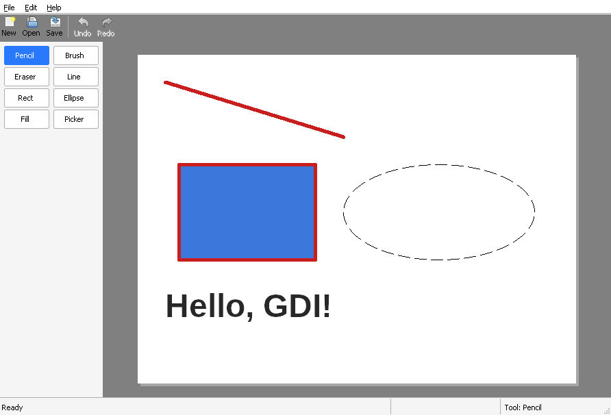

# Chapter 6 - The canvas

[< Chapter 5: Toolbar and status bar](../05-toolbar-and-status-bar/README.md)

So far DrawLite has a menu, a toolbar, a tool palette and a status bar, and an empty grey hole in the middle. Time to fill the hole. This is where the program starts to look like a paint program.

In this chapter you will

- make a child window with its own window class,
- learn how `WM_PAINT` works, and why Windows keeps asking you to redraw,
- draw lines, shapes and text with GDI,
- use double buffering to stop the flicker.

## Before we begin

One file is new, `src/canvas.c` (with its header `canvas.h`). The rest of the changes are a handful of lines in `mainwindow.c`, `mainwindow.h` and `resource.h` to create the canvas and give it room, plus the version number bumping to 0.6. If you want to see exactly what moved, run `diff -u` between this folder and chapter 5.

Build it and run it the same way as before (if you've forgotten how, [chapter 1](../01-hello-win32/README.md) has the details for all three compilers).

```text
cmake -S . -B build && cmake --build build
```

You should see a sheet of white paper in the middle of the grey area, with some shapes drawn on it.



You can't draw on it yet. The picture is painted by our code every time the window needs it, and it is always the same picture. That is on purpose. This chapter is about *how* a window paints itself. In the next chapter we'll get to the interesting part, the pixels.

## Breaking it up

Lets break down the code. There are three jobs to do. Make the window, put it in the right place, and paint it.

### A window class of its own

In chapter 2 we registered a class for the main window. The palette in chapter 5 did the same. The canvas is no different, and we register it once, the first time anyone asks for a canvas.

```text
20  static BOOL
21  Canvas_RegisterClass(HINSTANCE hInstance)
22  {
23      static BOOL registered = FALSE;
24      WNDCLASSEXW wcx;
25
26      if (registered)
27          return TRUE;
28
29      ZeroMemory(&wcx, sizeof(wcx));
30      wcx.cbSize = sizeof(wcx);
31      wcx.style = CS_HREDRAW | CS_VREDRAW;    // Repaint the whole window when it is resized
32      wcx.lpfnWndProc = Canvas_WndProc;
33      wcx.hInstance = hInstance;
34      wcx.hCursor = LoadCursorW(NULL, IDC_CROSS);
35      wcx.hbrBackground = NULL;               // We paint the background ourselves
36      wcx.lpszClassName = CANVAS_CLASS;
37
38      registered = RegisterClassExW(&wcx) != 0;
39      return registered;
40  }
```

Three lines are worth a second look.

`CS_HREDRAW | CS_VREDRAW` [line 31] tells Windows to invalidate the whole window when its width or height changes. Without it, making the window bigger would only repaint the new strip along the edge, and our centred paper would be left in the wrong place.

`IDC_CROSS` [line 34] is the mouse cursor to show over the window. A cross suits a drawing area.

`hbrBackground` is `NULL` [line 35]. Normally you give Windows a brush and it uses it to wipe the window before you paint. We are going to take care of the background ourselves, and in a moment you'll see why.

### Creating the window

```text
42  HWND
43  Canvas_Create(HWND parent, HINSTANCE hInstance, int id)
44  {
45      if (!Canvas_RegisterClass(hInstance))
46          return NULL;
47
48      return CreateWindowExW(0, CANVAS_CLASS, NULL, WS_CHILD | WS_VISIBLE,
49          0, 0, 0, 0, parent, (HMENU)(INT_PTR)id, hInstance, NULL);
50  }
```

```c
HWND CreateWindowExW(DWORD dwExStyle,       // Extra style bits. We have none
                     LPCWSTR lpClassName,   // The class we registered
                     LPCWSTR lpWindowName,  // Title. A child with no caption doesn't need one
                     DWORD dwStyle,         // WS_CHILD makes it live inside another window
                     int X, int Y,          // Position, relative to the parent
                     int nWidth, int nHeight,
                     HWND hWndParent,       // The window that will contain it
                     HMENU hMenu,           // For a child window this is its ID number
                     HINSTANCE hInstance,   // Our program
                     LPVOID lpParam);       // Extra data for WM_NCCREATE and WM_CREATE. Unused for now
```

We've called this one before, for the toolbar and the status bar. The new part is that the class is ours. `WS_CHILD` means the window is drawn inside the parent's client area and clipped to it. The `id` we pass in the `hMenu` slot is how the parent can find the canvas again later with `GetDlgItem`.

We create it with a size of zero. That looks odd, but the main window is about to decide how big it should be.

### Giving it room

Back in `mainwindow.c`, the canvas is created next to the palette and the status bar.

```text
153      mw->hPalette = Palette_Create(mw->hwnd, mw->hInstance, IDC_PALETTE);
154      mw->hCanvas = Canvas_Create(mw->hwnd, mw->hInstance, IDC_CANVAS);
155      mw->hStatusbar = CreateWindowExW(0, STATUSCLASSNAMEW, L"Ready",
156          WS_CHILD | WS_VISIBLE | SBARS_SIZEGRIP, 0, 0, 0, 0,
157          mw->hwnd, (HMENU)(INT_PTR)IDC_STATUSBAR, mw->hInstance, NULL);
158      if (!mw->hToolbar || !mw->hPalette || !mw->hCanvas || !mw->hStatusbar)
```

And the layout function from chapter 5 gets one more `MoveWindow`.

```text
305      paletteWidth = Ui_Scale(dpi, 150);
306      MoveWindow(mw->hPalette, 0, toolbarHeight, paletteWidth,
307          client.bottom - toolbarHeight - statusHeight, TRUE);
308      // The canvas gets whatever is left in the middle
309      MoveWindow(mw->hCanvas, paletteWidth, toolbarHeight, width - paletteWidth,
310          client.bottom - toolbarHeight - statusHeight, TRUE);
```

The palette takes its 150 (scaled) pixels down the left. The canvas takes whatever is left, from the palette's right edge to the right side of the main window, between the toolbar and the status bar. Resize the window and the canvas follows, because `MainWindow_Layout` runs on every `WM_SIZE`.

### WM_PAINT

Here is the idea that confuses every beginner, so let's go slowly.

Don't count on Windows remembering what is in your window. When another window slides over yours and moves away, the covered part of your window may well be gone. (Modern Windows is cleverer about this than it used to be, but you can't rely on it.) Windows marks that part of your window as *invalid* and sends you a `WM_PAINT` message, which means "please draw yourself again, I've forgotten what you look like." The same happens when your window is first shown, when it is resized, and when you call `InvalidateRect` yourself.

So your painting code has to be able to draw the whole picture from scratch, at any time, as many times as Windows asks.

Here's the window procedure.

```text
52  static LRESULT CALLBACK
53  Canvas_WndProc(HWND hwnd, UINT msg, WPARAM wParam, LPARAM lParam)
54  {
55      switch (msg)
56      {
57      case WM_ERASEBKGND:
58          // Saying "we did it" stops Windows wiping the window before WM_PAINT.
59          // That wipe is what makes unbuffered painting flicker.
60          return 1;
61      case WM_PAINT:
62          Canvas_OnPaint(hwnd);
63          return 0;
64      }
65      return DefWindowProcW(hwnd, msg, wParam, lParam);
66  }
```

You'll recognise the shape. `WM_PAINT` calls `Canvas_OnPaint` and returns 0 to say "handled". Everything else goes to `DefWindowProcW`.

Think of a shop window. Windows is the caretaker, and now and then it wipes the glass without warning. It leaves you a note that says "redo the display." That note is `WM_PAINT`. You can't ask the caretaker what the display looked like. Your code has to know how to dress the whole window again from scratch.

### WM_ERASEBKGND

Before it sends `WM_PAINT`, Windows usually sends `WM_ERASEBKGND`, which asks the window to wipe itself with the background brush. If we let that happen, the user would see a flash of plain background before our picture arrives. That flash is the flicker you see in badly written programs.

Returning 1 [line 60] tells Windows "I've done it, thanks." We haven't, of course. We are about to cover every pixel anyway, so the wipe would be wasted work and a source of flicker.

### BeginPaint and EndPaint

```c
HDC BeginPaint(HWND hWnd,               // The window to paint
               LPPAINTSTRUCT lpPaint);  // Filled in for you: ps.rcPaint is the area that needs drawing

BOOL EndPaint(HWND hWnd,
              const PAINTSTRUCT *lpPaint);  // The same structure BeginPaint filled in
```

Every `WM_PAINT` handler starts with `BeginPaint` and ends with `EndPaint`. `BeginPaint` gives you a device context (`HDC`), which is Windows' word for "something you can draw on." It also tells Windows you've started, and it fills in `ps.rcPaint`, the rectangle that actually needs redrawing. `EndPaint` tells Windows you're done, so it can stop sending `WM_PAINT`.

If you ever forget to call them, Windows thinks the window is still invalid and sends `WM_PAINT` again, and again, and your program uses 100% of a CPU core to draw nothing. Always call both.

### Double buffering

Now to the thing that removes the rest of the flicker. Staying with the shop window, you wouldn't dress it with the shoppers watching. You'd put up a curtain, arrange everything behind it, then pull the curtain back.

If you draw the grey, then the shadow, then the paper, then the shapes straight onto the screen, the user can briefly see each step. On a fast computer that's a faint shimmer. On a slow one it's a slide show. Double buffering fixes it. We draw everything into a hidden bitmap in memory first, and then copy the finished picture to the screen in one go.

```text
85      // An off-screen DC with a bitmap the size of the window
86      memDC = CreateCompatibleDC(hdc);
87      memBitmap = CreateCompatibleBitmap(hdc, width, height);
88      oldBitmap = (HBITMAP)SelectObject(memDC, memBitmap);
89
90      // The grey workspace
91      FillRect(memDC, &client, GetSysColorBrush(COLOR_APPWORKSPACE));
```

There are four new functions here.

```c
HDC CreateCompatibleDC(HDC hdc);        // A new, off-screen DC that matches this one's colour format

HBITMAP CreateCompatibleBitmap(HDC hdc, // Match this DC's colour format
                               int cx,  // Width in pixels
                               int cy); // Height in pixels

HGDIOBJ SelectObject(HDC hdc,           // The DC to change
                     HGDIOBJ h);        // The bitmap, pen, brush or font to use from now on
                                        // Returns the object that was selected before

BOOL BitBlt(HDC hdcDest, int xDest, int yDest, int w, int h,    // Where to copy to
            HDC hdcSrc, int xSrc, int ySrc,                     // Where to copy from
            DWORD rop);                                         // How to combine them. SRCCOPY just copies
```

A new memory DC has a tiny 1 by 1 bitmap inside it, which is no use to anybody. So we make a bitmap the size of the window and `SelectObject` it into the DC [line 88]. From then on, everything we draw to `memDC` lands in that bitmap.

The other end of the function looks like this.

```text
100      // Copy to the screen. Only the part that needs repainting.
101      BitBlt(hdc, ps.rcPaint.left, ps.rcPaint.top,
102          ps.rcPaint.right - ps.rcPaint.left, ps.rcPaint.bottom - ps.rcPaint.top,
103          memDC, ps.rcPaint.left, ps.rcPaint.top, SRCCOPY);
104
105      // Put back what we borrowed, then throw away what we made
106      SelectObject(memDC, oldBitmap);
107      DeleteObject(memBitmap);
108      DeleteDC(memDC);
109      EndPaint(hwnd, &ps);
```

`SelectObject` hands back whatever was selected before. Keep it. At the end we select it back [line 106] and only then delete our bitmap. Windows won't let you delete an object that is still selected into a DC.

The last step is `BitBlt` [lines 101 to 103], which stands for "bit block transfer". It copies a rectangle of pixels from one DC to another. Notice that we only copy `ps.rcPaint`. If only a small corner was uncovered, we don't need to push the whole window to the screen.

### Drawing with GDI

`Canvas_DrawPaper` is the picture itself. GDI (the Graphics Device Interface) is the oldest drawing API in Windows. In a moment we'll stop using it for the actual image, but you will meet it for the rest of the tutorial, so it's good to know the rhythm.

```text
129      // A thick red line. To draw with GDI you create a pen, select it into the
130      // DC (which hands you the old one), draw, then select the old pen back.
131      pen = CreatePen(PS_SOLID, 5, RGB(200, 30, 30));
132      oldPen = (HPEN)SelectObject(hdc, pen);
133      MoveToEx(hdc, x + 40, y + 40, NULL);
134      LineTo(hdc, x + 300, y + 120);
```

GDI draws with whatever is currently *selected* into the DC. To draw a red line, you create a red pen, select it, draw, and select the old pen back.

```c
HPEN CreatePen(int iStyle,          // PS_SOLID, PS_DASH, and friends
               int cWidth,          // Width in pixels
               COLORREF color);     // RGB(r, g, b). Note that COLORREF is 0x00BBGGRR

HBRUSH CreateSolidBrush(COLORREF color);    // The fill colour for shapes
```

Shapes such as `Rectangle` and `Ellipse` use both. The pen draws the outline and the brush fills the inside. To get an outline with no fill, select the stock `NULL_BRUSH` [line 143], a brush that paints nothing.

The last few lines are the ones that matter most.

```text
156      // Give every borrowed object back, then delete the ones we created.
157      // Forget this and you leak GDI objects until Windows runs out of them.
158      SelectObject(hdc, oldFont);
159      SelectObject(hdc, oldBrush);
160      SelectObject(hdc, oldPen);
161      DeleteObject(font);
162      DeleteObject(brush);
163      DeleteObject(pen);
164      DeleteObject(dashedPen);
```

Every pen, brush and font you create with a `Create...` function takes up a slot in Windows' tables. There aren't an infinite number of them. If you forget to delete them, you leak, and a program that paints 60 times a second will run out within minutes. So the rule is to give every borrowed object back, then delete everything you made.

Don't worry if all this select, draw, restore business feels fiddly. It is. You'll be doing it enough times to do it in your sleep.

## Adding functionality

Let's add a rounded rectangle at the bottom right of the paper. In `Canvas_DrawPaper`, after the `Ellipse` call, add

```c
RoundRect(hdc, x + 400, y + 330, x + 600, y + 440, 30, 30);    // The last two numbers are the corner size
```

The dashed pen is still selected and the brush is still `NULL_BRUSH`, so you get a dashed outline with nothing inside. Move the `SelectObject(hdc, brush)` line to just before it and see what changes.

Now try resizing the window. Drag it bigger and smaller. The paper stays in the middle and nothing flickers. If you're curious, comment out the `WM_ERASEBKGND` case, rebuild and resize again to see what we've been avoiding.

## Exercise

Draw a smiley face on the paper. A yellow circle for the head, two small filled circles for the eyes, and a smile.

*Hint: `Arc` draws part of an ellipse. You give it the box around the whole ellipse and two points that say where the arc starts and ends (it runs anticlockwise).*

## That's it

We now have a window that paints itself properly. Next we throw away the GDI picture and build one out of real pixels that we own, which is where DrawLite stops being a demo.

[Chapter 7: Pixels you own](../07-pixels-you-own/README.md)
