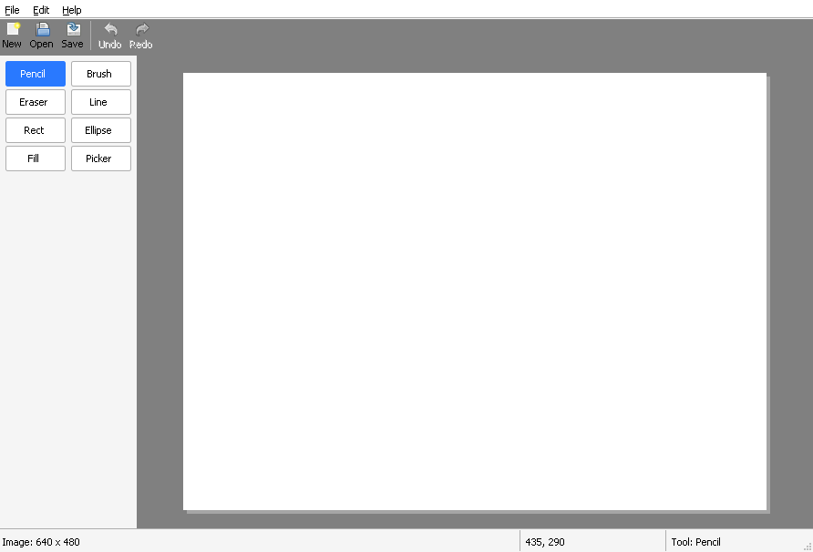

# Chapter 7 - Pixels you own

[< Chapter 6: The canvas](../06-the-canvas/README.md)

This is the most important chapter in the tutorial. Everything DrawLite does from here on, every tool, every effect, every layer, is arithmetic on the pixels we set up today. Take your time with it.

In this chapter you will

- make a `Surface`, a block of pixels that you can read and write like an array,
- learn what *premultiplied alpha* means, with a small worked example,
- meet `CreateDIBSection`, the function that lets GDI and your code share the same memory,
- keep per-window state in `GWLP_USERDATA` for the canvas,
- add a New Image dialog and scribble on a real image for the first time.

## Before we begin

A lot of new files this time.

| File | What it is |
|------|------------|
| `src/pixel.h` | What a pixel is, plus the arithmetic on pixels |
| `src/surface.c`, `surface.h` | A rectangle of pixels |
| `src/doc.c`, `doc.h` | The picture you're working on (for now, a surface and a few flags) |
| `src/newdlg.c`, `newdlg.h` | The New Image dialog |

`canvas.c` is rewritten. It no longer draws the GDI demo. It shows a document instead. `mainwindow.c` and `mainwindow.h` create that document and pass it to the canvas, and `drawlite.rc` and `resource.h` get the New Image dialog.

Build and run as usual (see [chapter 1](../01-hello-win32/README.md) if you need the compiler details).

```text
cmake -S . -B build && cmake --build build
```

You should get a white 640 by 480 image on the grey workspace. Hold the left mouse button down and move over it. Black squares appear under the mouse. Choose **File, New** (or press Ctrl+N) and you can pick a different size.



Look at the status bar while you move the mouse. It shows where you are in the image, in image pixels. Whoa! That's a real paint program, sort of.

It's crude. The squares are only placed where Windows happens to report the mouse, so if you move fast you get gaps. We fix that properly in chapter 8. What matters today is that every one of those black squares is a value we wrote into memory ourselves.

## Breaking it up

### What is a pixel?

A picture on a screen is a grid of tiny dots, and each dot is a pixel. In DrawLite a pixel is a 32 bit number, a `uint32_t`, laid out like this.

```text
 bits 31..24   23..16   15..8    7..0
        A        R       G        B
```

Alpha, red, green, blue, one byte each. Red, green and blue are how much of each light to mix, from 0 (none) to 255 (full). Alpha is how *solid* the pixel is. 255 is solid, 0 is invisible, and in between you can see through it. So `0xFFFF0000` is solid red and `0xFF000000` is solid black. Written as one hex number it reads `0xAARRGGBB`.

```text
16  #include <stdint.h>
17
18  #define PIX_A(c)    ((uint32_t)((c) >> 24) & 0xFF)
19  #define PIX_R(c)    ((uint32_t)((c) >> 16) & 0xFF)
20  #define PIX_G(c)    ((uint32_t)((c) >> 8) & 0xFF)
21  #define PIX_B(c)    ((uint32_t)(c) & 0xFF)
22
23  #define PIX_MAKE(a, r, g, b) \
24      (((uint32_t)(a) << 24) | ((uint32_t)(r) << 16) | ((uint32_t)(g) << 8) | (uint32_t)(b))
25
26  #define PIX_WHITE   0xFFFFFFFFu
27  #define PIX_BLACK   0xFF000000u
```

The `PIX_A`, `PIX_R`, `PIX_G` and `PIX_B` macros pull the four bytes out. `PIX_MAKE` glues them back together.

(Windows calls this format BGRA because on a PC the bytes sit in memory in the order B, G, R, A, since the least significant byte comes first. Same thing, just described from the other end. You never need to think about it. Treat a pixel as one number.)

### Premultiplied alpha

Here comes the hard part. Don't worry if it's hazy on the first read. We'll use it in every chapter from now on, and it gets easier.

Suppose you want to paint half see-through red. Alpha is 128 (about half of 255), and the colour is `0xFF` red. The obvious way to store it is `A=128, R=255, G=0, B=0`. This is called *straight* alpha, and it's what colour pickers and PNG files give you.

DrawLite does it differently. It stores every pixel *premultiplied*, which means red, green and blue have already been multiplied by the alpha, as a fraction of 255.

```text
straight:       A=128  R=255  G=0  B=0     0x80FF0000
premultiplied:  A=128  R=128  G=0  B=0     0x80800000
                              (255 * 128 / 255 = 128)
```

That looks like a worse way to store it. It's less obvious and the colour has been changed. So why bother?

Because of what happens when you put one pixel on top of another, which is the thing a paint program does all day. Let's put our half red pixel on solid white, `0xFFFFFFFF`. With straight alpha you work out each channel as `src * alpha + dst * (1 - alpha)`. That's two multiplications per channel, six in all, and a division. With premultiplied pixels the source has already done its multiplication, so the rule becomes

```text
result = src + dst * (1 - src alpha)
```

Each channel only has one multiplication, and it's on the pixel underneath. Here are the numbers. The source alpha is 128, so `1 - alpha` is 127 out of 255.

```text
         src    dst * 127 / 255        result
alpha    128    255 * 127 / 255 = 127  128 + 127 = 255
red      128    255 * 127 / 255 = 127  128 + 127 = 255
green      0    255 * 127 / 255 = 127    0 + 127 = 127
blue       0    255 * 127 / 255 = 127    0 + 127 = 127
```

The result is `0xFFFF7F7F`, a solid pink. Exactly what you'd expect when half see-through red lies on white paper. And notice that the alpha channel followed exactly the same rule as the colours. That's a bonus. We never need a special case for alpha.

Premultiplied pixels also give clean results when you blur or scale an image, and they're what Windows' own `AlphaBlend` expects. A lot of graphics software that cares about speed stores pixels this way. Now you know why.

There is one price. A premultiplied pixel can't remember its colour once it's fully transparent. If alpha is 0, red, green and blue must be 0 too. That doesn't matter to us.

Here are the helpers that do the work.

```text
29  // Function: Pixel_Mul255
30  // Returns a * b / 255, rounded. Both are 0 to 255.
31  static inline uint32_t
32  Pixel_Mul255(uint32_t a, uint32_t b)
33  {
34      uint32_t t = a * b + 128;
35      return (t + (t >> 8)) >> 8; // A fast, exact way of dividing by 255
36  }
```

`Pixel_Mul255` multiplies two numbers from 0 to 255 and divides by 255, rounding. Dividing is slower than shifting, so the last line uses a well known trick (add the result shifted right by 8, then shift again) that gives the exact rounded answer without a division.

```text
38  // Function: Pixel_Premultiply
39  // Turns a normal ("straight") 0xAARRGGBB colour into a premultiplied pixel.
40  static inline uint32_t
41  Pixel_Premultiply(uint32_t c)
42  {
43      uint32_t a = PIX_A(c);
44      if (a == 255)
45          return c;
46      return PIX_MAKE(a, Pixel_Mul255(PIX_R(c), a), Pixel_Mul255(PIX_G(c), a), Pixel_Mul255(PIX_B(c), a));
47  }
```

`Pixel_Premultiply` turns a straight colour into a premultiplied pixel. It's only needed when a colour comes in from outside, such as the paint colour the user picked.

```text
65  // Function: Pixel_Over
66  // Puts the premultiplied pixel src on top of the premultiplied pixel dst.
67  // This is the classic "over" operator:  result = src + dst * (1 - src alpha)
68  static inline uint32_t
69  Pixel_Over(uint32_t src, uint32_t dst)
70  {
71      uint32_t inv = 255 - PIX_A(src);
72      if (inv == 0)
73          return src;
74      if (inv == 255)
75          return dst;
76      return PIX_MAKE(
77          PIX_A(src) + Pixel_Mul255(PIX_A(dst), inv),
78          PIX_R(src) + Pixel_Mul255(PIX_R(dst), inv),
79          PIX_G(src) + Pixel_Mul255(PIX_G(dst), inv),
80          PIX_B(src) + Pixel_Mul255(PIX_B(dst), inv));
81  }
```

`Pixel_Over` is the formula above. It has two shortcuts at the start. If the source is solid (`inv == 0`) it just replaces the destination. If the source is invisible (`inv == 255`) it leaves the destination alone. Most pixels in a drawing are one or the other, so this saves a lot of time.

`Pixel_Unpremultiply` does the opposite of `Pixel_Premultiply`. We don't call any of these helpers yet, apart from `PIX_WHITE`, but they will be in constant use from the next chapter.

### Surface

Now we need somewhere to keep a grid of these pixels.

```text
13  // Struct: Surface
14  // A 32 bit per pixel image. The pixels are stored row by row, top row first,
15  // with no gaps between the rows. Pixel (x, y) is pixels[y * width + x].
16  typedef struct Surface
17  {
18      int width;
19      int height;
20      uint32_t *pixels;   // Premultiplied 0xAARRGGBB, see pixel.h
21      HBITMAP bitmap;     // The same memory as a GDI bitmap. Windows frees it, not us.
22  } Surface;
```

A `Surface` is a width, a height, and a pointer to `width * height` pixels, row after row, with the top row first. The pixel at (x, y) is `pixels[y * width + x]`. That's the formula to remember. Everything in this tutorial that touches pixels uses it.

The strange member is `bitmap`. Why does a surface have a GDI bitmap as well as a pixel pointer? Because they are the same memory. Let's see how.

### CreateDIBSection

```c
HBITMAP CreateDIBSection(HDC hdc,                   // Only matters for palettes. NULL is fine for 32 bit
                         const BITMAPINFO *pbmi,    // Describes the bitmap we want
                         UINT usage,                // DIB_RGB_COLORS. Colours are RGB values, not palette entries
                         VOID **ppvBits,            // Receives a pointer to the pixel memory
                         HANDLE hSection,           // NULL. We let Windows allocate the memory
                         DWORD offset);             // 0, because hSection is NULL
```

A DIB (device independent bitmap) is a bitmap whose pixels live in memory you can see. `CreateDIBSection` makes one and gives you two things back. An `HBITMAP`, which GDI understands and can draw, and through `ppvBits` a plain pointer to the pixels. Write through the pointer and the bitmap changes. Draw the bitmap with GDI and you see what you wrote. No copying, no conversion.

Here's the function that uses it.

```text
22      if (width < 1 || height < 1 || width > SURFACE_MAX_SIZE || height > SURFACE_MAX_SIZE)
23          return NULL;
24
25      // Describe the bitmap we want: 32 bits per pixel, no compression.
26      // A NEGATIVE height means the top row comes first in memory,
27      // which is how we like to think about images.
28      ZeroMemory(&bi, sizeof(bi));
29      bi.bmiHeader.biSize = sizeof(BITMAPINFOHEADER);
30      bi.bmiHeader.biWidth = width;
31      bi.bmiHeader.biHeight = -height;
32      bi.bmiHeader.biPlanes = 1;
33      bi.bmiHeader.biBitCount = 32;
34      bi.bmiHeader.biCompression = BI_RGB;
35
36      // Windows allocates the memory and hands us a pointer to it in "bits"
37      bitmap = CreateDIBSection(NULL, &bi, DIB_RGB_COLORS, &bits, NULL, 0);
38      if (!bitmap)
39          return NULL;
```

The `BITMAPINFO` describes what we want, and nearly all of it is boring. 32 bits per pixel [line 33], one plane, no compression. The one clever line is the height [line 31].

```c
bi.bmiHeader.biHeight = -height;   // Negative means the top row comes first in memory
```

By tradition, Windows bitmaps are stored upside down, bottom row first. A negative height flips that, so row 0 of our memory is row 0 of the picture. That's how every programmer thinks about images, so we take it.

Then we make the `Surface` struct and keep the pointer and the handle. We check for failure at each step and undo what we did so far. The first check [line 22] refuses sizes smaller than 1 or bigger than 16384 on each side. It's a sanity check, so a typo can't ask Windows for gigabytes.

Cleaning up is simple.

```text
54  void
55  Surface_Destroy(Surface *s)
56  {
57      if (!s)
58          return;
59      DeleteObject(s->bitmap); // This frees the pixel memory too
60      free(s);
61  }
```

`DeleteObject` on the bitmap frees the pixel memory too. That's why the header says "Windows frees it, not us." We never call `free` on `pixels`.

The remaining surface functions are short and do what they say. `Surface_Fill` sets every pixel to one value, `Surface_Clone` copies a surface (we'll lean on that in chapter 8), and `Surface_GetPixel` and `Surface_SetPixel` check that (x, y) is inside the image before touching memory.

```text
88  void
89  Surface_SetPixel(Surface *s, int x, int y, uint32_t pixel)
90  {
91      if (x < 0 || y < 0 || x >= s->width || y >= s->height)
92          return;
93      s->pixels[(size_t)y * s->width + x] = pixel;
94  }
```

That bounds check is why you can scribble past the edge of the image and nothing bad happens. Writes outside are quietly ignored.

### The document

```text
13  // Struct: Document
14  typedef struct Document
15  {
16      int width;
17      int height;
18      Surface *surface;       // The pixels
19      BOOL modified;          // Has it changed since it was last saved?
20      wchar_t path[MAX_PATH]; // File it was loaded from or saved to. Empty if none.
21  } Document;
```

```text
11  Document *
12  Doc_Create(int width, int height)
13  {
14      Document *doc = (Document *)calloc(1, sizeof(Document));
15      if (!doc)
16          return NULL;
17
18      doc->surface = Surface_Create(width, height);
19      if (!doc->surface)
20      {
21          free(doc);
22          return NULL;
23      }
24      doc->width = width;
25      doc->height = height;
26      Surface_Fill(doc->surface, PIX_WHITE);
27      return doc;
28  }
```

A `Document` is the picture being edited. Right now it's a surface, a size, a flag that says whether it's been changed, and a path for later chapters. `Doc_Create` makes a surface and fills it with `PIX_WHITE`. Later, the document gets layers, undo history and more. Putting the surface inside a document today means we won't have to change the canvas then.

### State for the canvas

The canvas now has things to remember: the document it shows. Where can a window procedure keep them? You could use a global variable, but then you could only ever have one canvas. We met the better answer in chapter 2 and again in chapter 4. Each window has a spare pointer-sized slot, `GWLP_USERDATA`, and we keep a pointer to our own struct in it.

```text
15  // Struct: Canvas
16  // Everything the canvas window needs to remember.
17  typedef struct Canvas
18  {
19      HWND hwnd;
20      Document *doc;      // The picture we show. Not owned by us.
21  } Canvas;
```

The pattern is always the same, and it's worth learning by heart.

```text
78  static LRESULT CALLBACK
79  Canvas_WndProc(HWND hwnd, UINT msg, WPARAM wParam, LPARAM lParam)
80  {
81      Canvas *cv = (Canvas *)GetWindowLongPtrW(hwnd, GWLP_USERDATA);
82
83      switch (msg)
84      {
85      case WM_NCCREATE:
86          cv = (Canvas *)((CREATESTRUCTW *)lParam)->lpCreateParams;
87          cv->hwnd = hwnd;
88          SetWindowLongPtrW(hwnd, GWLP_USERDATA, (LONG_PTR)cv);
89          break;
90      case WM_NCDESTROY:
91          // The very last message a window receives. Time to free our state.
92          free(cv);
93          SetWindowLongPtrW(hwnd, GWLP_USERDATA, 0);
94          break;
```

`Canvas_Create` allocates the struct and hands it to `CreateWindowExW` as the last parameter. Windows passes that pointer back to us in `WM_NCCREATE`, the very first message a window gets. We stash it in `GWLP_USERDATA` [line 88] and from then on every call to the window procedure starts by fetching it [line 81]. `WM_NCDESTROY` is the very last message, and that's where we free it [line 92].

The canvas does not own the document. `MainWindow` does. The canvas just keeps a pointer, and `Canvas_SetDocument` replaces it and asks for a repaint.

### Mouse messages

```text
127  // Function: Canvas_OnMouse
128  // For now, painting a tiny black square wherever the mouse goes while the
129  // left button is down. It proves the pixels really are ours.
130  // Next chapter this turns into proper tools.
131  static void
132  Canvas_OnMouse(Canvas *cv, UINT msg, int x, int y, UINT keys)
133  {
134      POINT origin;
135      int ix, iy, dx, dy;
136
137      if (!cv->doc)
138          return;
139
140      origin = Canvas_ImageOrigin(cv);
141      ix = x - origin.x;
142      iy = y - origin.y;
143
144      // Tell the main window where we are, so it can show it in the status bar
145      SendMessageW(GetParent(cv->hwnd), WMU_CANVAS_POS, (WPARAM)ix, (LPARAM)iy);
146
147      switch (msg)
148      {
149      case WM_LBUTTONDOWN:
150          SetCapture(cv->hwnd); // Keep getting mouse messages even outside the window
151          break;
152      case WM_LBUTTONUP:
153          ReleaseCapture();
154          return;
155      }
156
157      if (keys & MK_LBUTTON)
158      {
159          for (dy = -1; dy <= 1; dy++)
160              for (dx = -1; dx <= 1; dx++)
161                  Surface_SetPixel(cv->doc->surface, ix + dx, iy + dy, 0xFF000000);
162          cv->doc->modified = TRUE;
163          InvalidateRect(cv->hwnd, NULL, FALSE);
164      }
165  }
```

Three messages arrive here. `WM_LBUTTONDOWN` when the button goes down, `WM_MOUSEMOVE` while the mouse moves, and `WM_LBUTTONUP` when it's let go. In each, `lParam` carries the mouse position relative to the top left of the canvas window. `GET_X_LPARAM` and `GET_Y_LPARAM` (from `windowsx.h`) unpack it. Don't use `LOWORD` and `HIWORD` for this. They treat the numbers as unsigned, and mouse co-ordinates can be negative.

Window co-ordinates aren't image co-ordinates, because the image is centred in the window. `Canvas_ImageOrigin` works out where the image's top left corner is, and subtracting it gives the pixel the mouse is over [lines 141 and 142].

### SetCapture

```c
HWND SetCapture(HWND hWnd);   // The window that should receive all mouse messages until we let go
BOOL ReleaseCapture(void);
```

Normally you only get mouse messages while the pointer is over your window. If the user presses the button inside the canvas and drags out of it, you'd never find out they let go. `SetCapture` fixes that. Until `ReleaseCapture`, all mouse messages come to us, wherever the mouse is. Every drawing program does this. It's why you can drag a selection right off the edge of the window.

### Telling the main window about it

The status bar belongs to the main window, so the canvas can't write to it. Instead it sends a message.

```text
13  // Message: WMU_CANVAS_POS
14  // Posted to the canvas's parent when the mouse moves over the canvas.
15  // wParam is the x position in image pixels, lParam is y. They can be negative
16  // or past the edge of the image.
17  #define WMU_CANVAS_POS  (WM_APP + 1)
```

`WM_APP + n` is the range Windows keeps free for your own messages. Pick a number, give it a name (we use the prefix `WMU_`), and send it like any other. The main window's window procedure handles `WMU_CANVAS_POS` and puts the numbers in the status bar. The canvas doesn't know or care what the main window does with them. The comment in the header says "posted", but the code uses `SendMessageW`, so the main window handles it straight away, before `Canvas_OnMouse` carries on.

### Painting the image

The painting code from chapter 6 is almost the same. Here's the new part.

```text
198          // The surface has a GDI bitmap behind it, so we can select it into a DC
199          // and copy it like any other bitmap.
200          imageDC = CreateCompatibleDC(hdc);
201          oldImage = (HBITMAP)SelectObject(imageDC, cv->doc->surface->bitmap);
202          BitBlt(memDC, origin.x, origin.y, cv->doc->width, cv->doc->height, imageDC, 0, 0, SRCCOPY);
203          SelectObject(imageDC, oldImage);
204          DeleteDC(imageDC);
```

The `Surface`'s `bitmap` is a perfectly good GDI bitmap, so we create another memory DC, select the bitmap into it, and `BitBlt` it onto our back buffer. Select the old bitmap back and delete the DC when done. We already know the pattern from the last chapter.

One limitation. `BitBlt` with `SRCCOPY` ignores alpha, so it works only because our white image is solid. When layers arrive in chapter 16 we'll blend the pixels ourselves with `Pixel_Over`, and the screen will show the result.

### The New Image dialog

`NewDlg_Show` uses `DialogBoxParamW`, the same function we used for the About box, with one extra. The last parameter is a pointer to a small struct, and it arrives as `lParam` in `WM_INITDIALOG`. The dialog procedure keeps it in `DWLP_USER`, the dialog version of `GWLP_USERDATA`. When OK is pressed it checks the numbers are between 1 and 8192, and writes them back.

The main window then makes a fresh document and swaps it in.

```text
250  // Function: MainWindow_SetDocument
251  // Makes doc the current document and throws the old one away.
252  static void
253  MainWindow_SetDocument(MainWindow *mw, Document *doc)
254  {
255      Document *old = mw->doc;
256      wchar_t text[64];
257
258      mw->doc = doc;
259      Canvas_SetDocument(mw->hCanvas, doc);
260      Doc_Destroy(old); // Only after the canvas has stopped looking at it
261
262      if (doc)
263      {
264          StringCchPrintfW(text, ARRAYSIZE(text), L"Image: %d x %d", doc->width, doc->height);
265          SendMessageW(mw->hStatusbar, SB_SETTEXTW, SB_PART_HINT, (LPARAM)text);
266      }
267  }
```

It also writes "Image: 640 x 480" (or whatever the size is) into the status bar. Order matters here. We tell the canvas about the new document before destroying the old one, so the canvas is never holding a pointer to freed memory.

## An analogy

A `Surface` is a sheet of graph paper with one square per pixel. Before this chapter you could only ask Windows to draw on the paper for you ("a red line, from here to there"). Now you hold the paper and the pen, and you can colour any square you like. Premultiplied alpha is a note on each square saying how much light it already lets through, so that when you stack two sheets, working out what you see takes one quick sum.

## Adding functionality

Make the scribble red instead of black. In `Canvas_OnMouse`, change the colour in the `Surface_SetPixel` call to a premultiplied pixel made from a red you build with `PIX_MAKE`

```c
Surface_SetPixel(cv->doc->surface, ix + dx, iy + dy, PIX_MAKE(255, 255, 0, 0));
```

You'll need `#include "pixel.h"` at the top of `canvas.c`. Now try a see-through red, `PIX_MAKE(128, 128, 0, 0)`. Remember, that's already premultiplied, so green and blue stay at 0 and red is 128. Draw over the white. It looks dark red, not pink. Why? Because `Surface_SetPixel` *replaces* the pixel instead of blending it, and `BitBlt` ignores alpha. We'll make it blend next chapter.

## Exercise

Make **File, New** paint the new image with a different background. Instead of white, fill it with a light grey you choose.

*Hint: `Doc_Create` calls `Surface_Fill` with `PIX_WHITE`. Try `PIX_MAKE(255, 230, 230, 230)`.*

## That's it

You now own a block of memory that's also a Windows bitmap, and you know how a pixel is stored and why. Next we turn those black squares into a real pencil and brush.

[Chapter 8: Pencil and brush](../08-pencil-and-brush/README.md)
