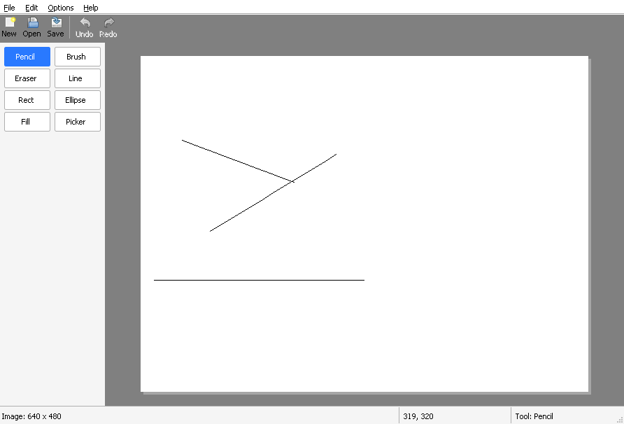

# Chapter 8 - Pencil and brush

[< Chapter 7: Pixels you own](../07-pixels-you-own/README.md)

Last chapter we scribbled black squares. This time we get a pencil, a brush with soft edges, and lines that don't have gaps in them. We'll also meet an object that DrawLite leans on for almost everything from here to the end, the `Edit`.

In this chapter you will

- turn mouse messages into tool calls (`Tool_MouseDown`, `Tool_MouseMove`, `Tool_MouseUp`),
- stamp a round brush into a surface, hard or soft,
- join the stamps with Bresenham's line algorithm,
- learn what an `Edit` is, and why it keeps a copy of the image,
- add an Options menu to change the brush size.

## Before we begin

One new file pair, `src/edit.c` and `edit.h`. `tools.c` and `tools.h` grow a lot, and `canvas.c` hands its mouse messages to them instead of drawing squares itself. `mainwindow.c`, `resource.h` and `drawlite.rc` get the Options menu. Everything else is the same as chapter 7, bar the version number.

Build and run.

```text
cmake -S . -B build && cmake --build build
```

Draw with the mouse. The Pencil tool (selected at start) draws a one pixel line. Click **Brush** in the palette and draw again, then try **Options, Brush Size** and **Options, Soft Brush**. The right mouse button paints with the secondary colour, which is white for now, so it works a bit like an eraser. We get proper colour controls in the next chapter.



Only Pencil and Brush do anything. The other buttons are there, but they'll have to wait for later chapters.

## Breaking it up

### Settings and state

First, somewhere to keep what the user has chosen, and what a tool needs to remember between one mouse message and the next.

```text
30  // Struct: ToolSettings
31  // What the user has chosen. The main window owns one of these and the
32  // canvas looks at it whenever it needs to draw.
33  typedef struct ToolSettings
34  {
35      ToolId tool;
36      uint32_t primary;       // Left button colour, normal 0xAARRGGBB
37      uint32_t secondary;     // Right button colour
38      int brushSize;          // Width in pixels
39      BOOL softBrush;
40  } ToolSettings;
41
42  // Struct: ToolState
43  // What a tool remembers while the mouse button is held down.
44  typedef struct ToolState
45  {
46      Edit *edit;             // The change in progress, or NULL when no button is down
47      int lastX, lastY;       // Where the mouse was last time
48      RECT dirty;             // Changed area the canvas has not repainted yet
49  } ToolState;
```

`ToolSettings` belongs to the main window. The canvas gets a pointer to it with `Canvas_SetSettings` and reads it whenever it needs to. The colours are ordinary, *straight* `0xAARRGGBB` values, the kind a person thinks in. We turn them into premultiplied pixels at the last moment, inside the `Edit`.

`ToolState` belongs to the canvas. While you hold the mouse button down it remembers the stroke in progress (`edit`), where the mouse was last time (`lastX`, `lastY`), and the part of the image that has changed since the window last repainted (`dirty`).

### From mouse to tool

The canvas used to paint squares itself. Now it is a go-between.

```text
183      switch (msg)
184      {
185      case WM_LBUTTONDOWN:
186      case WM_RBUTTONDOWN:
187          if (cv->drawing)
188              return; // Already drawing with the other button
189          cv->drawing = TRUE;
190          SetCapture(cv->hwnd); // Keep getting mouse messages even outside the window
191          Tool_MouseDown(&cv->tool, cv->doc, cv->settings, ix, iy, msg == WM_RBUTTONDOWN);
192          break;
193      case WM_MOUSEMOVE:
194          if (cv->drawing)
195              Tool_MouseMove(&cv->tool, cv->doc, cv->settings, ix, iy);
196          break;
197      case WM_LBUTTONUP:
198      case WM_RBUTTONUP:
199          if (cv->drawing)
200          {
201              Tool_MouseUp(&cv->tool, cv->doc, cv->settings, ix, iy);
202              cv->drawing = FALSE;
203              ReleaseCapture();
204          }
205          break;
206      }
207      Canvas_RepaintDirty(cv);
```

A button going down starts a stroke. Moving, while the button is down, continues it. A button coming up ends it. The `drawing` flag stops a second button from starting a new stroke in the middle of the first. The last line asks the tool whether anything changed and invalidates just that part of the window. We'll come back to it.

The tools themselves are in `tools.c`.

```text
39  void
40  Tool_MouseDown(ToolState *st, Document *doc, const ToolSettings *ts, int x, int y, BOOL useSecond)
41  {
42      uint32_t color = useSecond ? ts->secondary : ts->primary;
43
44      switch (ts->tool)
45      {
46      case TOOL_PENCIL:
47      case TOOL_BRUSH:
48          st->edit = Edit_Begin(doc->surface);
49          if (!st->edit)
50              return;
51          // The pencil is always one hard pixel wide. The brush uses the settings.
52          if (ts->tool == TOOL_PENCIL)
53              Edit_SetBrush(st->edit, color, 1, FALSE);
54          else
55              Edit_SetBrush(st->edit, color, ts->brushSize, ts->softBrush);
56          Edit_Stamp(st->edit, x, y); // A single click leaves a dot
57          break;
58      default:
59          break; // The other tools come in later chapters
60      }
61      st->lastX = x;
62      st->lastY = y;
63      Tool_Collect(st);
64  }
```

When a stroke begins, we start an `Edit`, tell it what colour and size to use, and press the brush down once at the mouse position (`Edit_Stamp`) so a single click leaves a dot. The pencil is always one hard pixel wide. The brush takes its size and softness from the settings. Any other tool falls into `default` and does nothing, until chapter 10.

```text
66  void
67  Tool_MouseMove(ToolState *st, Document *doc, const ToolSettings *ts, int x, int y)
68  {
69      UNREFERENCED_PARAMETER(doc);
70      UNREFERENCED_PARAMETER(ts);
71
72      if (!st->edit)
73          return;
74
75      // Mouse messages only arrive every so often, so a fast stroke is a
76      // series of dots with gaps. We join them with straight lines.
77      Edit_Line(st->edit, st->lastX, st->lastY, x, y);
78      st->lastX = x;
79      st->lastY = y;
80      Tool_Collect(st);
81  }
```

```text
83  void
84  Tool_MouseUp(ToolState *st, Document *doc, const ToolSettings *ts, int x, int y)
85  {
86      Tool_MouseMove(st, doc, ts, x, y);
87      if (!st->edit)
88          return;
89
90      doc->modified = TRUE;
91      Tool_Collect(st);
92      // The pixels are already where they should be, so there is nothing
93      // left to do but let go of the edit.
94      Edit_End(st->edit);
95      st->edit = NULL;
96  }
```

Moving draws a line from the last place to the new one. Letting go draws the final bit of line, marks the document as changed, and throws the `Edit` away. The pixels already live in the surface, so there is nothing to save.

### The Edit

An `Edit` is one change to a surface, from the moment the mouse goes down until it comes back up. A brush stroke is an edit. In later chapters so is a rectangle, and so is a flood fill.

```text
19  // Struct: Edit
20  typedef struct Edit
21  {
22      Surface *target;    // The surface we are painting on
23      Surface *base;      // What it looked like before we started
24      uint8_t *mask;      // How much paint each pixel has had, 0 (none) to 255 (full)
25      uint32_t color;     // Paint colour, normal (not premultiplied) 0xAARRGGBB
26      int size;           // Brush width in pixels
27      BOOL soft;          // Soft edged brush?
28      RECT bounds;        // Everything we have touched so far
29      RECT dirty;         // Touched since the canvas last asked
30  } Edit;
```

There are three things in here we haven't seen before. `base` is a copy of the surface taken *before* we painted anything. `mask` has one byte per pixel and records how much paint that pixel has had so far, from 0 to 255. And `dirty` is the rectangle we have changed since the canvas last asked.

Why keep a copy of the image? It's the simplest way to get see-through paint right. Hold that thought for a moment. First, the stamp.

```text
14  Edit *
15  Edit_Begin(Surface *target)
16  {
17      Edit *e = (Edit *)calloc(1, sizeof(Edit));
18      if (!e)
19          return NULL;
20
21      e->target = target;
22      e->base = Surface_Clone(target);
23      e->mask = (uint8_t *)calloc((size_t)target->width * target->height, 1);
24      if (!e->base || !e->mask)
25      {
26          Edit_End(e);
27          return NULL;
28      }
29      e->color = 0xFF000000;
30      e->size = 1;
31      return e;
32  }
```

`Edit_Begin` makes the copy with `Surface_Clone` from chapter 7, and a zeroed mask. That's a whole extra copy of the picture for every stroke, which is fine for ordinary images and slower for enormous ones. It's a trade I'm happy with, because it keeps the code short.

### Stamping the brush

A brush is a round stamp. To draw a stroke, we press the stamp down at lots of places along the mouse path. Each press is one `Edit_Stamp`.

```text
 96  void
 97  Edit_Stamp(Edit *e, int cx, int cy)
 98  {
 99      Surface *s = e->target;
100      float radius = e->size / 2.0f;
101      int reach = (int)ceilf(radius);
102      RECT area;
103      int x, y;
104      uint32_t colorA = PIX_A(e->color);
105
106      area.left = max(cx - reach, 0);
107      area.top = max(cy - reach, 0);
108      area.right = min(cx + reach + 1, s->width);
109      area.bottom = min(cy + reach + 1, s->height);
110      if (IsRectEmpty(&area))
111          return;
112
113      for (y = area.top; y < area.bottom; y++)
114      {
115          for (x = area.left; x < area.right; x++)
116          {
117              size_t i = (size_t)y * s->width + x;
118              float dist = sqrtf((float)((x - cx) * (x - cx) + (y - cy) * (y - cy)));
119              uint32_t m = (uint32_t)(Edit_Coverage(e, dist, radius) * 255.0f + 0.5f);
120              uint32_t a, src;
121
122              // Keep the strongest coverage any stamp has given this pixel.
123              // This is why a see-through stroke does not get darker where it overlaps itself.
124              if (m <= e->mask[i])
125                  continue;
126              e->mask[i] = (uint8_t)m;
127
128              // Work out the paint at this strength and lay it over the original pixel
129              a = Pixel_Mul255(colorA, m);
130              src = Pixel_Premultiply((a << 24) | (e->color & 0x00FFFFFF));
131              s->pixels[i] = Pixel_Over(src, e->base->pixels[i]);
132          }
133      }
134      Edit_Touch(e, &area);
135  }
```

Let's go through it. `radius` is half the brush size. `reach` is that rounded up, and `area` is the square of pixels around the centre that the brush could possibly touch, clipped so we never leave the surface [lines 106 to 109]. Then we visit every pixel in that square.

For each pixel we work out its distance from the centre [line 118] and ask `Edit_Coverage` how much of the pixel the brush covers. That's the next function.

```text
74  // Function: Edit_Coverage
75  // How much of the pixel at distance dist from the brush centre does the brush cover?
76  // Returns 0.0 to 1.0.
77  static float
78  Edit_Coverage(const Edit *e, float dist, float radius)
79  {
80      if (e->soft)
81      {
82          // Fade out smoothly from the middle to the edge
83          float t = dist / radius;
84          if (t >= 1.0f)
85              return 0.0f;
86          return 1.0f - t * t * (3.0f - 2.0f * t);
87      }
88      else
89      {
90          // Solid, with a one pixel soft edge so circles do not look jagged
91          float c = radius + 0.5f - dist;
92          return c < 0.0f ? 0.0f : (c > 1.0f ? 1.0f : c);
93      }
94  }
```

A hard brush is solid up to its edge, with a one pixel fade so that circles don't look like staircases. A soft brush fades smoothly from full strength at the centre to nothing at the edge, using a curve called smoothstep (`3t² - 2t³`, turned upside down, which starts and ends flat). The answer is a number from 0.0 to 1.0, which we scale to 0 to 255 in `m` [line 119].

One small detail. The centre of the brush is a pixel, not the gap between pixels, so even sizes like 2 and 4 come out a little soft on one side. Sizes are close to what the menu says, not exact.

Now the clever bit, in three lines.

```text
122              // Keep the strongest coverage any stamp has given this pixel.
123              // This is why a see-through stroke does not get darker where it overlaps itself.
124              if (m <= e->mask[i])
125                  continue;
126              e->mask[i] = (uint8_t)m;
127
128              // Work out the paint at this strength and lay it over the original pixel
129              a = Pixel_Mul255(colorA, m);
130              src = Pixel_Premultiply((a << 24) | (e->color & 0x00FFFFFF));
131              s->pixels[i] = Pixel_Over(src, e->base->pixels[i]);
```

Say you're painting with half see-through red, and you drag the brush across a spot. Stamp after stamp lands on the same pixels. If each stamp blended on top of the previous result, the red would get stronger and stronger, and your stroke would turn into a dark blob where it overlaps itself. Nobody wants that.

So instead we remember in `mask` the strongest coverage any stamp has given each pixel [line 124]. A stamp only does something if it beats what is already there. And when it does, we don't blend over the pixel as it is now. We blend over `base`, the pixel as it was before the stroke began [line 131]. Every pixel in a stroke is therefore "the original, plus paint at the strongest strength it got", worked out once, however many times the stamp passes over.

The blending itself is last chapter's work. `Pixel_Mul255` scales the alpha by the coverage. `Pixel_Premultiply` turns the straight colour into a premultiplied pixel, and `Pixel_Over` puts it on the original. Don't worry if that still feels new. You'll see the same three calls again.

An analogy helps here. Think of a rubber stamp that can print each spot on the paper only once. However many times you press it over the same spot, that spot gets its ink once, at the strongest strength any press gave it. The photocopy in the drawer is `base`. It's how we always know what the paper looked like before we started.

### Joining the dots

Windows only tells us where the mouse is every so often. Move quickly and the positions are far apart, so a row of stamps would look like a row of beads. We fill the gaps with a straight line.

```text
137  void
138  Edit_Line(Edit *e, int x0, int y0, int x1, int y1)
139  {
140      // Bresenham's line algorithm. It walks from one end to the other using only
141      // whole numbers, deciding at each step whether to move sideways, up/down, or both.
142      int dx = abs(x1 - x0);
143      int dy = -abs(y1 - y0);
144      int sx = x0 < x1 ? 1 : -1;
145      int sy = y0 < y1 ? 1 : -1;
146      int err = dx + dy;
147
148      for (;;)
149      {
150          int e2;
151
152          Edit_Stamp(e, x0, y0);
153          if (x0 == x1 && y0 == y1)
154              break;
155          e2 = 2 * err;
156          if (e2 >= dy)
157          {
158              err += dy;
159              x0 += sx;
160          }
161          if (e2 <= dx)
162          {
163              err += dx;
164              y0 += sy;
165          }
166      }
167  }
```

This is Bresenham's line algorithm, from the 1960s, and it's lovely. It draws a line using only whole numbers and no division. At each step it has a number, `err`, that says how far the pixel it's on has drifted from the true line. It then decides whether to step sideways, step up or down, or both, to keep the drift small.

Here's a trace for a line from (0,0) to (4,2). Then `dx` is 4, `dy` is -2 and `err` starts at 2.

```text
stamp at   e2 = 2*err   move x?     move y?     next
(0,0)      4            yes         yes         (1,1)
(1,1)      8            yes         no          (2,1)
(2,1)      4            yes         yes         (3,2)
(3,2)      8            yes         no          (4,2)
(4,2)      done
```

Two steps right for every one step up. That's the slope. You don't have to memorise the algorithm. Know that it exists, it's fast, and it never leaves a gap. Every drawing program has one somewhere.

The line stamps the start point too, which the previous stroke segment already did. That's harmless, because the mask makes a second stamp on the same pixel do nothing.

### Telling the canvas what to repaint

In chapter 7 every mouse move repainted the whole canvas. With a big image that gets sluggish. Now `Edit_Stamp` records the area it touched with `Edit_Touch`, and the dirty rectangle is passed up the chain.

```text
24  // Function: Tool_Collect
25  // Moves the area the edit has changed into the tool state, so it is still
26  // there after the edit has been freed.
27  static void
28  Tool_Collect(ToolState *st)
29  {
30      RECT area, merged;
31
32      if (st->edit && Edit_TakeDirty(st->edit, &area))
33      {
34          UnionRect(&merged, &st->dirty, &area);
35          st->dirty = merged;
36      }
37  }
```

`Tool_Collect` moves the edit's dirty rectangle into the tool state. Why the extra step? Because `Tool_MouseUp` frees the edit before the canvas has had a chance to ask. The tool state outlives the edit. Then the canvas picks it up.

```text
142  // Function: Canvas_InvalidateImageRect
143  // Asks Windows to repaint the part of the window that shows this part of the image.
144  static void
145  Canvas_InvalidateImageRect(const Canvas *cv, const RECT *area)
146  {
147      POINT origin = Canvas_ImageOrigin(cv);
148      RECT r = *area;
149
150      OffsetRect(&r, origin.x, origin.y);
151      InvalidateRect(cv->hwnd, &r, FALSE);
152  }
```

The rectangle is in image co-ordinates, so we shift it by the image origin to get window co-ordinates, and call `InvalidateRect` with it. Windows then sends a `WM_PAINT` whose `ps.rcPaint` is just that small box.

`Canvas_OnPaint` takes advantage of it.

```text
222      GetClientRect(cv->hwnd, &client);
223      // The back buffer only needs to be as big as the area being repainted.
224      // A tiny brush stroke should not allocate a window-sized bitmap.
225      int paintW = ps.rcPaint.right - ps.rcPaint.left;
226      int paintH = ps.rcPaint.bottom - ps.rcPaint.top;
227
228      if (paintW <= 0 || paintH <= 0)
229      {
230          EndPaint(cv->hwnd, &ps);
231          return;
232      }
233      memDC = CreateCompatibleDC(hdc);
234      memBitmap = CreateCompatibleBitmap(hdc, paintW, paintH);
235      oldBitmap = (HBITMAP)SelectObject(memDC, memBitmap);
236      // Shift the origin so we can keep drawing in window co-ordinates
237      SetViewportOrgEx(memDC, -ps.rcPaint.left, -ps.rcPaint.top, NULL);
```

The back buffer used to be as big as the window. Now it's only as big as `rcPaint`. A small brush stroke shouldn't allocate a window-sized bitmap sixty times a second. The back buffer is smaller, though, so a point such as (500, 300) in the window is no longer at (500, 300) in the buffer. `SetViewportOrgEx` fixes that.

```c
BOOL SetViewportOrgEx(HDC hdc,          // The DC to change
                      int x, int y,     // Where logical (0, 0) should land on the bitmap
                      LPPOINT lppt);    // Receives the old origin. NULL if you don't care
```

We shift the origin by minus the top left of `rcPaint`, and then all the code that follows can carry on drawing in window co-ordinates, as if nothing had changed. The final `BitBlt` copies from the same logical position, which now maps to the top left of the buffer.

### The Options menu

Four small pieces of plumbing. The menu is in `drawlite.rc`, the ids are in `resource.h`, and the main window handles them.

```text
233      if (id >= IDM_BRUSH_FIRST && id <= IDM_BRUSH_LAST)
234      {
235          static const int sizes[] = { 1, 2, 4, 8, 16, 32 };
236          mw->settings.brushSize = sizes[id - IDM_BRUSH_FIRST];
237          MainWindow_CheckBrushSize(mw, id);
238          return;
239      }
240
241      switch (id)
242      {
243      case IDM_OPT_SOFT:
244          mw->settings.softBrush = !mw->settings.softBrush;
245          CheckMenuItem(GetMenu(mw->hwnd), IDM_OPT_SOFT, MF_BYCOMMAND | (mw->settings.softBrush ? MF_CHECKED : MF_UNCHECKED));
246          break;
```

The brush sizes have consecutive ids, `IDM_BRUSH_FIRST` to `IDM_BRUSH_LAST`, so the size is `sizes[id - IDM_BRUSH_FIRST]`. One line handles all six. The Soft Brush item flips a flag and moves its tick.

```c
DWORD CheckMenuItem(HMENU hMenu,        // The menu
                    UINT uIDCheckItem,  // Which item. See next parameter
                    UINT uCheck);       // MF_BYCOMMAND (the item's id) plus MF_CHECKED or MF_UNCHECKED
```

Windows doesn't tick menu items for you. You do it yourself. `MainWindow_CheckBrushSize` makes sure only one size has a tick.

```text
272  // Function: MainWindow_CheckBrushSize
273  // Puts the tick next to the chosen brush size in the menu.
274  static void
275  MainWindow_CheckBrushSize(MainWindow *mw, int id)
276  {
277      HMENU menu = GetMenu(mw->hwnd);
278      int i;
279
280      for (i = IDM_BRUSH_FIRST; i <= IDM_BRUSH_LAST; i++)
281          CheckMenuItem(menu, i, MF_BYCOMMAND | (i == id ? MF_CHECKED : MF_UNCHECKED));
282  }
```

The window doesn't hold any of this state in the menu itself. The truth is in `mw->settings`, and the menu just shows it.

## Adding functionality

Let's add a 64 pixel brush. It takes three small edits.

1. In `resource.h`, add `#define IDM_BRUSH_64 606` and change `IDM_BRUSH_LAST` to 606.
2. In `drawlite.rc`, add `MENUITEM "&64 pixels", IDM_BRUSH_64` below the 32 pixel line.
3. In `mainwindow.c`, add `, 64` to the end of the `sizes` array.

Rebuild. The new item appears, and the ticks and the size selection work with no other change. That's the benefit of using consecutive ids.

## Exercise

Show the brush size next to the tool name in the status bar, as in "Tool: Brush (16 px)", and keep it up to date when the size changes.

*Hint: Change the format string in `MainWindow_ShowToolName`, then call it again after the brush size is set in `MainWindow_OnCommand`.*

## That's it

We have a pencil and a brush. They paint in black and white, though, and there's nothing see-through about them yet. In the next chapter we add colours, a swap button, an alpha slider and the standard Windows colour dialog.

[Chapter 9: Colour](../09-colour/README.md)
