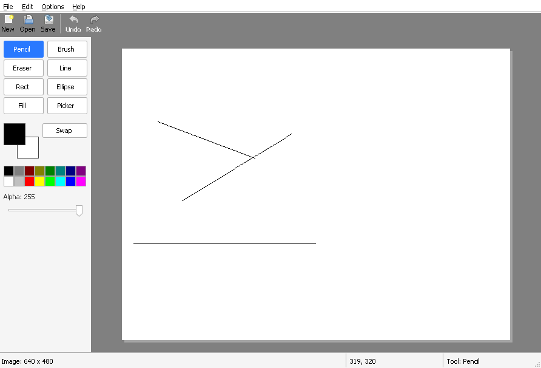

# Chapter 10 - Shapes

[< Chapter 9: Colour](../09-colour/README.md)

The Line, Rect and Ellipse buttons have been sitting in the tool palette since chapter 5, looking pretty and doing nothing. Time to put them to work.

In this chapter you will

- draw lines, rectangles and ellipses by dragging,
- watch the shape grow and shrink under the mouse,
- hold Shift to get squares, circles and tidy angles,
- choose between outline, filled and filled with outline.

## Before we begin

No new files this time. The changes are in `edit.c`, `tools.c`, `canvas.c` and `mainwindow.c`, plus a few lines in `resource.h` and `drawlite.rc` for the new menu. From the chapter folder, build it the same way as always.

```text
cmake -S . -B build && cmake --build build
```

If you need a reminder of how to run it with your compiler, [chapter 1](../01-hello-win32/README.md) has all three options. Pick the **Rect** or **Ellipse** tool, press the left mouse button on the canvas and drag.



Hold Shift while you drag and the rectangle snaps to a square, the ellipse to a circle. Open **Options, Shape Style** and try the other two styles. There isn't much code behind it, but there is one clever trick, so let's go through it.

## Breaking it up

### The big idea: draw it again

Think about how a pencil stroke works. Every time the mouse moves, we add a bit more paint. We never take any back. A shape is different. While you drag, the rectangle keeps changing size, and the old, smaller one has to disappear.

We could try to erase just the edges of the old shape, but that gets messy fast. Filled shapes, soft brushes and see-through colours all make "just erase the edges" a nightmare. So we do something much simpler. On every mouse move we put the picture back exactly as it was when the button went down, then draw the whole shape again from scratch.

Picture an architect with a sheet of tracing paper over a plan. If the sketch goes wrong, she doesn't try to rub out one wobbly line. She lifts the tracing paper, lays down a clean sheet, and draws the whole thing again. The plan underneath is never touched.

Good news. We already have the plan. Since chapter 8, every `Edit` keeps a copy of the surface from before the stroke started, the `base`. All we need is a way to say "go back to that copy".

### Shift needs the mouse flags

Every mouse message comes with a set of flags in `wParam`. They tell you which buttons and which of the Shift and Ctrl keys are held at that moment. They all start with `MK_`, for "mouse key". Up to now the canvas ignored them (we even told the compiler so with `UNREFERENCED_PARAMETER`). Now we pass them down to the tools.

```text
184      case WM_LBUTTONDOWN:
185      case WM_RBUTTONDOWN:
186          if (cv->drawing)
187              return; // Already drawing with the other button
188          cv->drawing = TRUE;
189          SetCapture(cv->hwnd); // Keep getting mouse messages even outside the window
190          Tool_MouseDown(&cv->tool, cv->doc, cv->settings, ix, iy, msg == WM_RBUTTONDOWN, keys);
191          break;
192      case WM_MOUSEMOVE:
193          if (cv->drawing)
194              Tool_MouseMove(&cv->tool, cv->doc, cv->settings, ix, iy, keys);
195          break;
196      case WM_LBUTTONUP:
197      case WM_RBUTTONUP:
198          if (cv->drawing)
199          {
200              Tool_MouseUp(&cv->tool, cv->doc, cv->settings, ix, iy, keys);
201              cv->drawing = FALSE;
202              ReleaseCapture();
203          }
204          break;
205      }
```

`Tool_MouseDown`, `Tool_MouseMove` and `Tool_MouseUp` each get a new `keys` parameter at the end. Inside the tool, `keys & MK_SHIFT` is non-zero when Shift is down. There is also `MK_CONTROL`, which we will use in the exercise.

### Remembering where we started

A shape needs two points, where the mouse went down and where it is now. The pencil only ever needed the last point, so `ToolState` gets a few more fields.

```text
54  typedef struct ToolState
55  {
56      Edit *edit;             // The change in progress, or NULL when no button is down
57      int lastX, lastY;       // Where the mouse was last time
58      int startX, startY;     // Where the mouse went down
59      BOOL useSecond;         // Was it the right button?
60      RECT dirty;             // Changed area the canvas has not repainted yet
61  } ToolState;
```

`startX` and `startY` are filled in by `Tool_MouseDown`. `useSecond` remembers which button we started with, because that decides the colour. We could dig it out of the later messages, but it's simpler to remember it once.

### Tool_DrawShape

All three shapes go through one function. It is called on mouse down, on every mouse move, and once more on mouse up, and it does the same thing each time.

```text
43  static void
44  Tool_DrawShape(ToolState *st, const ToolSettings *ts, int x, int y, UINT keys)
45  {
46      uint32_t mainColor = st->useSecond ? ts->secondary : ts->primary;
47      uint32_t other = st->useSecond ? ts->primary : ts->secondary;
48      int x0 = st->startX, y0 = st->startY;
49      int dx = x - x0, dy = y - y0;
50      int adx = abs(dx), ady = abs(dy);
51      BOOL outline = ts->shapeStyle != SHAPE_FILLED;
52      BOOL fill = ts->shapeStyle != SHAPE_OUTLINE;
```

First it works out the two colours. The left button draws with the primary colour and the right button with the secondary, and `other` is whichever one is left over. Then it works out the vector `dx`, `dy` from the start to the mouse.

```text
54      // Holding Shift keeps things regular: squares, circles, and lines at 45 degree steps
55      if (keys & MK_SHIFT)
56      {
57          if (ts->tool == TOOL_LINE)
58          {
59              if (adx > 2 * ady)
60                  dy = 0;
61              else if (ady > 2 * adx)
62                  dx = 0;
63              else
64              {
65                  int side = max(adx, ady);
66                  dx = dx < 0 ? -side : side;
67                  dy = dy < 0 ? -side : side;
68              }
69          }
70          else
71          {
72              int side = max(adx, ady);
73              dx = dx < 0 ? -side : side;
74              dy = dy < 0 ? -side : side;
75          }
76      }
```

This is the Shift handling [lines 55 to 76]. For a rectangle or ellipse we make both sides equal to the longer one, keeping the direction you were dragging in, which gives a square or a circle. For a line it is a bit more fun. If the line is mostly sideways (more than twice as wide as tall) we flatten it. If it is mostly up and down we straighten it. Anywhere in between becomes a 45 degree diagonal.

```text
78      Edit_Reset(st->edit);
79      Edit_SetBrush(st->edit, mainColor, ts->brushSize, ts->softBrush);
80      // A filled shape with no outline uses the main colour for its inside
81      Edit_SetFillColor(st->edit, ts->shapeStyle == SHAPE_FILLED ? mainColor : other);
82
83      switch (ts->tool)
84      {
85      case TOOL_LINE:
86          Edit_Line(st->edit, x0, y0, x0 + dx, y0 + dy);
87          break;
88      case TOOL_RECT:
89          Edit_Rect(st->edit, x0, y0, x0 + dx, y0 + dy, outline, fill);
90          break;
91      case TOOL_ELLIPSE:
92          Edit_Ellipse(st->edit, x0, y0, x0 + dx, y0 + dy, outline, fill);
93          break;
94      default:
95          break;
96      }
```

Here is the trick [line 78]. `Edit_Reset` puts the surface back to how it was. Then we set the brush and the fill colour and draw the shape afresh, from the start point to the corner we worked out. In `SHAPE_FILLED` mode there is no outline, so the inside gets the main colour. Otherwise [line 81] the inside gets `other`, so a left button drag gives you a primary coloured outline filled with the secondary colour.

The line tool ignores the shape style. A line has no inside.

### Edit_Reset

Here is how `Edit_Reset` puts things back.

```text
215  void
216  Edit_Reset(Edit *e)
217  {
218      RECT area = e->bounds;
219      int y;
220
221      if (IsRectEmpty(&area))
222          return;
223
224      // Forget the paint in the area we have touched, then put the original pixels back
225      for (y = area.top; y < area.bottom; y++)
226      {
227          size_t row = (size_t)y * e->target->width + area.left;
228          size_t count = (size_t)(area.right - area.left);
229
230          memset(e->mask + row, 0, count);
231          if (e->fillMask)
232              memset(e->fillMask + row, 0, count);
233          memcpy(e->target->pixels + row, e->base->pixels + row, count * sizeof(uint32_t));
234      }
235      Edit_Touch(e, &area);
236  }
```

It only touches `e->bounds`, which is the rectangle covering everything the edit has changed so far. There is no point copying a whole 4000 pixel wide image back when we only drew in the corner. For each row in that rectangle it clears the masks, then copies the original pixels back over the top. `Edit_Touch` marks the area as needing a repaint, so the canvas redraws the bit where the old shape used to be.

### Masks, and why Edit_Stamp changed

Since chapter 8, a brush stroke has recorded how much paint each pixel has received in `mask`, a byte per pixel. The stamp used to blend the colour into the surface right away. That worked for strokes, but a shape has two layers: an inside and an outline that sits on top of it. So now there are two masks, `mask` for the outline (or brush) and `fillMask` for the inside, and the pixels are worked out in one place.

```text
108  // Function: Edit_Compose
109  // Works out the final pixels for an area: the original, then the fill on top,
110  // then the outline on top of that. Nothing is added to what is already
111  // there, so doing it twice gives the same answer as doing it once.
112  static void
113  Edit_Compose(Edit *e, const RECT *area)
114  {
115      Surface *s = e->target;
116      int x, y;
117
118      for (y = area->top; y < area->bottom; y++)
119      {
120          for (x = area->left; x < area->right; x++)
121          {
122              size_t i = (size_t)y * s->width + x;
123              uint32_t p = e->base->pixels[i];
124
125              if (e->fillMask && e->fillMask[i])
126                  p = Pixel_Over(Edit_Paint(e->fillColor, e->fillMask[i]), p);
127              if (e->mask[i])
128                  p = Pixel_Over(Edit_Paint(e->color, e->mask[i]), p);
129              s->pixels[i] = p;
130          }
131      }
132  }
```

For every pixel in the area, start with the original from `base`. If the fill mask says there is fill here, lay the fill colour over it. Then, if the mask says there is outline, lay that on top. The result goes into the surface.

The important line in the comment is "nothing is added to what is already there". We always start from `base`, never from what is on screen, so calling `Edit_Compose` twice on the same pixel gives the same answer as calling it once. That is what makes it safe to redraw as often as we like.

`Edit_Stamp` now only updates the mask [lines 169 and 170] and then calls `Edit_Compose` [line 173].

```text
159      for (y = area.top; y < area.bottom; y++)
160      {
161          for (x = area.left; x < area.right; x++)
162          {
163              size_t i = (size_t)y * s->width + x;
164              float dist = sqrtf((float)((x - cx) * (x - cx) + (y - cy) * (y - cy)));
165              uint32_t m = (uint32_t)(Edit_Coverage(e, dist, radius) * 255.0f + 0.5f);
166
167              // Keep the strongest coverage any stamp has given this pixel.
168              // This is why a see-through stroke does not get darker where it overlaps itself.
169              if (m > e->mask[i])
170                  e->mask[i] = (uint8_t)m;
171          }
172      }
173      Edit_Compose(e, &area);
174      Edit_Touch(e, &area);
175  }
```

The `fillMask` is only allocated the first time something is filled, in `Edit_FillSpan`, so pencil strokes don't pay for memory they never use.

### Edit_Rect

```text
277  void
278  Edit_Rect(Edit *e, int x0, int y0, int x1, int y1, BOOL outline, BOOL fill)
279  {
280      int y;
281      // Stroke along the inside edge so the outer edge of the line sits on the box we dragged
282      int inset = (e->size - 1) / 2;
283
284      Edit_Order(&x0, &y0, &x1, &y1);
285
286      if (fill)
287          for (y = y0; y <= y1; y++)
288              Edit_FillSpan(e, y, x0, x1);
289
290      if (outline)
291      {
292          int l = min(x0 + inset, (x0 + x1) / 2), r = max(x1 - inset, (x0 + x1 + 1) / 2);
293          int t = min(y0 + inset, (y0 + y1) / 2), b = max(y1 - inset, (y0 + y1 + 1) / 2);
294
295          Edit_Line(e, l, t, r, t);
296          Edit_Line(e, r, t, r, b);
297          Edit_Line(e, r, b, l, b);
298          Edit_Line(e, l, b, l, t);
299      }
300  }
```

The inside is easy. One `Edit_FillSpan` per row fills a horizontal run of pixels. The outline is four calls to `Edit_Line`, going round the edge with the current brush. Because the brush has a width, a thick line is centred on the path we give it. If we ran the path along the very edge of the box, half of a 16 pixel line would stick out beyond where you dragged. So `inset` pulls the path inwards by half the brush width, which keeps the outside edge of the line on the box. The `min` and `max` stop the path from crossing over itself when the box is smaller than the brush.

### Edit_Ellipse

The ellipse is the maths-heavy one. Don't worry if it is a bit hazy. You can use it without understanding every line.

```text
302  void
303  Edit_Ellipse(Edit *e, int x0, int y0, int x1, int y1, BOOL outline, BOOL fill)
304  {
305      // Work in pixel edges: the box covers x0 to x1+1, so its centre is half way between.
306      double cx, cy, rx, ry;
307      double inset = (e->size - 1) / 2.0;
308      int y;
309
310      Edit_Order(&x0, &y0, &x1, &y1);
311      cx = (x0 + x1 + 1) / 2.0;
312      cy = (y0 + y1 + 1) / 2.0;
313      rx = (x1 - x0 + 1) / 2.0;
314      ry = (y1 - y0 + 1) / 2.0;
315
316      if (fill)
317      {
318          for (y = y0; y <= y1; y++)
319          {
320              // How far from the middle row are we, as a fraction of the height?
321              double dy = (y + 0.5 - cy) / ry;
322              double half;
323              if (dy > 1.0 || dy < -1.0)
324                  continue;
325              // From x^2/rx^2 + y^2/ry^2 = 1, the half width of this row
326              half = rx * sqrt(1.0 - dy * dy);
327              Edit_FillSpan(e, y, (int)ceil(cx - half - 0.5), (int)floor(cx + half - 0.5));
328          }
329      }
```

We treat the dragged box as covering the *edges* of its pixels, so it runs from `x0` to `x1 + 1`. That gives us the centre `cx, cy` and the two radii `rx, ry` [lines 311 to 314]. To fill it, we visit each row, measure how far its middle (the `+ 0.5`) is from the centre of the ellipse as a fraction `dy` of the radius [line 321], and use the equation of an ellipse to find how wide the ellipse is at that height. Then one `Edit_FillSpan` fills that stretch.

```text
331      if (outline)
332      {
333          // The path runs through the middle of the outermost pixels, so it is half a pixel
334          // smaller than the box, and a thick brush needs room on the inside as well.
335          double orx = max(rx - 0.5 - inset, 0.0), ory = max(ry - 0.5 - inset, 0.0);
336          int steps = max(16, (int)(4.0 * (orx + ory)));
337          int i, px = 0, py = 0;
338
339          // Walk around the ellipse in small steps and join the dots with lines
340          for (i = 0; i <= steps; i++)
341          {
342              double angle = 6.283185307179586 * i / steps;
343              int x = (int)floor(cx - 0.5 + orx * cos(angle) + 0.5);
344              int yy = (int)floor(cy - 0.5 + ory * sin(angle) + 0.5);
345              if (i == 0)
346                  Edit_Stamp(e, x, yy);
347              else
348                  Edit_Line(e, px, py, x, yy);
349              px = x;
350              py = yy;
351          }
352      }
353  }
```

The outline is an approximation [lines 335 to 351]. We walk round the ellipse in `steps` small angle steps, work out a point each time with `cos` and `sin`, and join the dots with `Edit_Line`. The bigger the ellipse, the more steps. It is a polygon, not a perfect curve, though at normal sizes the steps are small enough to look smooth. The radius is shrunk by half a pixel and by `inset` so the outside of the line lands on the box, like the rectangle.

### The Shape Style menu

The three styles live in an enum.

```text
30  // Enum: ShapeStyle
31  // How the rectangle and ellipse tools draw.
32  typedef enum ShapeStyle
33  {
34      SHAPE_OUTLINE,      // Just the outline, in the paint colour
35      SHAPE_FILLED,       // Just the inside, in the paint colour
36      SHAPE_BOTH          // Outline in the paint colour, inside in the other colour
37  } ShapeStyle;
```

The menu is another popup in **Options**, and `ToolSettings` has a `shapeStyle` field for the choice. We need a tick next to the current one in the menu, just as for brush sizes. Instead of copying the brush size code, `MainWindow_CheckBrushSize` has become a function that works for any run of consecutive menu ids.

```text
281  // Function: MainWindow_CheckRadio
282  // Ticks one menu item out of a run of ids and unticks the rest.
283  static void
284  MainWindow_CheckRadio(MainWindow *mw, int first, int last, int checked)
285  {
286      HMENU menu = GetMenu(mw->hwnd);
287      int i;
288
289      for (i = first; i <= last; i++)
290          CheckMenuItem(menu, i, MF_BYCOMMAND | (i == checked ? MF_CHECKED : MF_UNCHECKED));
291  }
```

We call it with the first and last ids of the group, and the one to tick. The resource ids for the new menu are numbered in a block (`IDM_SHAPE_FIRST` to `IDM_SHAPE_LAST`) so the command handler can subtract to turn a menu id into a `ShapeStyle`.

```text
243      if (id >= IDM_SHAPE_FIRST && id <= IDM_SHAPE_LAST)
244      {
245          mw->settings.shapeStyle = (ShapeStyle)(id - IDM_SHAPE_FIRST);
246          MainWindow_CheckRadio(mw, IDM_SHAPE_FIRST, IDM_SHAPE_LAST, id);
247          return;
248      }
```

### What it can't do

A few honest limitations. The whole shape is redrawn on every mouse move, so a big shape with a thick brush does a lot more work on each mouse move than a pencil stroke does. Once you let go the shape is final, and there is no way to grab it and adjust it. The outline of a see-through colour is blended once, not once per overlapping stamp, which is what you want but may surprise you if you have used other programs.

## Adding functionality

Let's make the inside of a "Filled with Outline" shape half see-through. In `Tool_DrawShape`, find the line that calls `Edit_SetFillColor` [line 81] and change it to

```c
Edit_SetFillColor(st->edit, ts->shapeStyle == SHAPE_FILLED ? mainColor
                                                          : (other & 0x00FFFFFF) | 0x80000000);
```

The top byte of the colour is its alpha. `0x80` is about half. `Edit_Paint` (which `Edit_Compose` calls) multiplies the fill by that alpha, so you can see the picture underneath through the inside of the shape. Draw one over some scribbles to see it.

## Exercise

Make the rectangle and ellipse tools draw from the centre when Ctrl is held down, so that the point where you pressed becomes the middle and the mouse drags out a corner.

*Hint: Test `keys & MK_CONTROL` in `Tool_DrawShape`, then pass `x0 - dx` and `y0 - dy` as the first corner instead of `x0` and `y0`.*

## That's it

Congratulations! Your paint program can draw. Next we will add the other three buttons: the paint bucket, the colour picker and the eraser.

[Chapter 11: Fill, picker and eraser](../11-fill-picker-eraser/README.md)
