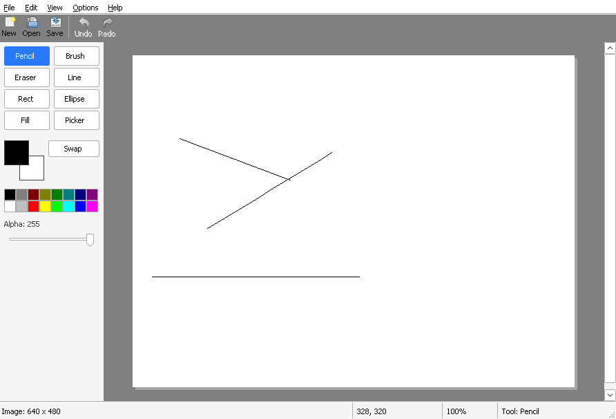

# Chapter 12 - Zoom and scroll

[< Chapter 11: Fill, picker and eraser](../11-fill-picker-eraser/README.md)

Up to now, one pixel in your picture has been exactly one pixel on screen. That is fine for a 640 by 480 doodle. It is no use for a big picture that doesn't fit in the window, or for fixing a single wrong pixel. This chapter fixes both.

In this chapter you will

- zoom from 25% to 3200% with `StretchBlt`,
- add scroll bars to the canvas and respond to them,
- scroll and zoom with the mouse wheel, and pan with the middle button,
- draw a grid between the pixels when you are zoomed right in,
- find out why dividing negative numbers in C can ruin your day.

## Before we begin

No new files. Almost everything happens in `canvas.c`. There is a new **View** menu in `drawlite.rc`, a few new ids in `resource.h`, and a fourth part on the status bar in `mainwindow.c` to show the zoom. Build it as before. [Chapter 1](../01-hello-win32/README.md) has the details for each compiler.

```text
cmake -S . -B build && cmake --build build
```

Run it, draw something, and press **Ctrl and +** a few times.



Here is what you can do now.

- **View, Zoom In** (Ctrl and +) and **Zoom Out** (Ctrl and -) step through the zoom levels: 25, 50, 100, 200, 300, 400, 600, 800, 1200, 1600 and 3200 percent.
- **Actual Size** (Ctrl and 0) goes back to 100%. **Fit to Window** (Ctrl and 9) picks the biggest level at which the whole picture is visible.
- Hold Ctrl and turn the mouse wheel to zoom. The spot under the mouse stays where it is.
- The wheel alone scrolls up and down, Shift and the wheel scrolls sideways, and dragging with the middle button pans.
- From 800% up, a grid appears between the pixels.

## Breaking it up

### The big idea: two sets of co-ordinates

Picture a big poster lying on a table, and a picture frame that you slide around on top of it. You only see the part of the poster inside the frame. The poster is the zoomed image. The frame is our window. Scrolling is sliding the frame. Zooming is swapping the poster for a bigger or smaller print, and making sure that the bit you were looking at stays under the frame.

That gives us two sets of numbers to keep apart. **Window co-ordinates** are where something is in the window, in screen pixels. **Image co-ordinates** are which pixel of the picture we mean. Until now they differed by a fixed offset, the position of the image's top left corner. At 400% one image pixel is four screen pixels wide, so the conversion needs a divide as well.

The `Canvas` struct gets some new fields to hold all this.

```text
29  // Everything the canvas window needs to remember.
30  typedef struct Canvas
31  {
32      HWND hwnd;
33      Document *doc;      // The picture we show. Not owned by us.
34      ToolSettings *settings;   // Colours, brush size and so on. Owned by the main window.
35      ToolState tool;     // The tool in action
36      BOOL drawing;       // Is a mouse button down?
37      int zoom;           // In percent. 100 is one image pixel per screen pixel.
38      int scrollX;        // How far the view has moved right and down, in zoomed pixels
39      int scrollY;
40      BOOL panning;       // Dragging with the middle button?
41      POINT panStart;     // Where the pan began, in window co-ordinates
42      int panScrollX, panScrollY;
43      BOOL inScrollUpdate; // Stops a loop when changing scroll bars changes our size
44  } Canvas;
```

`zoom` is a percentage, and `scrollX` and `scrollY` say how far the view has moved, measured in zoomed pixels. The `panning` fields are for the middle button, and `inScrollUpdate` we will meet in a moment.

### Where is the image?

`Canvas_ImageOrigin` works out where the top left corner of the image is in the window.

```text
293  // Function: Canvas_ImageOrigin
294  // Where the top left pixel of the image is, in canvas window co-ordinates.
295  // If the image (zoomed) is smaller than the window it sits in the middle.
296  // Otherwise the scroll position decides.
297  static POINT
298  Canvas_ImageOrigin(const Canvas *cv)
299  {
300      RECT client;
301      POINT origin = { 0, 0 };
302
303      GetClientRect(cv->hwnd, &client);
304      if (cv->doc)
305      {
306          int zw = cv->doc->width * cv->zoom / 100;
307          int zh = cv->doc->height * cv->zoom / 100;
308
309          if (zw + 2 * CANVAS_MARGIN <= client.right)
310              origin.x = (client.right - zw) / 2;
311          else
312              origin.x = CANVAS_MARGIN - cv->scrollX;
313
314          if (zh + 2 * CANVAS_MARGIN <= client.bottom)
315              origin.y = (client.bottom - zh) / 2;
316          else
317              origin.y = CANVAS_MARGIN - cv->scrollY;
318      }
319      return origin;
320  }
```

`zw` and `zh` are the size of the zoomed picture. If it fits in the window, with a margin of 16 pixels on each side (`CANVAS_MARGIN`), we centre it, as we always did. If it doesn't fit, the origin is the margin minus the scroll position. Scroll right by 100 and the picture slides 100 pixels to the left. The two directions are decided separately, so a wide, short picture can be centred vertically and scrolled horizontally.

### FloorDiv

Now the other direction. Given a mouse position, which pixel of the picture is it over?

```text
61  // Function: FloorDiv
62  // Integer division that rounds down. C rounds towards zero, which gives the
63  // wrong answer for negative numbers: -1 / 4 is 0 in C, but the pixel is -1.
64  static int
65  FloorDiv(int a, int b)
66  {
67      int q = a / b;
68      if ((a % b != 0) && ((a < 0) != (b < 0)))
69          q--;
70      return q;
71  }
```

```text
322  // Function: Canvas_ToImage
323  // Turns a position in the window into a pixel in the image.
324  static void
325  Canvas_ToImage(const Canvas *cv, int x, int y, int *ix, int *iy)
326  {
327      POINT origin = Canvas_ImageOrigin(cv);
328      *ix = FloorDiv((x - origin.x) * 100, cv->zoom);
329      *iy = FloorDiv((y - origin.y) * 100, cv->zoom);
330  }
```

`Canvas_ToImage` takes the distance from the image's corner, multiplies by 100 and divides by the zoom. We multiply first so that we stay with whole numbers. At 400%, a mouse position 10 pixels from the corner is `10 * 100 / 400`, which is pixel 2, because pixels 0, 1 and 2 are 4 pixels wide each and 10 lies in the third.

So why not just use `/`? Because C rounds towards zero. Take a mouse position one screen pixel to the *left* of the image at 400%. The distance is -1, and `-100 / 400` is `0` in C. That says the mouse is over pixel 0, which is wrong. It is over pixel -1, outside the picture. With plain division, a strip of screen pixels just outside the left and top edges would all claim to be pixel 0, and a click there would paint on the picture. `FloorDiv` rounds down instead, so -1 stays -1.

Don't worry if you have to read that twice. Just remember that negative numbers and integer division need care.

### StretchBlt

Drawing the picture at a different size is the job of `StretchBlt`. In chapter 7 we used `BitBlt`, which copies a block of pixels. `StretchBlt` does the same thing, but takes two rectangles, a source and a destination, and squeezes or stretches to fit.

```c
BOOL StretchBlt(HDC hdcDest,    // Where to draw to
                int xDest,      // Top left of the destination rectangle...
                int yDest,
                int wDest,      // ...and its size
                int hDest,
                HDC hdcSrc,     // Where to copy from
                int xSrc,       // Top left of the source rectangle...
                int ySrc,
                int wSrc,       // ...and its size
                int hSrc,
                DWORD rop);     // What to do with the pixels. SRCCOPY means "just copy"
```

When the destination is bigger than the source, each source pixel is repeated. When it is smaller, some are thrown away. How that is done depends on the *stretch mode* of the destination.

```c
int SetStretchBltMode(HDC hdc,      // The device context to change
                      int mode);    // How to combine pixels when shrinking
```

The default mode averages pixels when shrinking. That is good for photos, but we want the exact pixels, so we choose `COLORONCOLOR`, which just throws pixels away or repeats them. At 800% you should see sharp little squares, not a blur.

```text
663          // Which part of the image is inside the area we are repainting?
664          SetRect(&imageRect, origin.x, origin.y, origin.x + zw, origin.y + zh);
665          if (IntersectRect(&visible, &imageRect, &ps.rcPaint))
666          {
667              // Work out which image pixels that covers, rounding outwards to
668              // whole pixels. Stretching whole pixels keeps the picture steady
669              // however we are scrolled.
670              int sx0 = FloorDiv((visible.left - origin.x) * 100, cv->zoom);
671              int sy0 = FloorDiv((visible.top - origin.y) * 100, cv->zoom);
672              int sx1 = FloorDiv((visible.right - origin.x) * 100 + cv->zoom - 1, cv->zoom);
673              int sy1 = FloorDiv((visible.bottom - origin.y) * 100 + cv->zoom - 1, cv->zoom);
674
675              sx1 = min(sx1, cv->doc->width);
676              sy1 = min(sy1, cv->doc->height);
677
678              // The surface has a GDI bitmap behind it, so we can select it into a DC
679              // and copy it like any other bitmap. StretchBlt does the zooming.
680              imageDC = CreateCompatibleDC(hdc);
681              oldImage = (HBITMAP)SelectObject(imageDC, cv->doc->surface->bitmap);
682              // COLORONCOLOR just throws pixels away or repeats them. No blurring.
683              SetStretchBltMode(memDC, COLORONCOLOR);
684              StretchBlt(memDC,
685                  origin.x + sx0 * cv->zoom / 100, origin.y + sy0 * cv->zoom / 100,
686                  (sx1 - sx0) * cv->zoom / 100, (sy1 - sy0) * cv->zoom / 100,
687                  imageDC, sx0, sy0, sx1 - sx0, sy1 - sy0, SRCCOPY);
688              SelectObject(imageDC, oldImage);
689              DeleteDC(imageDC);
690
691              if (cv->zoom >= GRID_ZOOM)
692                  Canvas_DrawGrid(cv, memDC, origin, &visible);
693          }
```

You might expect to stretch the whole picture on every repaint. Resist. A 640 by 480 picture at 3200% would be 20480 by 15360 pixels. Instead we work out which part of the picture is actually in the area Windows asked us to repaint (`ps.rcPaint`), and stretch only that. The `FloorDiv` lines [lines 670 to 673] turn the visible rectangle into image pixels, rounding *outwards* so that we always stretch whole image pixels. If we cut a pixel in half at the edge, the picture would shimmer as you scroll.

The shadow, the grey workspace and the double buffer from chapter 7 are all still there. We only changed how the picture gets onto the back buffer.

At zoom levels below 100%, the sizes are worked out with whole number division, so they are approximate. Zoomed out, the picture is a rough preview, not a pixel perfect one.

### The grid

At high zoom it helps to see where one pixel ends and the next begins.

```text
584  // Function: Canvas_DrawGrid
585  // When zoomed right in, draws thin lines between the pixels.
586  static void
587  Canvas_DrawGrid(const Canvas *cv, HDC hdc, POINT origin, const RECT *area)
588  {
589      HPEN pen = CreatePen(PS_SOLID, 1, RGB(160, 160, 160));
590      HPEN oldPen = (HPEN)SelectObject(hdc, pen);
591      int x0 = FloorDiv((area->left - origin.x) * 100, cv->zoom);
592      int x1 = FloorDiv((area->right - origin.x) * 100, cv->zoom) + 1;
593      int y0 = FloorDiv((area->top - origin.y) * 100, cv->zoom);
594      int y1 = FloorDiv((area->bottom - origin.y) * 100, cv->zoom) + 1;
595      int i;
596
597      x0 = max(x0, 0);
598      y0 = max(y0, 0);
599      x1 = min(x1, cv->doc->width);
600      y1 = min(y1, cv->doc->height);
601
602      for (i = x0; i <= x1; i++)
603      {
604          int sx = origin.x + i * cv->zoom / 100;
605          MoveToEx(hdc, sx, origin.y + y0 * cv->zoom / 100, NULL);
606          LineTo(hdc, sx, origin.y + y1 * cv->zoom / 100);
607      }
608      for (i = y0; i <= y1; i++)
609      {
610          int sy = origin.y + i * cv->zoom / 100;
611          MoveToEx(hdc, origin.x + x0 * cv->zoom / 100, sy, NULL);
612          LineTo(hdc, origin.x + x1 * cv->zoom / 100, sy);
613      }
614      SelectObject(hdc, oldPen);
615      DeleteObject(pen);
616  }
```

It creates a thin grey pen, works out which image columns and rows are in the visible area, and draws one vertical line per column and one horizontal line per row with `MoveToEx` and `LineTo`. `GRID_ZOOM` at the top of the file decides when the grid starts. It is 800, and [line 691] is where the paint code checks it.

### Scroll bars

Windows will draw scroll bars for you if you ask. Ask by adding two window styles when you create the window.

```text
109      // WS_HSCROLL and WS_VSCROLL give the window scroll bars. Windows draws them for us.
110      hwnd = CreateWindowExW(0, CANVAS_CLASS, NULL, WS_CHILD | WS_VISIBLE | WS_HSCROLL | WS_VSCROLL,
111          0, 0, 0, 0, parent, (HMENU)(INT_PTR)id, hInstance, cv);
```

`WS_HSCROLL` and `WS_VSCROLL` give the window a horizontal and vertical bar. Windows draws them and handles the mouse on them. But it knows nothing about our picture. We have to tell it how big the scrollable area is, how much is visible and where we are, and Windows turns that into a thumb of the right size in the right place.

```c
typedef struct tagSCROLLINFO
{
    UINT cbSize;    // Size of this struct, so Windows knows which version we mean
    UINT fMask;     // Which of the fields below are valid
    int  nMin;      // The smallest scroll position
    int  nMax;      // The largest position of the whole scrollable area
    UINT nPage;     // How much of it is visible at once. Sizes the thumb
    int  nPos;      // The current position
    int  nTrackPos; // While dragging the thumb, where it is right now
} SCROLLINFO;

int SetScrollInfo(HWND hwnd,        // The window with the scroll bar
                  int nBar,         // SB_HORZ or SB_VERT
                  LPCSCROLLINFO psi,// The numbers above
                  BOOL redraw);     // Redraw the bar now?
```

```text
349  // Function: Canvas_UpdateScrollBars
350  // Tells Windows how big the scrollable area is, how much of it we can see,
351  // and where we are.
352  static void
353  Canvas_UpdateScrollBars(Canvas *cv)
354  {
355      RECT client;
356      SCROLLINFO si;
357
358      if (!cv->doc || cv->inScrollUpdate)
359          return;
360
361      // Showing or hiding a scroll bar changes our client size, and that sends
362      // us another WM_SIZE, which brings us back here. This flag breaks the loop.
363      cv->inScrollUpdate = TRUE;
364
365      GetClientRect(cv->hwnd, &client);
366      ZeroMemory(&si, sizeof(si));
367      si.cbSize = sizeof(si);
368      si.fMask = SIF_RANGE | SIF_PAGE | SIF_POS;
369
370      si.nMin = 0;
371      si.nMax = cv->doc->width * cv->zoom / 100 + 2 * CANVAS_MARGIN - 1;
372      si.nPage = client.right;
373      si.nPos = cv->scrollX;
374      SetScrollInfo(cv->hwnd, SB_HORZ, &si, TRUE);
375
376      si.nMax = cv->doc->height * cv->zoom / 100 + 2 * CANVAS_MARGIN - 1;
377      si.nPage = client.bottom;
378      si.nPos = cv->scrollY;
379      SetScrollInfo(cv->hwnd, SB_VERT, &si, TRUE);
380
381      cv->inScrollUpdate = FALSE;
382  }
```

The scrollable area is the zoomed picture plus a margin each side. `nPage` is the size of our client area, and if `nPage` is bigger than the range, Windows hides the bar for us. That takes care of "no scroll bar when the picture fits".

There is a trap here. Showing or hiding a scroll bar changes the size of the client area, because the bar takes up room. That sends us `WM_SIZE`, and in `WM_SIZE` we update the scroll bars, which might show or hide a bar again, and round we go. The `inScrollUpdate` flag [lines 363 and 381] stops the loop. If we are already in the middle of updating, we skip.

We call this from `WM_SIZE`, after clamping the scroll position so it stays inside the picture.

```text
332  // Function: Canvas_ClampScroll
333  // Keeps the scroll position inside the image.
334  static void
335  Canvas_ClampScroll(Canvas *cv)
336  {
337      RECT client;
338      int rangeX, rangeY;
339
340      if (!cv->doc)
341          return;
342      GetClientRect(cv->hwnd, &client);
343      rangeX = cv->doc->width * cv->zoom / 100 + 2 * CANVAS_MARGIN;
344      rangeY = cv->doc->height * cv->zoom / 100 + 2 * CANVAS_MARGIN;
345      cv->scrollX = max(0, min(cv->scrollX, rangeX - client.right));
346      cv->scrollY = max(0, min(cv->scrollY, rangeY - client.bottom));
347  }
```

### Responding to the scroll bars

When the user drags the thumb or clicks an arrow, Windows sends `WM_HSCROLL` or `WM_VSCROLL` to the window. The low word of `wParam` says what happened.

```text
403  // Function: Canvas_OnScroll
404  // The user dragged the thumb or clicked the arrows of a scroll bar.
405  static void
406  Canvas_OnScroll(Canvas *cv, int bar, WPARAM wParam)
407  {
408      SCROLLINFO si;
409      int pos;
410
411      // Get the full 32 bit track position. LOWORD(wParam) is only 16 bits.
412      ZeroMemory(&si, sizeof(si));
413      si.cbSize = sizeof(si);
414      si.fMask = SIF_ALL;
415      GetScrollInfo(cv->hwnd, bar, &si);
416      pos = si.nPos;
417
418      switch (LOWORD(wParam))
419      {
420      case SB_LINEUP:         pos -= 40; break;       // Same name for left and up
421      case SB_LINEDOWN:       pos += 40; break;
422      case SB_PAGEUP:         pos -= (int)si.nPage; break;
423      case SB_PAGEDOWN:       pos += (int)si.nPage; break;
424      case SB_THUMBTRACK:     pos = si.nTrackPos; break;
425      case SB_TOP:            pos = si.nMin; break;
426      case SB_BOTTOM:         pos = si.nMax; break;
427      default:                return;
428      }
429
430      if (bar == SB_HORZ)
431          Canvas_ScrollTo(cv, pos, cv->scrollY);
432      else
433          Canvas_ScrollTo(cv, cv->scrollX, pos);
434  }
```

Arrows move us 40 pixels (`SB_LINEUP`, `SB_LINEDOWN`). Clicking the track moves a page (`SB_PAGEUP`, `SB_PAGEDOWN`). While the thumb is dragged we get `SB_THUMBTRACK`, and for the position we ask Windows with `GetScrollInfo` and read `nTrackPos`. The message itself carries the position in the high word of `wParam`, but that is only 16 bits, and a big picture at high zoom can easily be more than 65535 pixels wide. So we go and fetch the full 32 bit number.

Whatever the cause, the work is done by one function that all the scrolling paths share.

```text
384  // Function: Canvas_ScrollTo
385  // Moves the view, repaints, and moves the scroll bars to match.
386  static void
387  Canvas_ScrollTo(Canvas *cv, int x, int y)
388  {
389      int oldX = cv->scrollX, oldY = cv->scrollY;
390
391      cv->scrollX = x;
392      cv->scrollY = y;
393      Canvas_ClampScroll(cv);
394      if (cv->scrollX == oldX && cv->scrollY == oldY)
395          return;
396
397      Canvas_UpdateScrollBars(cv);
398      // Slide what is already on screen and only paint the strip that is new.
399      // ScrollWindowEx tells Windows to invalidate that strip for us.
400      ScrollWindowEx(cv->hwnd, oldX - cv->scrollX, oldY - cv->scrollY, NULL, NULL, NULL, NULL, SW_INVALIDATE);
401  }
```

It clamps the new position, and if nothing changed it does nothing. Otherwise it moves the scroll bars to match, and then scrolls the window.

```c
int ScrollWindowEx(HWND hWnd,               // The window to scroll
                   int dx, int dy,          // How far to slide the contents, in pixels
                   const RECT *prcScroll,   // Part to scroll. NULL means all of it
                   const RECT *prcClip,     // Clipping rectangle. NULL means none
                   HRGN hrgnUpdate,         // Receives the uncovered region. NULL if you don't care
                   LPRECT prcUpdate,        // Receives its bounding box. NULL if you don't care
                   UINT flags);             // SW_INVALIDATE: repaint the uncovered strip
```

`ScrollWindowEx` slides the pixels that are already on screen, and with `SW_INVALIDATE` marks only the strip that just came into view as needing a repaint. Windows has far less to repaint, because we don't redraw what was already there.

### Zooming

`Canvas_SetZoom` is the busiest function in the chapter. The tricky bit is keeping the point under the mouse still.

```text
144  void
145  Canvas_SetZoom(HWND canvas, int percent, int cx, int cy)
146  {
147      Canvas *cv = (Canvas *)GetWindowLongPtrW(canvas, GWLP_USERDATA);
148      POINT origin;
149      RECT client;
150      double fx, fy;
151
152      if (!cv->doc)
153          return;
154      percent = max(ZOOM_MIN, min(ZOOM_MAX, percent));
155      if (percent == cv->zoom)
156          return;
157
158      GetClientRect(canvas, &client);
159      if (cx < 0 || cy < 0)
160      {
161          cx = client.right / 2;
162          cy = client.bottom / 2;
163      }
164
165      // Which bit of the image is under the point we want to keep still?
166      // We use doubles here so that the point does not creep about when zooming
167      // in and out a lot.
168      origin = Canvas_ImageOrigin(cv);
169      fx = (cx - origin.x) * 100.0 / cv->zoom;
170      fy = (cy - origin.y) * 100.0 / cv->zoom;
171
172      cv->zoom = percent;
173
174      // Now work out the scroll position that puts that bit back under (cx, cy).
175      // If the image is smaller than the window, the clamp will undo this and
176      // the image will be centred, which is what we want.
177      cv->scrollX = CANVAS_MARGIN - (cx - (int)(fx * percent / 100.0));
178      cv->scrollY = CANVAS_MARGIN - (cy - (int)(fy * percent / 100.0));
179      Canvas_ClampScroll(cv);
180      Canvas_UpdateScrollBars(cv);
181      InvalidateRect(canvas, NULL, FALSE);
182      SendMessageW(GetParent(canvas), WMU_ZOOM_CHANGED, (WPARAM)cv->zoom, 0);
183  }
```

It starts by clamping the zoom into the range we allow. Then it asks which spot in the *image* is under the point (`cx`, `cy`), as a fraction of a pixel, stored in `fx` and `fy` [lines 169 and 170]. These are `double`s so that the point doesn't drift when you zoom in and out many times. Then it sets the new zoom, and works out the scroll position that puts the same spot back under the same screen point [lines 177 and 178]. If the picture is now smaller than the window, `Canvas_ClampScroll` throws that answer away, and the picture is centred instead, which is what we want.

Passing `-1, -1` for `cx` and `cy` means "use the middle of the window". The menu and the keyboard do that. The wheel passes the position of the mouse.

`Canvas_ZoomStep` goes to the next level in `g_zoomLevels` above or below the current one, and `Canvas_ZoomToFit` tries each level in turn and keeps the biggest one at which the picture fits with its margins. Both end by calling `Canvas_SetZoom`. When the zoom changes it sends `WMU_ZOOM_CHANGED` to the main window, which writes the percentage into the new status bar part. The same message flow you saw in chapters 7 and 11.

### The mouse wheel

The wheel sends `WM_MOUSEWHEEL` for up and down and `WM_MOUSEHWHEEL` for sideways, which some mice and trackpads have.

```c
// WM_MOUSEWHEEL
// wParam, high word: how far the wheel turned. A multiple of WHEEL_DELTA (120)
//                    for a notch. Positive means away from you
// wParam, low word:  which keys and buttons are down (MK_CONTROL, MK_SHIFT...)
// lParam:            the mouse position, in SCREEN co-ordinates
```

The position being in *screen* co-ordinates catches people out. All the other mouse messages use window co-ordinates. So we call `ScreenToClient` before using it [line 266].

```text
436  // Function: Canvas_OnWheel
437  // Wheel scrolls. Shift+wheel scrolls sideways. Ctrl+wheel zooms.
438  static void
439  Canvas_OnWheel(Canvas *cv, int delta, UINT keys, BOOL horizontal, int x, int y)
440  {
441      // One notch of the wheel is WHEEL_DELTA (120). Some mice send smaller steps.
442      int step = delta * 80 / WHEEL_DELTA;
443
444      if (!cv->doc)
445          return;
446      if (keys & MK_CONTROL)
447      {
448          Canvas_ZoomStep(cv->hwnd, delta > 0 ? 1 : -1, x, y);
449          return;
450      }
451      if (horizontal || (keys & MK_SHIFT))
452          Canvas_ScrollTo(cv, cv->scrollX + (horizontal ? step : -step), cv->scrollY);
453      else
454          Canvas_ScrollTo(cv, cv->scrollX, cv->scrollY - step);
455  }
```

With Ctrl held, the wheel zooms one step at the mouse position. Otherwise it scrolls. A notch is `WHEEL_DELTA`, which is 120, and we scroll 80 pixels per notch. Some mice send smaller steps, so we scale by `delta / WHEEL_DELTA` instead of counting notches.

### Panning with the middle button

```text
524      // The middle button pans. It never reaches the tools.
525      if (msg == WM_MBUTTONDOWN && !cv->drawing)
526      {
527          cv->panning = TRUE;
528          cv->panStart.x = x;
529          cv->panStart.y = y;
530          cv->panScrollX = cv->scrollX;
531          cv->panScrollY = cv->scrollY;
532          SetCapture(cv->hwnd);
533          return;
534      }
535      if (cv->panning)
536      {
537          if (msg == WM_MOUSEMOVE)
538              Canvas_ScrollTo(cv, cv->panScrollX - (x - cv->panStart.x), cv->panScrollY - (y - cv->panStart.y));
539          else if (msg == WM_MBUTTONUP)
540          {
541              cv->panning = FALSE;
542              ReleaseCapture();
543          }
544          return;
545      }
```

Pressing the middle button remembers where the mouse was and where the scroll position was. While it moves, the scroll position is the old one minus how far the mouse has travelled, so the picture follows your hand. `SetCapture` is back, as in chapter 7, so the drag keeps working outside the window. A pan never reaches the tools, and one can't start while you are drawing. The cursor changes to the four arrow one in `Canvas_OnSetCursor` while it is going on.

### Everything else follows the zoom

Quite a few places in the canvas assumed one image pixel was one screen pixel. `Canvas_ToImage` replaced the offset arithmetic in `Canvas_OnMouse` and `Canvas_OnSetCursor`. `Canvas_InvalidateImageRect` now scales the dirty rectangle, rounding outwards so a partly covered screen pixel is repainted too.

```text
457  // Function: Canvas_InvalidateImageRect
458  // Asks Windows to repaint the part of the window that shows this part of the image.
459  static void
460  Canvas_InvalidateImageRect(const Canvas *cv, const RECT *area)
461  {
462      POINT origin = Canvas_ImageOrigin(cv);
463      RECT r;
464
465      // Round outwards, so that a partly covered screen pixel is included
466      r.left = origin.x + area->left * cv->zoom / 100;
467      r.top = origin.y + area->top * cv->zoom / 100;
468      r.right = origin.x + (area->right * cv->zoom + 99) / 100 + 1;
469      r.bottom = origin.y + (area->bottom * cv->zoom + 99) / 100 + 1;
470      InvalidateRect(cv->hwnd, &r, FALSE);
471  }
```

That is why drawing keeps working at any zoom. The tools still think in image pixels, and don't know about zoom at all.

## Adding functionality

Try these two small changes.

1. Show the grid earlier. In `canvas.c`, change `GRID_ZOOM` [line 26] from 800 to 400.
2. Add a 500% level. In the `g_zoomLevels` array [line 20], put a `500` between `400` and `600`.

Nothing else needs to change. `ZOOM_LEVELS`, `ZOOM_MIN` and `ZOOM_MAX` are worked out from the array, and `Canvas_ZoomStep` just walks through it. That is the reward for keeping the levels in a table.

## Exercise

Add **View, Show Grid**, a menu item with a tick that turns the grid on at any zoom of 400% or more, regardless of `GRID_ZOOM`.

*Hint: Give `Canvas` a `BOOL showGrid`, add a function like `Canvas_SetShowGrid(HWND, BOOL)` that sets it and invalidates the window, and change the test at [line 691]. The menu needs an id in `resource.h`, a line in the `.rc` file and a `case` in `MainWindow_OnCommand`.*

## That's it

Whew. That was a long one. You can now work at any size. Next we will fix something that has been bothering you since the first wobbly line. Mistakes.

[Chapter 13: Undo and redo](../13-undo-and-redo/README.md)
