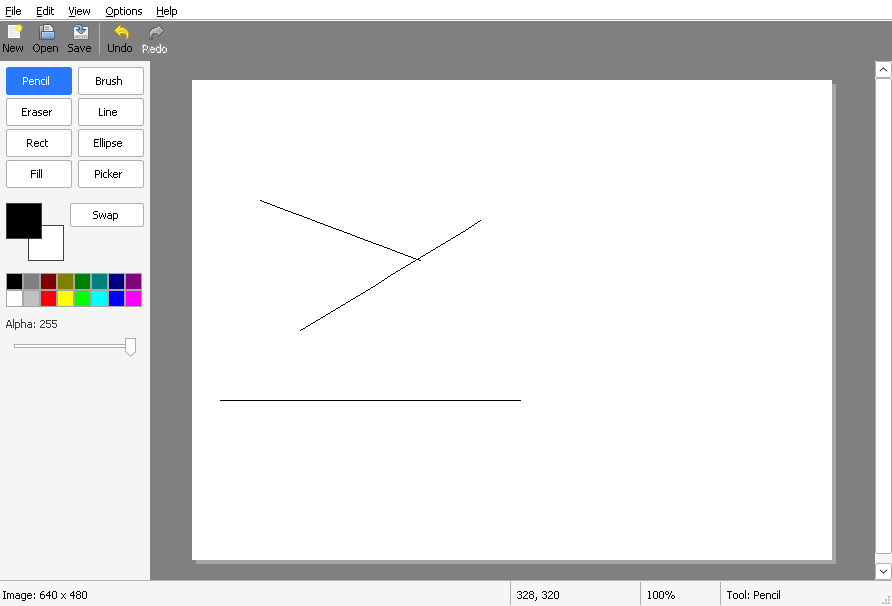

# Chapter 14 - Open and save

[< Chapter 13: Undo and redo](../13-undo-and-redo/README.md)

Until now, everything you drew vanished the moment you closed the window. That's about to change. In this chapter DrawLite learns to open and save pictures, and we'll write the file reader and writer ourselves instead of asking Windows to do it.

In this lesson you will

- see what is inside a `.bmp` file, byte by byte,
- read and write files with `CreateFileW`, `ReadFile` and `WriteFile`,
- show the standard Open and Save As dialogs,
- ask "Save changes?" before anything gets thrown away.

## Before we begin

Two new files hold the format code, `src/bmp.c` and `src/bmp.h`. Two more, `src/filedlg.c` and `src/filedlg.h`, wrap the common file dialogs. The rest of the work is in `src/mainwindow.c`, which now knows about file names, the title bar and the "unsaved changes" question. `src/doc.c` gets a small helper so a document can be built around a surface that already exists. In `CMakeLists.txt` we add `shell32` to the libraries, for drag and drop.

Build and run it the same way as before (if you've forgotten how, [chapter 1](../01-hello-win32/README.md) has the details).

```text
cmake -S . -B build && cmake --build build
```

Draw something, press `Ctrl+S`, type a name, and close the program. Run it again and use `Ctrl+O` to get your picture back.



The title bar now shows the file name. A star after the name means there are changes you haven't saved yet. Whew, finally something you can keep!

The menu has a new item, **Save As...** (`Ctrl+Shift+S`). You can also drop an image file onto the window, or pass a file name on the command line.

## What is inside a .bmp file

We could have called `LoadImage` and been done in one line. But a bitmap file is about the simplest image format that exists, and once you know what's in one, a lot of the Win32 graphics API makes sense. So we do it by hand. Here is the picture from the top of `bmp.c`.

```text
 6   * A .bmp file is laid out like this:
 7   *
 8   *   BITMAPFILEHEADER   14 bytes  "BM", file size, where the pixels start
 9   *   BITMAPINFOHEADER   40 bytes  (or a bigger version) width, height, bits per pixel...
10   *   colour table       only for 8 bits per pixel or fewer
11   *   pixels             rows padded to a multiple of 4 bytes, usually bottom row first
12   *
13   * All numbers are little endian, which is what we have, so we can use a
14   * struct. Windows already defines the structs: see <wingdi.h>.
15   */
```

A file has four parts, one after the other.

1. **The file header**, 14 bytes. It starts with the two letters `BM`, then the size of the file, then the offset of the first pixel.
2. **The info header**, 40 bytes or more. Width, height, bits per pixel, compression.
3. **A colour table**, only if there are 8 bits per pixel or fewer. Each pixel is then a small number that picks a colour from this table.
4. **The pixels.**

Windows already declares the structs for the first two in `<wingdi.h>`: `BITMAPFILEHEADER` and `BITMAPINFOHEADER`. All the numbers in the file are little endian, which is the byte order your PC uses, so we can lay a struct straight over the bytes and read the fields. No shifting and masking needed.

### Bottom up, and padding

Two quirks catch everybody out the first time.

The first is that the rows are usually stored **upside down**. The first row in the file is the bottom row of the picture. The height in the header tells you which way it is: a positive height means bottom up, a negative one means top down. (This is a leftover from the days when graphics hardware had its origin at the bottom left.) Our `Surface` from [chapter 7](../07-pixels-you-own/README.md) is top down, so when we read, we flip.

The second is **padding**. Every row in the file takes up a whole number of 4 byte chunks. A row of 5 pixels at 24 bits is 15 bytes of colour, but takes up 16 in the file, with one spare byte at the end. The formula for the size of a row is

```c
stride = ((width * bitsPerPixel + 31) / 32) * 4;   // bytes per row, padded
```

The `+ 31` and the `/ 32` round the number of bits up to a multiple of 32, and the `* 4` turns that into bytes. `stride` is the word programmers use for "how far do I move to get from the start of one row to the start of the next".

## Reading a file

Reading is split in two. `Bmp_Load` gets the bytes from the disk, and `Bmp_Decode` turns bytes into a `Surface`. We split them so that the clipboard code in the next chapter can reuse the decoder on memory it got from somewhere else.

### CreateFileW, ReadFile and CloseHandle

```text
31  // Function: Bmp_ReadFile
32  // Reads a whole file into memory using the Win32 file functions.
33  // Free the result with free().
34  static uint8_t *
35  Bmp_ReadFile(const wchar_t *path, size_t *size, wchar_t *error, size_t errorLen)
36  {
37      HANDLE file;
38      LARGE_INTEGER length;
39      uint8_t *data;
40      DWORD got = 0;
41
42      file = CreateFileW(path, GENERIC_READ, FILE_SHARE_READ, NULL, OPEN_EXISTING,
43          FILE_ATTRIBUTE_NORMAL, NULL);
44      if (file == INVALID_HANDLE_VALUE)
45      {
46          Bmp_Fail(error, errorLen, L"The file could not be opened.");
```

```c
HANDLE CreateFileW(LPCWSTR lpFileName,                   // The path
                   DWORD dwDesiredAccess,                // GENERIC_READ, GENERIC_WRITE or both
                   DWORD dwShareMode,                    // What others may do while we have it open
                   LPSECURITY_ATTRIBUTES lpSecurity,     // Almost always NULL
                   DWORD dwCreationDisposition,          // OPEN_EXISTING, CREATE_ALWAYS...
                   DWORD dwFlagsAndAttributes,           // FILE_ATTRIBUTE_NORMAL is fine
                   HANDLE hTemplateFile);                // Ignore, pass NULL
```

The name is misleading. `CreateFileW` is how you *open* a file as well. What happens depends on `dwCreationDisposition`. `OPEN_EXISTING` fails if there is no such file, which is what we want for reading. It gives us a handle (we met those in chapter 1), and if something goes wrong it returns `INVALID_HANDLE_VALUE`. Not `NULL`! This is one of the odd corners of Win32, so check for the right value.

Then we ask how big the file is with `GetFileSizeEx`, allocate that many bytes, and read the whole lot with `ReadFile` in one go. DrawLite files are small enough for that. We insist on getting exactly as many bytes as we asked for, and we always `CloseHandle` before we leave, on every path. A forgotten `CloseHandle` leaves the file locked until the program quits.

### Checking before trusting

Files come from outside, so we don't believe anything in them. Before we touch a pixel, `Bmp_Decode` checks that the file starts with `BM`, that the header is one we know, that the size is sane, and that the pixels fit inside the file.

```text
121      if (size < sizeof(BITMAPFILEHEADER) + 12 || fh->bfType != 0x4D42) // "BM"
122      {
123          Bmp_Fail(error, errorLen, L"This is not a bitmap file.");
124          return NULL;
125      }
126      headerSize = ih->biSize;
127      if (headerSize < 40 || sizeof(BITMAPFILEHEADER) + headerSize > size)
128      {
129          Bmp_Fail(error, errorLen, L"This kind of bitmap (an old OS/2 one, perhaps) is not supported.");
130          return NULL;
131      }
132
133      width = ih->biWidth;
134      height = ih->biHeight;
135      topDown = height < 0;
136      if (topDown)
137          height = -height;
138      bpp = ih->biBitCount;
139      offset = fh->bfOffBits;
140      colorsUsed = ih->biClrUsed;
141
142      if (width <= 0 || height <= 0 || width > 32768 || height > 32768)
143      {
144          Bmp_Fail(error, errorLen, L"The bitmap has a strange size.");
145          return NULL;
146      }
147      if (ih->biCompression != BI_RGB && ih->biCompression != BI_BITFIELDS)
148      {
149          Bmp_Fail(error, errorLen, L"Compressed bitmaps are not supported.");
150          return NULL;
151      }
152      if (bpp != 1 && bpp != 4 && bpp != 8 && bpp != 24 && bpp != 32)
153      {
154          Bmp_Fail(error, errorLen, L"This number of bits per pixel is not supported.");
155          return NULL;
156      }
```

Every one of those `Bmp_Fail` calls fills in a message that `MainWindow_OpenFile` shows in a message box. A reader that crashes on a damaged file is a bad reader. A reader that says "The bitmap is damaged" is a good one.

Look at what it accepts: 1, 4, 8, 24 and 32 bits per pixel, `BI_RGB` and `BI_BITFIELDS`. It says no to compressed files (RLE) and to the 16 bit format. That's a limit of this chapter, and the error message says so plainly. The next chapter lets Windows do the decoding for formats like PNG and JPEG.

### Turning rows into pixels

Here is the heart of the decoder.

```text
192      // Each row is padded to a multiple of 4 bytes
193      stride = (((size_t)width * bpp + 31) / 32) * 4;
194      if (offset >= size || stride * (size_t)height > size - offset)
195      {
196          Bmp_Fail(error, errorLen, L"The bitmap is damaged (not enough pixels).");
197          return NULL;
198      }
199
200      s = Surface_Create(width, height);
201      if (!s)
202      {
203          Bmp_Fail(error, errorLen, L"There is not enough memory for an image this big.");
204          return NULL;
205      }
206
207      for (y = 0; y < height; y++)
208      {
209          // Normally the first row in the file is the BOTTOM row of the picture
210          const uint8_t *row = data + offset + stride * (size_t)(topDown ? y : height - 1 - y);
211          uint32_t *out = s->pixels + (size_t)y * width;
```

The row calculation on [line 210] is the bottom up trick. If the file is top down we take row `y`. If not, we take row `height - 1 - y`, which starts at the last row in the file and walks up. Then `out` points at row `y` of our own surface, and the loop fills it in one pixel at a time.

How a pixel is decoded depends on the bit depth.

```text
215              switch (bpp)
216              {
217              case 1:
218              case 4:
219              case 8:
220              {
221                  // Several pixels are packed in each byte, leftmost pixel in the top bits
222                  int perByte = 8 / bpp;
223                  uint32_t index = (row[x / perByte] >> (8 - bpp * (x % perByte + 1))) & ((1u << bpp) - 1);
224                  const uint8_t *c = palette + (size_t)(index < paletteCount ? index : 0) * 4; // B, G, R, unused
225                  out[x] = PIX_MAKE(255, c[2], c[1], c[0]);
226                  break;
227              }
228              case 24:
229                  // Blue comes first in the file
230                  out[x] = PIX_MAKE(255, row[x * 3 + 2], row[x * 3 + 1], row[x * 3]);
231                  break;
```

The 24 bit case is the simple one [line 230]. Three bytes per pixel, and blue comes first in the file, then green, then red. We use `PIX_MAKE` with a full alpha of 255.

For 1, 4 and 8 bits [lines 217 to 227], a byte holds several pixels. At 4 bits, one byte holds two, and the left one is in the high bits. So we work out how many fit in a byte, shift the right one down, mask the rest off, and get an index. That index picks a colour from the table (stored as blue, green, red and one unused byte). If the index is out of range we use entry 0 rather than reading outside the table.

The 32 bit case has two extra twists.

```text
232              case 32:
233              {
234                  uint32_t v;
235                  uint32_t r, g, b, a;
236                  memcpy(&v, row + x * 4, 4);
237                  r = Bmp_Channel(v, masks[0], shifts[0], bits[0]);
238                  g = Bmp_Channel(v, masks[1], shifts[1], bits[1]);
239                  b = Bmp_Channel(v, masks[2], shifts[2], bits[2]);
240                  a = masks[3] ? Bmp_Channel(v, masks[3], shifts[3], bits[3]) : 255;
241                  if (a != 0)
242                      sawAlpha = TRUE;
243                  // The file has normal colours. We want premultiplied.
244                  out[x] = Pixel_Premultiply(PIX_MAKE(a, r, g, b));
245                  break;
246              }
247              }
248          }
249      }
250
251      // Plenty of programs write 32 bit files with the alpha byte left at zero,
252      // meaning "I did not use it". If we took that literally the picture would
253      // be invisible. So if no pixel has any alpha at all, make them all opaque.
254      if (bpp == 32 && masks[3] && !sawAlpha)
255          for (y = 0; y < width * height; y++)
256              s->pixels[y] = PIX_MAKE(255, PIX_R(s->pixels[y]), PIX_G(s->pixels[y]), PIX_B(s->pixels[y]));
```

First, 32 bit files may carry **colour masks** that say which bits are red, green, blue and alpha. `Bmp_MaskInfo` and `Bmp_Channel` turn a mask like `0x00FF0000` into "shift right by 16, 8 bits wide" and pull the channel out. If a channel has fewer than 8 bits, it is scaled up to 0 to 255.

Second, the file holds normal ("straight") colours, but we keep **premultiplied** ones (chapter 7), so `Pixel_Premultiply` converts [line 244]. And a lot of programs write 32 bit files with the alpha bytes all zero, meaning "I didn't use it". Taken literally, the picture would be completely invisible. So if we got to the end and no pixel had any alpha at all, we make everything opaque [lines 254 to 256]. It's a guess, but a kind one.

## Writing a file

`Bmp_Encode` builds the whole file in memory, and `Bmp_Save` writes it out. We pick the format by looking at the pixels.

```text
284      for (i = 0; i < count; i++)
285          if (PIX_A(s->pixels[i]) != 255)
286          {
287              opaque = FALSE;
288              break;
289          }
290
291      bpp = opaque ? 24 : 32;
292      // A V4 header has room for the colour masks and the alpha mask.
293      headerSize = opaque ? sizeof(BITMAPINFOHEADER) : sizeof(BITMAPV4HEADER);
294      stride = (((size_t)s->width * bpp + 31) / 32) * 4;
295      offset = sizeof(BITMAPFILEHEADER) + headerSize;
296      total = offset + stride * (size_t)s->height;
```

If every pixel is opaque, we write an ordinary 24 bit file that every program on earth can open. If anything is transparent, we write 32 bits with a bigger `BITMAPV4HEADER`, which has room for the colour masks and the alpha mask. Then we fill in the file header and the info header.

```text
307      if (opaque)
308      {
309          BITMAPINFOHEADER *ih = (BITMAPINFOHEADER *)(data + sizeof(BITMAPFILEHEADER));
310          ih->biSize = sizeof(BITMAPINFOHEADER);
311          ih->biWidth = s->width;
312          ih->biHeight = s->height;       // Positive means the file is stored bottom up
313          ih->biPlanes = 1;
314          ih->biBitCount = 24;
315          ih->biCompression = BI_RGB;
316          ih->biSizeImage = (DWORD)(stride * (size_t)s->height);
317      }
```

Notice the height on [line 312]. A positive number is how we say "bottom up". The rows are written in that order too.

```text
335      for (y = 0; y < s->height; y++)
336      {
337          uint8_t *row = data + offset + stride * (size_t)(s->height - 1 - y);
338          const uint32_t *in = s->pixels + (size_t)y * s->width;
339
340          for (x = 0; x < s->width; x++)
341          {
342              if (opaque)
343              {
344                  row[x * 3] = (uint8_t)PIX_B(in[x]);
345                  row[x * 3 + 1] = (uint8_t)PIX_G(in[x]);
346                  row[x * 3 + 2] = (uint8_t)PIX_R(in[x]);
347              }
348              else
349              {
350                  uint32_t v = Pixel_Unpremultiply(in[x]); // Files hold normal colours
351                  memcpy(row + x * 4, &v, 4);
352              }
353          }
354      }
```

The loop writes row `height - 1 - y` for source row `y`, so the picture's top row ends up last in the file. In the transparent case we call `Pixel_Unpremultiply` first, because files hold normal colours.

### WriteFile

```text
373      file = CreateFileW(path, GENERIC_WRITE, 0, NULL, CREATE_ALWAYS, FILE_ATTRIBUTE_NORMAL, NULL);
374      if (file == INVALID_HANDLE_VALUE)
375      {
376          free(data);
377          Bmp_Fail(error, errorLen, L"The file could not be created. Is it read only, or open in another program?");
378          return FALSE;
379      }
380      ok = WriteFile(file, data, (DWORD)size, &written, NULL) && written == size;
381      // CloseHandle can fail too, for example if a network drive goes away
382      ok = CloseHandle(file) && ok;
383      free(data);
384      if (!ok)
385          Bmp_Fail(error, errorLen, L"The file could not be written. Is the disk full?");
386      return ok;
```

```c
BOOL WriteFile(HANDLE hFile,                 // Handle from CreateFileW
               LPCVOID lpBuffer,             // The bytes to write
               DWORD nNumberOfBytesToWrite,  // How many
               LPDWORD lpNumberOfBytesWritten, // Receives how many were written
               LPOVERLAPPED lpOverlapped);   // NULL for plain, blocking writes
```

This time we pass `CREATE_ALWAYS` to `CreateFileW`, which makes a new file or empties the old one, and `0` for sharing, so nobody else can touch it while we write. We check `WriteFile`, and we also check `CloseHandle` [line 382]. Data can still be sitting in buffers when you call `WriteFile`, and on a network drive the failure may only show up at the close. It's cheap to check, so we check.

## The common file dialogs

Every Windows program has the same Open and Save As boxes, because Windows provides them. You fill in a struct and call a function. That's it.

```c
BOOL GetOpenFileNameW(LPOPENFILENAMEW lpofn);   // Fills in lpofn->lpstrFile with the chosen path
BOOL GetSaveFileNameW(LPOPENFILENAMEW lpofn);   // Same struct, for Save As
```

Both return `TRUE` if the user pressed OK and `FALSE` if they cancelled. (If something went wrong rather than cancelled, `CommDlgExtendedError` says what, but we treat both as "nothing to do".)

```text
17  BOOL
18  FileDlg_Open(HWND owner, wchar_t *path)
19  {
20      OPENFILENAMEW ofn;
21
22      path[0] = L'\0';
23      ZeroMemory(&ofn, sizeof(ofn));
24      ofn.lStructSize = sizeof(ofn);
25      ofn.hwndOwner = owner;
26      ofn.lpstrFilter = BMP_FILTER;
27      ofn.lpstrFile = path;
28      ofn.nMaxFile = MAX_PATH;
29      ofn.lpstrTitle = L"Open Image";
30      ofn.Flags = OFN_FILEMUSTEXIST | OFN_PATHMUSTEXIST | OFN_HIDEREADONLY;
31      return GetOpenFileNameW(&ofn);
32  }
```

The struct is `OPENFILENAMEW`. We zero it all first with `ZeroMemory`, then set only what we need.

- `lStructSize` must be the size of the struct. Windows uses it to know which version of the struct you were compiled with.
- `hwndOwner` makes the dialog belong to our window, so it stays in front of it.
- `lpstrFilter` is the list of file types in the drop down.
- `lpstrFile` and `nMaxFile` are the buffer that receives the path, and its size in characters.
- `Flags` tweaks the behaviour. `OFN_FILEMUSTEXIST` stops people typing a name that isn't there, and `OFN_OVERWRITEPROMPT` in the Save dialog asks before replacing a file.

The filter is the odd one out.

```text
10  #include "filedlg.h"
11
12  // A filter is a list of pairs: the text the user sees, then the pattern.
13  // Each piece ends with a \0, and the whole list ends with an extra \0.
14  // That is why this is not a normal string, and why we cannot use strlen on it.
```

It is a list of pairs: the text the user sees, then the pattern. Every piece ends with a `\0`, and the whole list ends with an extra one. It is not a normal string at all, and `strlen` would stop at the first piece. That is why we use a macro with a string literal rather than building it with `wcscpy`.

`FileDlg_SaveAs` is nearly the same. It leaves out `OFN_FILEMUSTEXIST`, adds `OFN_OVERWRITEPROMPT`, and sets `lpstrDefExt` to `L"bmp"`, so a name typed without an extension gets `.bmp` added. The filter only lists `.bmp` in this chapter, and the next chapter adds more.

## Putting it together in the main window

All the new decisions live in `mainwindow.c`. Here they are, one at a time.

### The title bar and the star

```text
418  // Function: MainWindow_UpdateTitle
419  // Puts "name* - DrawLite" in the title bar. The star means unsaved changes.
420  static void
421  MainWindow_UpdateTitle(MainWindow *mw)
422  {
423      wchar_t title[MAX_PATH + 32];
424
425      if (mw->doc)
426          StringCchPrintfW(title, ARRAYSIZE(title), L"%s%s - DrawLite",
427              MainWindow_FileName(mw->doc->path), mw->doc->modified ? L"*" : L"");
428      else
429          StringCchCopyW(title, ARRAYSIZE(title), L"DrawLite");
430      SetWindowTextW(mw->hwnd, title);
431  }
```

`doc->modified` has been there since chapter 13. Making a change sets it to `TRUE` (when a stroke is committed, and when you undo or redo), and a successful save sets it to `FALSE`. `MainWindow_UpdateTitle` just turns that into text, and we call it from `WMU_DOC_CHANGED` and after every undo.

### Save changes?

Closing the window or opening another file would throw your work away, so the program asks first.

```text
433  // Function: MainWindow_ConfirmDiscard
434  // If the image has unsaved changes, asks the user what to do about them.
435  //
436  // Returns:
437  //   TRUE if it is fine to throw the image away (nothing to save, the user
438  //   chose No, or the user chose Yes and it was saved). FALSE if the user
439  //   cancelled, or saving failed, and we should stay where we are.
440  static BOOL
441  MainWindow_ConfirmDiscard(MainWindow *mw)
442  {
443      wchar_t text[MAX_PATH + 64];
444
445      if (!mw->doc || !mw->doc->modified)
446          return TRUE;
447
448      StringCchPrintfW(text, ARRAYSIZE(text), L"Save changes to %s?", MainWindow_FileName(mw->doc->path));
449      switch (MessageBoxW(mw->hwnd, text, L"DrawLite", MB_YESNOCANCEL | MB_ICONQUESTION))
450      {
451      case IDYES:
452          return MainWindow_Save(mw, FALSE);
453      case IDNO:
454          return TRUE;
455      default:
456          return FALSE;
457      }
458  }
```

`MB_YESNOCANCEL` gives three buttons. Yes saves, and carries on only if the save worked. No means throw it away. Cancel stays put. The function returns `TRUE` when it's fine to go on.

We call it from three places: `MainWindow_NewImage`, `MainWindow_OpenFile`, and `WM_CLOSE`. Closing is the interesting one.

```text
165      case WM_CLOSE:
166          // Give the user the chance to save first
167          if (MainWindow_ConfirmDiscard(mw))
168              DestroyWindow(hwnd);
169          return 0;
```

Until now `WM_CLOSE` went straight to `DefWindowProc`, which calls `DestroyWindow`. By handling it ourselves we get to say no. If the user cancels, we simply don't call `DestroyWindow`, and the window stays. The Exit menu item sends `WM_CLOSE` for the same reason, so it asks too.

### Save and Save As

```text
460  // Function: MainWindow_Save
461  // Saves the image. Asks for a file name if there isn't one yet, or if saveAs is TRUE.
462  //
463  // Returns:
464  //   TRUE if the image was saved.
465  static BOOL
466  MainWindow_Save(MainWindow *mw, BOOL saveAs)
467  {
468      wchar_t path[MAX_PATH];
469      wchar_t error[128];
470
471      if (!mw->doc)
472          return FALSE;
473
474      StringCchCopyW(path, ARRAYSIZE(path), mw->doc->path);
475      if (saveAs || !path[0])
476      {
477          if (!FileDlg_SaveAs(mw->hwnd, path))
478              return FALSE;
479      }
480
481      if (!Bmp_Save(mw->doc->surface, path, error, ARRAYSIZE(error)))
482      {
483          MessageBoxW(mw->hwnd, error, L"DrawLite", MB_OK | MB_ICONERROR);
484          return FALSE;
485      }
486      StringCchCopyW(mw->doc->path, ARRAYSIZE(mw->doc->path), path);
487      mw->doc->modified = FALSE;
488      MainWindow_UpdateTitle(mw);
489      return TRUE;
490  }
```

If the document has no path yet, or the user chose Save As, we show the dialog. Then we call `Bmp_Save`, and on success we remember the path and clear `modified`. If it fails, the message goes in a box and `modified` stays set, so the star is still there. A loud failure beats a silent one.

### Drag and drop, and the command line

Two small extras. `DragAcceptFiles` tells Windows that our window is happy to receive dropped files, and then `WM_DROPFILES` arrives.

```c
UINT DragQueryFileW(HDROP hDrop,       // The wParam of WM_DROPFILES
                    UINT iFile,        // Which file (0 is the first)
                    LPWSTR lpszFile,   // Buffer for the path
                    UINT cch);         // Size of the buffer in characters
void DragFinish(HDROP hDrop);          // Frees what Windows allocated for the drop
```

We only open the first file. And in `MainWindow_Create`, if `wWinMain` passed a command line (the one parameter we ignored in chapter 1!), we strip the quotes and open that. This is what makes "Open with DrawLite" in Explorer work.

## The restaurant order

Reading a file is like asking the kitchen for a dish. You hand over the ticket (`CreateFileW`), and you get a number (the handle). Every request after that ("give me the next 500 bytes") uses the number, never the name. When you're done you tell them (`CloseHandle`), so they can clear the table. And if you walk out without telling them, nobody else can sit there.

## Adding functionality

Add a title bar hint that says how big the image is. In `MainWindow_UpdateTitle`, change the format string to include the size.

1. Change the format to `L"%s%s (%dx%d) - DrawLite"`.
2. Add `mw->doc->width, mw->doc->height` after the two existing arguments.

## Exercise

`Bmp_Save` writes 24 bits for any opaque picture, even a plain grey one. Change `Bmp_Encode` so that it writes an 8 bit file when every pixel has equal red, green and blue.

*Hint: You'll need a 256 entry colour table after the info header, and `stride` for 8 bits is `((width * 8 + 31) / 32) * 4`.*

## That's it

We can now keep our work. But BMP files are big and nobody emails them. Next we'll use Windows' own image codecs for PNG and JPEG, and learn to talk to the clipboard.

[Chapter 15: PNG, JPEG and the clipboard](../15-png-jpeg-clipboard/README.md)
