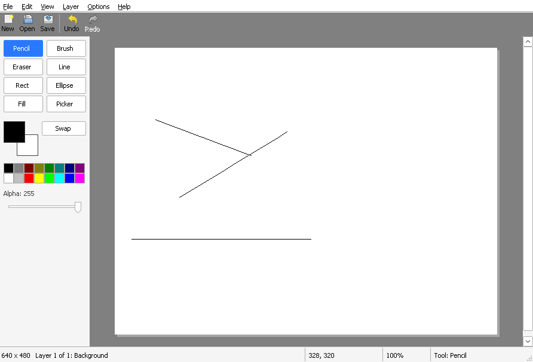

# Chapter 16 - Layers

[< Chapter 15: PNG, JPEG and the clipboard](../15-png-jpeg-clipboard/README.md)

This is the big one. Until now a DrawLite picture was one flat sheet of pixels. Real paint programs let you draw the sky on one sheet, the mountains on another and the sun on a third, and change your mind about the sun later. That's what layers are for. The change touches almost every file, because "the picture" is no longer a single surface. But the idea is simple, so stay with me.

In this lesson you will

- turn a `Document` into a stack of `Layer`s,
- combine the stack into one picture, over a chequerboard,
- make the eraser rub pixels out to transparent,
- teach undo about adding, deleting, moving and hiding layers,
- paste into a new layer.

## Before we begin

The new files are `src/composite.c` and `src/composite.h`, which squash layers together. The big changes are in `src/doc.c` and `src/doc.h` (layers), `src/history.c` and `src/history.h` (undo for layer changes), `src/mainwindow.c` (the Layer menu), `src/tools.c` and `src/edit.c` (draw on the active layer, and the new eraser). `canvas.c` changes by a handful of lines, which is a nice sign that the design from the earlier chapters is holding up.

Build and run it as usual (see [chapter 1](../01-hello-win32/README.md) if you need a reminder).

```text
cmake -S . -B build && cmake --build build
```



There's a new **Layer** menu. Try `Ctrl+Shift+N` to add a layer, draw something on it, and then `Ctrl+Shift+H` to hide and show it. `Ctrl+PgUp` and `Ctrl+PgDn` pick the next or the previous layer, and the status bar at the bottom tells you which layer you're on. Now rub something out with the eraser. See the chequerboard come through? That's transparency. The picture is no longer white paper.

There's no panel with a list of layers yet. That's the next chapter.

## Layers are sheets of plastic

Picture a stack of clear plastic sheets, like the ones from an overhead projector. You draw on one sheet at a time. What you see is all of them seen through each other. The sheet at the bottom is layer 0.

Here is how that looks in code.

```text
18
19  // Struct: Layer
20  // One sheet of the stack.
21  typedef struct Layer
22  {
23      Surface *surface;               // The pixels. Same size as the document.
24      wchar_t name[LAYER_NAME_MAX];
25      BOOL visible;                   // Hidden layers are skipped when drawing
26      int opacity;                    // How solid the whole layer is: 0 (gone) to 255 (full)
27  } Layer;
28
29  // Forward declaration. history.h includes this file, so we cannot include it here.
30  typedef struct History History;
31
32  // Struct: Document
33  typedef struct Document
34  {
35      int width;
36      int height;
37      Layer **layers;         // layers[0] is at the bottom
38      int layerCount;
39      int layerCapacity;
40      int active;             // Index of the layer the tools draw on
41      Surface *view;          // What the canvas shows: all visible layers over a chequerboard
42      History *history;       // Everything that can be undone and redone
43      BOOL modified;          // Has it changed since it was last saved?
44      wchar_t path[MAX_PATH]; // File it was loaded from or saved to. Empty if none.
45  } Document;
```

A `Layer` is a `Surface` (the same one we've used since chapter 7) with a name, a flag for whether it's visible, and an opacity from 0 to 255 for the whole sheet. Every layer is the same size as the document, even if you've only drawn a dot on it. That wastes memory, but it makes everything else easier.

A `Document` now holds an array of layer pointers, how many there are, and `active`, which is the index of the sheet the tools draw on. It also has a new surface called `view`. Hold on to that one. It's the trick of this chapter, and we'll come back to it.

(The comment about `History` is a C thing. `history.h` needs to know about `Layer`, so it includes `doc.h`. That means `doc.h` can't include `history.h` back, or each would wait for the other. So we only promise that a `History` exists, and that's enough for a pointer.)

### Creating and destroying

A layer starts out completely see-through, because `Surface_Create` gives zeroed memory and zero is "alpha 0".

```text
16  Layer *
17  Layer_Create(int width, int height, const wchar_t *name)
18  {
19      Layer *layer = (Layer *)calloc(1, sizeof(Layer));
20      if (!layer)
21          return NULL;
22      layer->surface = Surface_Create(width, height);
23      if (!layer->surface)
24      {
25          free(layer);
26          return NULL;
27      }
28      StringCchCopyW(layer->name, LAYER_NAME_MAX, name);
29      layer->visible = TRUE;
30      layer->opacity = 255;
31      return layer;
32  }
```

`Doc_CreateFromSurface` now makes a one layer document. The surface it was given becomes a layer called "Background". It also makes `view` and the history. That's why opening a PNG, or creating a New image, still gives you a normal looking picture, and why nothing else in the program had to change.

```text
 76      // The layer takes over the surface we were given
 77      layer = (Layer *)calloc(1, sizeof(Layer));
 78      if (!layer)
 79      {
 80          free(doc);
 81          return NULL;
 82      }
 83      layer->surface = surface;
 84      StringCchCopyW(layer->name, LAYER_NAME_MAX, L"Background");
 85      layer->visible = TRUE;
 86      layer->opacity = 255;
 87
 88      doc->width = surface->width;
 89      doc->height = surface->height;
 90      doc->view = Surface_Create(doc->width, doc->height);
 91      // Undo may use up to 256 MB before it starts forgetting the oldest changes
 92      doc->history = History_Create(256u * 1024 * 1024);
 93      if (!doc->view || !doc->history || !Doc_InsertLayer(doc, 0, layer))
 94      {
 95          // Careful: the surface is still the caller's, so detach it before freeing the layer
 96          layer->surface = NULL;
 97          Layer_Destroy(layer);
 98          Surface_Destroy(doc->view);
 99          History_Destroy(doc->history);
100          free(doc->layers);
101          free(doc);
102          return NULL;
103      }
104      return doc;
105  }
```

Have a look at the failure path. If anything goes wrong, we set `layer->surface = NULL` before we destroy the layer. The surface is still the caller's, and if the layer freed it too, they'd free it a second time. It's a small thing, and it's the sort of thing that crashes people's programs at 2am.

### Inserting and removing

The stack is an array, so inserting is shuffling.

```text
149  BOOL
150  Doc_InsertLayer(Document *doc, int index, Layer *layer)
151  {
152      if (index < 0 || index > doc->layerCount)
153          return FALSE;
154      if (doc->layerCount == doc->layerCapacity)
155      {
156          int newCap = doc->layerCapacity ? doc->layerCapacity * 2 : 8;
157          Layer **bigger = (Layer **)realloc(doc->layers, (size_t)newCap * sizeof(Layer *));
158          if (!bigger)
159              return FALSE;
160          doc->layers = bigger;
161          doc->layerCapacity = newCap;
162      }
163      // Shuffle the layers above the new one up a place
164      memmove(&doc->layers[index + 1], &doc->layers[index], (size_t)(doc->layerCount - index) * sizeof(Layer *));
165      doc->layers[index] = layer;
166      doc->layerCount++;
167      doc->active = index;
168      Doc_UpdateAllOfView(doc);
169      return TRUE;
170  }
```

The array grows when it's full (eight slots to start, then doubling), `memmove` slides the layers above the new one up a place, and the new one becomes active. After any change to the stack the whole view needs recalculating, so each of these ends with `Doc_UpdateAllOfView`. `Doc_RemoveLayer` and `Doc_MoveLayer` do the same dance in the other directions.

```text
172  Layer *
173  Doc_RemoveLayer(Document *doc, int index)
174  {
175      Layer *layer;
176
177      if (index < 0 || index >= doc->layerCount)
178          return NULL;
179      layer = doc->layers[index];
180      memmove(&doc->layers[index], &doc->layers[index + 1], (size_t)(doc->layerCount - index - 1) * sizeof(Layer *));
181      doc->layerCount--;
182
183      // Keep the same layer active if we can. If we removed the active one, the one below.
184      if (index <= doc->active && doc->active > 0)
185          doc->active--;
186      Doc_UpdateAllOfView(doc);
187      return layer;
188  }
```

Notice that `Doc_RemoveLayer` doesn't free the layer. It gives it to you [line 187]. You'll see why in a minute.

## Making one picture out of many

Now the part that makes the sheets look like a picture. For every pixel in the image, we start with nothing, and put each visible layer on top, bottom first. We have used the "over" operator already, whenever a brush put colour on the picture, and `Pixel_Over` does exactly that.

```text
16  // Function: Layer_PixelAt
17  // The pixel of a layer at index i, with the layer's opacity applied.
18  static inline uint32_t
19  Layer_PixelAt(const Layer *layer, size_t i)
20  {
21      uint32_t p = layer->surface->pixels[i];
22      if (layer->opacity < 255)
23          p = Pixel_Scale(p, (uint32_t)layer->opacity);
24      return p;
25  }
26
27  // Function: Doc_PixelIndex
28  // Stack up the visible layers for one pixel, bottom to top.
29  static uint32_t
30  Doc_PixelIndex(const Document *doc, size_t i)
31  {
32      uint32_t acc = 0;   // Start with nothing: fully see-through
33      int l;
34
35      for (l = 0; l < doc->layerCount; l++)
36      {
37          const Layer *layer = doc->layers[l];
38          if (layer->visible)
39              acc = Pixel_Over(Layer_PixelAt(layer, i), acc);
40      }
41      return acc;
42  }
```

`Layer_PixelAt` applies the layer's opacity. `Pixel_Scale` (new in `pixel.h`) multiplies all four channels of a premultiplied pixel by `opacity / 255`. Because the pixel is premultiplied, that is all it takes to make it see-through. (The same thing with straight colours would mean scaling only alpha. One of the nice things about premultiplied pixels is that "make it fainter" is one multiplication for everything.)

Let's do one by hand. A solid red pixel is `0xFFFF0000`. On a layer at opacity 128, `Pixel_Scale` gives alpha 128 and red 128, green and blue 0. Put that over a solid white pixel and `Pixel_Over` works out `src + dst * (255 - 128) / 255`. The alpha is `128 + 127 = 255`, red is `128 + 127 = 255`, and green and blue are `0 + 127 = 127`. That's `0xFFFF7F7F`, a light red, which is just what half strength red on white paper should look like.

### The view

Redoing that sum for every pixel, for every layer, on every repaint would be slow. A 4000 by 3000 picture has 12 million pixels. So we do it once, and keep the answer. That is `doc->view`: a normal surface the size of the picture holding the finished result, with all the visible layers over a chequerboard.

```text
44  void
45  Doc_UpdateView(Document *doc, const RECT *area)
46  {
47      RECT r;
48      int x, y;
49
50      r.left = max(area->left, 0);
51      r.top = max(area->top, 0);
52      r.right = min(area->right, doc->width);
53      r.bottom = min(area->bottom, doc->height);
54
55      for (y = r.top; y < r.bottom; y++)
56      {
57          for (x = r.left; x < r.right; x++)
58          {
59              size_t i = (size_t)y * doc->width + x;
60              uint32_t check = (((x / CHECK_SIZE) + (y / CHECK_SIZE)) & 1) ? CHECK_DARK : CHECK_LIGHT;
61              doc->view->pixels[i] = Pixel_Over(Doc_PixelIndex(doc, i), check);
62          }
63      }
64  }
```

The canvas never looks at the layers at all. It shows `doc->view`. That's the main change in `canvas.c`: it selects `cv->doc->view->bitmap` into the device context instead of the old surface. Everything we built for zoom and scrolling carries on working.

The clever bit is the rectangle. `Doc_UpdateView` takes an `area` and only recalculates those pixels. When you draw a brush stroke, the canvas already knows which rectangle changed, the "dirty" rectangle. Now it first calls `Doc_UpdateView` on that area, and then invalidates it. A small stroke on a huge picture costs a small amount of work.

The chequerboard [line 60] is made of 8 by 8 squares, light and dark grey. It's a bit of arithmetic. Divide `x` and `y` by 8, add them, and look at whether the answer is odd or even. It's put *under* the layers, as the last step of the sum, `Pixel_Over(layers, check)`. It only exists in `view`. It's never saved, and never copied.

### Flatten

When we save a file, or copy to the clipboard, we want the picture without a chequerboard.

```text
74  Surface *
75  Doc_Flatten(const Document *doc)
76  {
77      Surface *s = Surface_Create(doc->width, doc->height);
78      size_t i, count = (size_t)doc->width * doc->height;
79
80      if (!s)
81          return NULL;
82      for (i = 0; i < count; i++)
83          s->pixels[i] = Doc_PixelIndex(doc, i);
84      return s;
85  }
```

This is the same sum, but it stops before the chequerboard, so see-through parts stay see-through. `MainWindow_Save` and the Copy command both call it first. That means that, for now, PNG and JPEG files hold the layers squashed together, and the layer structure is lost. We'll fix that in chapter 17.

## Drawing on a layer

Every tool used to start with `Edit_Begin(doc->surface)`. Now it says `Edit_Begin(Doc_ActiveSurface(doc))`. That's the whole change. A tool paints on whatever layer is active, and doesn't know there are others. `Doc_PixelAt`, which stacks up the layers for one pixel, is what the colour picker now uses. It picks what you can *see*, not what's on the active layer.

### The eraser

In chapter 11 the eraser painted with the secondary colour. That was fine when the picture was one opaque sheet, but it isn't an eraser. With layers, we can do it properly.

```text
118      for (y = area->top; y < area->bottom; y++)
119      {
120          for (x = area->left; x < area->right; x++)
121          {
122              size_t i = (size_t)y * s->width + x;
123              uint32_t p = e->base->pixels[i];
124
125              if (e->erase)
126              {
127                  // Rubbing out is the reverse of painting: keep (255 - strength) of what is there
128                  uint32_t strength = Pixel_Mul255(e->mask[i], PIX_A(e->color));
129                  p = Pixel_Scale(p, 255 - strength);
130              }
131              else
132              {
133                  if (e->fillMask && e->fillMask[i])
134                      p = Pixel_Over(Edit_Paint(e->fillColor, e->fillMask[i]), p);
135                  if (e->mask[i])
136                      p = Pixel_Over(Edit_Paint(e->color, e->mask[i]), p);
137              }
138              s->pixels[i] = p;
139          }
140      }
```

When `erase` is on, we don't paint. We take the old pixel from `base` and scale it *down* by how hard the brush is rubbing [line 129]. A strength of 255 gives `Pixel_Scale(p, 0)`, which is nothing at all, so the pixel is fully transparent. A strength of 128 gives `Pixel_Scale(p, 127)`, so a solid pixel becomes half see-through.

```text
147      case TOOL_ERASER:
148          // With layers, the eraser makes pixels see-through. The alpha slider
149          // sets how hard it rubs.
150          st->edit = Edit_Begin(Doc_ActiveSurface(doc));
151          if (!st->edit)
152              return;
153          Edit_SetErase(st->edit, TRUE);
154          Edit_SetBrush(st->edit, (ts->primary & 0xFF000000) | 0x00FFFFFF, ts->brushSize, ts->softBrush);
155          Edit_Stamp(st->edit, x, y);
156          break;
```

The strength comes from the alpha of the primary colour, so the alpha slider says how hard you rub. (The colour's red, green and blue are set to white and ignored.) Rub on the Background layer and you get a hole through to the chequerboard. It isn't a bug. The Background is just a layer like any other.

## Undo, for things that aren't pixels

Until now `History` stored pairs of "before" and "after" pixels. But undoing *Add Layer* isn't a matter of pixels. We need to store *what happened*. So each item now has a `kind`.

```text
14  #ifndef HISTORY_H
15  #define HISTORY_H
16
17  #include <windows.h>
18  #include <stdint.h>
19  #include "doc.h"
20
21  // Enum: HistoryKind
22  // What sort of change an item records.
23  typedef enum HistoryKind
24  {
25      HIST_PIXELS,        // A tool changed pixels on a layer
26      HIST_LAYER_ADDED,   // A layer was put in the stack
27      HIST_LAYER_REMOVED, // A layer was taken out of the stack
28      HIST_LAYER_MOVED,   // A layer changed places
29      HIST_LAYER_PROPS    // A layer's name, visibility or opacity changed
30  } HistoryKind;
31
32  // Struct: HistoryItem
33  // One undoable change. Which fields are used depends on the kind.
34  typedef struct HistoryItem
35  {
36      HistoryKind kind;
37      int layer;          // The layer it happened to (HIST_LAYER_MOVED: where it started)
38      int layerTo;        // HIST_LAYER_MOVED: where it ended up
39      RECT area;          // HIST_PIXELS: the part of the layer that changed
40      uint32_t *before;   // HIST_PIXELS: its pixels before the change, row by row
41      uint32_t *after;    // HIST_PIXELS: its pixels after
42      Layer *held;        // ADDED/REMOVED: the layer, while it is NOT in the document
43      Layer propsBefore;  // HIST_LAYER_PROPS: the settings before (the surface pointer is unused)
44      Layer propsAfter;
45      size_t bytes;       // Memory this item uses, so we can keep the total in check
46  } HistoryItem;
47
```

Pixel changes work as before, except they say which layer they happened on. The four other kinds are new, and each is small. A layer was added at index N. A layer was removed from index N. A layer moved from A to B. A layer's name, visibility or opacity changed (before and after copies of the layer, using `Layer_CopyProps` to copy everything except the pixels).

### Who owns the layer?

Here's the tricky bit. When you delete a layer, the user can still undo it, so the pixels have to be kept somewhere. And when the layer is in the document, the document owns it and frees it. We need a rule that stops it ever being freed twice, or leaked.

The rule is that **a layer is either in the document or held by a history item, never both**. That's what the `held` pointer in `HistoryItem` is for.

```text
634      case IDM_LAYER_DELETE:
635          if (doc->layerCount < 2)
636          {
637              MessageBoxW(mw->hwnd, L"An image needs at least one layer.", L"DrawLite", MB_OK | MB_ICONINFORMATION);
638              return;
639          }
640          at = doc->active;
641          layer = Doc_RemoveLayer(doc, at);
642          // The history keeps the layer now, in case the user wants it back
643          History_PushLayerRemoved(doc->history, layer, at);
644          break;
```

`Doc_RemoveLayer` takes the layer out of the stack and hands it to us. We hand it straight on to the history [line 643], which now holds it. The history item remembers its size in `bytes`, so a deleted 4000 by 3000 layer counts against the 256 MB undo budget. If the history item is ever thrown away (because it's too old, or because you did something new after undoing), `HistoryItem_Free` calls `Layer_Destroy` on whatever it's holding.

Now see how undoing and redoing use it.

```text
235      switch (item->kind)
236      {
237      case HIST_PIXELS:
238      {
239          Surface *s = doc->layers[item->layer]->surface;
240          History_PasteRect(s, &item->area, forward ? item->after : item->before);
241          doc->active = item->layer;
242          *area = item->area;
243          Doc_UpdateView(doc, area);
244          break;
245      }
246      case HIST_LAYER_ADDED:
247      case HIST_LAYER_REMOVED:
248      {
249          // Redoing an add inserts. Undoing a remove inserts. The others take out.
250          BOOL insert = (item->kind == HIST_LAYER_ADDED) == forward;
251          if (insert)
252          {
253              Doc_InsertLayer(doc, item->layer, item->held);
254              item->held = NULL;
255          }
256          else
257              item->held = Doc_RemoveLayer(doc, item->layer);
258          break;
259      }
```

`HIST_LAYER_ADDED` and `HIST_LAYER_REMOVED` are mirror images of each other. Redoing an add *puts a layer in*. Undoing a remove *puts a layer in*. The other two combinations take one out. So instead of four separate cases we work out one yes or no, `insert`, and do one of two things. To put a layer in, we take it from `held` and set `held` to `NULL`. To take one out, we put it into `held`. The layer is always in exactly one place.

It's a nice trick. Whenever two operations are exact opposites, ask whether one function can do both.

`HIST_PIXELS` switches to the right layer first (so that undoing a stroke you made on another layer takes you back to that layer), pastes the pixels, and updates the view for just that area. The others just update the whole view.

`History_Undo` and `History_Redo` now take the whole `Document`, instead of a single surface, because they have to be able to change the stack.

## The Layer menu

All the Layer menu items go through one function, which does the same three steps for each: change the stack, record what we did, and repaint.

```text
602      // Don't change the stack in the middle of a brush stroke
603      if (!doc || Canvas_IsBusy(mw->hCanvas))
604          return;
605
606      switch (id)
607      {
608      case IDM_LAYER_ADD:
609          StringCchPrintfW(name, ARRAYSIZE(name), L"Layer %d", doc->layerCount + 1);
610          layer = Layer_Create(doc->width, doc->height, name);
611          if (!layer)
612              return;
613          at = doc->active + 1;               // Just above the active layer
614          if (!Doc_InsertLayer(doc, at, layer))
615          {
616              Layer_Destroy(layer);
617              return;
618          }
619          History_PushLayerAdded(doc->history, at);
620          break;
```

The first thing it does is refuse to change anything in the middle of a brush stroke (`Canvas_IsBusy`). If you deleted the layer while a stroke was being drawn onto it, the `Edit` would be left pointing at freed memory. The new layer goes *just above* the active one [line 613], and we push `History_PushLayerAdded` with where it went.

```text
656      case IDM_LAYER_VISIBLE:
657      {
658          Layer before;
659          Layer *active = Doc_ActiveLayer(doc);
660
661          Layer_CopyProps(&before, active);
662          active->visible = !active->visible;
663          History_PushLayerProps(doc->history, doc->active, &before, active);
664          Doc_UpdateAllOfView(doc);
665          break;
666      }
667      case IDM_LAYER_NEXT:
668      case IDM_LAYER_PREV:
669      {
670          int to = doc->active + (id == IDM_LAYER_NEXT ? 1 : -1);
671          if (to >= 0 && to < doc->layerCount)
672              doc->active = to;
673          MainWindow_UpdateImageInfo(mw);
674          return;     // Choosing a layer is not a change to the picture
675      }
```

Hiding is an edit to the layer's properties. We take a copy of the old properties, flip the flag, and record both. Undoing it flips it back.

We refuse to delete the last layer, because a document with no layers has no active layer, and `Doc_ActiveLayer` would read outside the array. Select Next and Select Previous don't touch the history at all [line 674]. Choosing a layer isn't a change to the picture, so there's nothing to undo.

### Paste

Last chapter, Ctrl+V replaced your picture. Now it makes a new layer.

```text
703      pasted = Clipboard_PasteImage(mw->hwnd, error, ARRAYSIZE(error));
704      if (!pasted)
705      {
706          MessageBoxW(mw->hwnd, error, L"DrawLite", MB_OK | MB_ICONERROR);
707          return;
708      }
709      layer = Layer_Create(doc->width, doc->height, L"Pasted");
710      if (!layer)
711      {
712          Surface_Destroy(pasted);
713          return;
714      }
715      // A layer is always as big as the image. Copy as much as fits.
716      w = min(pasted->width, doc->width);
717      h = min(pasted->height, doc->height);
718      for (y = 0; y < h; y++)
719          memcpy(layer->surface->pixels + (size_t)y * doc->width,
720              pasted->pixels + (size_t)y * pasted->width, (size_t)w * sizeof(uint32_t));
721      Surface_Destroy(pasted);
722
723      at = doc->active + 1;
724      if (!Doc_InsertLayer(doc, at, layer))
725      {
726          Layer_Destroy(layer);
727          return;
728      }
729      History_PushLayerAdded(doc->history, at);
730      doc->modified = TRUE;
731      MainWindow_RepaintAll(mw);
732      MainWindow_DocChanged(mw);
733  }
```

It gets the picture from the clipboard, makes a see-through layer the size of the document, and copies the pasted rows into the top left corner. A layer is always as big as the image, so if the pasted picture is bigger, the edges are cut off, and if it's smaller, the rest stays see-through. There's no way to move it afterwards, and no crop. Those are limits of this chapter. The old behaviour is still there as **Paste as New Image** (`Ctrl+Shift+V`).

## The restaurant order

Think of a kitchen that makes a layered cake. Each layer is baked on its own tray, and the customer only ever sees the finished cake in the window. If you swap the sponge for a different one, the kitchen doesn't bake the whole cake again. It rebuilds the part of the cake that changed and puts it back in the window. The window is `doc->view`, and the trays are the layers.

## Adding functionality

Add the layer count to the title bar. In `MainWindow_UpdateTitle` (chapter 14), change the format string and add the argument.

1. Change the format to `L"%s%s [%d layers] - DrawLite"`.
2. Add `mw->doc->layerCount` after the existing arguments.

## Exercise

Add **Merge Down** to the Layer menu, which combines the active layer with the one below it.

*Hint: For each pixel, `Pixel_Over(upper, lower)` gives the merged colour. You'll want to record it as a pixel change on the lower layer (`History_PushPixels`), and then a removal of the upper one. Two history items for one command is fine, but then one undo only takes back half. Can you think of a way around that?*

## That's it

Whew. That was long! You now have layers, and undo that understands them. Next we'll build a proper layers panel with a list you can click on, an opacity slider and blend modes. We'll also save the layers in a file format of our own.

[Chapter 17: Layers panel and blend modes](../17-layers-panel-and-blend-modes/README.md)
