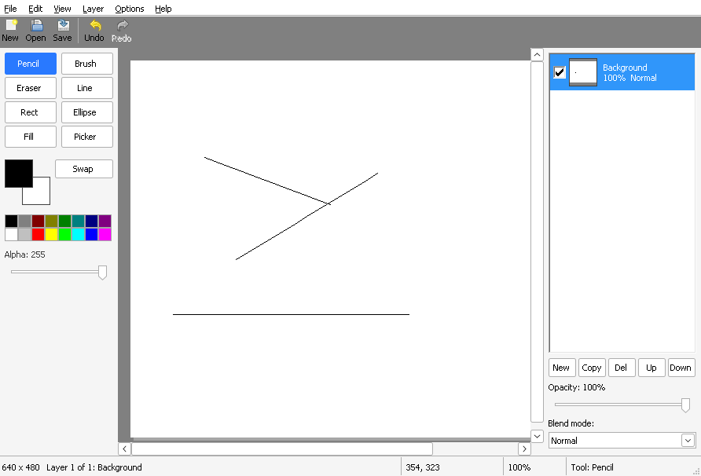

# Chapter 17 - Layers panel and blend modes

[< Chapter 16: Layers](../16-layers/README.md)

Last chapter gave DrawLite layers, but you had to drive them from a menu and keep count in your head. This time we build the panel every paint program has: a list of layers with little pictures of each one, an opacity slider and a blend mode box. Then we give layers a file format of their own, so that they survive being saved.

In this lesson you will

- write a window that draws its own list of rows, with thumbnails, scrolling and clicks,
- use a trackbar and a combo box, and turn their messages into one undo step,
- mix layers with real blend modes, and do the sums by hand for two of them,
- read and write DrawLite's own `.dlt` file, which keeps all the layers.

## Before we begin

New files this time: `src/layerpanel.c` and `src/layerpanel.h` (the panel), `src/blend.c` and `src/blend.h` (blend modes), `src/dlt.c` and `src/dlt.h` (the file format), and `src/namedlg.c` and `src/namedlg.h` (a small dialog to rename a layer, with its template in `res/drawlite.rc`). Smaller changes are in `doc.h` (each layer gets a `blend` field), `composite.c` (one line), `filedlg.c` (a new filter) and `mainwindow.c` (a lot of new code that deals with messages from the panel).

Build and run it as usual (see [chapter 1](../01-hello-win32/README.md) if you need a reminder).

```text
cmake -S . -B build && cmake --build build
```



The panel sits down the right hand side. Click a row to choose a layer, click the tick box to show or hide it, and double click the name to rename it. The slider changes the opacity of the chosen layer, and the drop down changes how it mixes with the layers below it. Try putting a layer on top of a photo and choosing Multiply. Then try the other eleven.

Save with `Ctrl+S`, pick **DrawLite, with layers (*.dlt)**, close the program and open the file again. Your layers are all there.

## A window that draws its own list

Windows has a list box control that could hold the layers. But ours has thumbnails, a tick box and two lines of text per row, and by the time you've told a list box how to draw that, you've done most of the work anyway. So the list is a window class of its own that paints every row itself. You've seen all the pieces already. It's a window class, a state struct in `GWLP_USERDATA` from chapter 6, and a `WM_PAINT` handler.

There are two classes, and two structs. `LayerPanel` is the whole panel: a plain window that holds the list, five buttons, the slider, a label, and the combo box. `LayerList` is the list inside it.

```text
28  typedef struct LayerList
29  {
30      HWND hwnd;
31      Document *doc;
32      HFONT font;
33      int scrollY;
34  } LayerList;
35
36  // Struct: LayerPanel
37  typedef struct LayerPanel
38  {
39      HWND hwnd;
40      Document *doc;
41      HWND hList;
42      HWND hOpacity;
43      HWND hOpacityLabel;
44      HWND hBlendLabel;
45      HWND hBlend;
46      HWND hButtons[5];
47  } LayerPanel;
48
49  static const int g_buttonIds[5] =
50  {
51      IDM_LAYER_ADD, IDM_LAYER_DUPLICATE, IDM_LAYER_DELETE, IDM_LAYER_UP, IDM_LAYER_DOWN
52  };
53  static const wchar_t *g_buttonText[5] = { L"New", L"Copy", L"Del", L"Up", L"Down" };
```

### The panel never changes the document

Read the comment at the top of `layerpanel.h`. The panel looks at the document, but it doesn't touch it. When the user does something, the panel sends a message to its parent, and the main window decides what happens. That keeps all the undo bookkeeping in one place. If the panel changed layers itself, we'd have two places to remember to call `History_PushLayerProps`, and sooner or later we'd forget one.

```text
17
18  // Message: WMU_LAYER_SELECT
19  // The user clicked a layer. wParam is its index in the stack.
20  #define WMU_LAYER_SELECT    (WM_APP + 5)
21
22  // Message: WMU_LAYER_VISIBLE
23  // The user clicked a layer's eye box. wParam is the layer index.
24  #define WMU_LAYER_VISIBLE   (WM_APP + 6)
25
26  // Message: WMU_LAYER_OPACITY
27  // The opacity slider moved. wParam is the new opacity, 0 to 255. lParam is
28  // TRUE if the user has let go of the slider (so it is time to remember it).
29  #define WMU_LAYER_OPACITY   (WM_APP + 7)
30
31  // Message: WMU_LAYER_BLEND
32  // A new blend mode was chosen. wParam is the BlendMode.
33  #define WMU_LAYER_BLEND     (WM_APP + 8)
34
35  // Message: WMU_LAYER_RENAME
36  // The user double clicked a layer to rename it. wParam is the layer index.
37  #define WMU_LAYER_RENAME    (WM_APP + 9)
```

These are custom messages, `WM_APP + n`, as before. For the five buttons (New, Copy, Del, Up, Down) we don't need new messages at all. They have the same ids as the Layer menu items from chapter 16. So the panel just passes the `WM_COMMAND` up to its parent, and the `MainWindow_LayerCommand` we already wrote does the job. One function, two ways to call it. You can see it at the end of the next listing [line 526], which also shows the combo box talking to the main window [line 521].

```text
514      case WM_COMMAND:
515          if (LOWORD(wParam) == IDC_LAYER_BLEND)
516          {
517              if (HIWORD(wParam) == CBN_SELCHANGE)
518              {
519                  LRESULT sel = SendMessageW(p->hBlend, CB_GETCURSEL, 0, 0);
520                  if (sel != CB_ERR)
521                      SendMessageW(GetParent(hwnd), WMU_LAYER_BLEND, (WPARAM)sel, 0);
522              }
523              return 0;
524          }
525          // The buttons use the same ids as the Layer menu. Pass them straight up.
526          SendMessageW(GetParent(hwnd), WM_COMMAND, wParam, lParam);
527          return 0;
```

### Drawing the rows

The top row of the list is the top layer, so row numbers count down while layer numbers count up. One small function keeps that in one place.

```text
86  // Function: List_LayerAtRow
87  // The top row shows the top layer, so rows count down while layer numbers count up.
88  static int
89  List_LayerAtRow(const LayerList *ll, int row)
90  {
91      return ll->doc->layerCount - 1 - row;
92  }
```

Now `WM_PAINT`. We loop over the layers, work out where each row is, and skip the ones that aren't in the part Windows asked us to repaint.

```text
204      if (ll->doc)
205      {
206          for (row = 0; row < ll->doc->layerCount; row++)
207          {
208              int rowTop = row * rowH - ll->scrollY;
209              int index = List_LayerAtRow(ll, row);
210              const Layer *layer = ll->doc->layers[index];
211              BOOL active = index == ll->doc->active;
212              RECT full, eye, thumb, text, line1, line2;
213              wchar_t info[64];
214              COLORREF fg;
215
216              if (rowTop + rowH < ps.rcPaint.top || rowTop > ps.rcPaint.bottom)
217                  continue;
218
219              SetRect(&full, 0, rowTop, client.right, rowTop + rowH);
220              FillRect(hdc, &full, GetSysColorBrush(active ? COLOR_HIGHLIGHT : COLOR_WINDOW));
221              fg = GetSysColor(active ? COLOR_HIGHLIGHTTEXT : (layer->visible ? COLOR_WINDOWTEXT : COLOR_GRAYTEXT));
222              SetTextColor(hdc, fg);
223
224              List_RowRects(ll, rowTop, &eye, &thumb, &text);
225              DrawFrameControl(hdc, &eye, DFC_BUTTON, DFCS_BUTTONCHECK | (layer->visible ? DFCS_CHECKED : 0));
226              List_DrawThumbnail(hdc, &thumb, layer);
227
228              line1 = text;
229              line1.bottom = rowTop + rowH / 2;
230              line2 = text;
231              line2.top = line1.bottom;
232              DrawTextW(hdc, layer->name, -1, &line1, DT_LEFT | DT_BOTTOM | DT_SINGLELINE | DT_END_ELLIPSIS | DT_NOPREFIX);
233
234              StringCchPrintfW(info, ARRAYSIZE(info), L"%d%%  %s", (layer->opacity * 100 + 127) / 255, Blend_Name(layer->blend));
235              DrawTextW(hdc, info, -1, &line2, DT_LEFT | DT_TOP | DT_SINGLELINE | DT_END_ELLIPSIS | DT_NOPREFIX);
236          }
237      }
```

Several new calls there.

```c
int FillRect(HDC hdc,            // Where to paint
             const RECT *lprc,   // The area
             HBRUSH hbr);        // The colour. GetSysColorBrush gives one from the user's theme
```

We use `GetSysColorBrush(COLOR_HIGHLIGHT)` for the active row and `COLOR_WINDOW` for the rest. Colours come from the system, so the list looks right for people with dark or high contrast themes.

```c
BOOL DrawFrameControl(HDC hdc,      // Where to paint
                      LPRECT lprc,  // The rectangle for the control
                      UINT uType,   // DFC_BUTTON, a button of some sort
                      UINT uState); // DFCS_BUTTONCHECK, a tick box. Add DFCS_CHECKED to tick it
```

`DrawFrameControl` paints a standard control without making a window for it. It's a cheap way to get a real looking tick box [line 225].

```c
int DrawTextW(HDC hdc,          // Where to paint
              LPCWSTR lpchText, // The text
              int cchText,      // Its length, or -1 if it ends in a zero
              LPRECT lprc,      // The box to draw it in
              UINT format);     // How: DT_LEFT, DT_END_ELLIPSIS (end with "..." if too long), DT_NOPREFIX...
```

Every row has the layer's name on the first line, and the opacity as a percentage and the blend mode on the second [line 234]. A hidden layer is drawn in grey. `DT_NOPREFIX` is easy to forget, and it matters. Without it an `&` in a layer's name would be swallowed and would underline the next letter, because that's what `&` means in menus.

### Thumbnails

Each row has a tiny picture of the layer.

```text
131      // Fit the whole picture in the box, keeping its shape
132      scale = (float)bw / s->width;
133      if ((float)bh / s->height < scale)
134          scale = (float)bh / s->height;
135      tw = max(1, (int)(s->width * scale));
136      th = max(1, (int)(s->height * scale));
137      ox = (bw - tw) / 2;
138      oy = (bh - th) / 2;
139
140      for (y = 0; y < bh; y++)
141      {
142          for (x = 0; x < bw; x++)
143          {
144              uint32_t check = (((x / 4) + (y / 4)) & 1) ? 0xFFC0C0C0 : 0xFFFFFFFF;
145              uint32_t p = 0;
146
147              if (x >= ox && x < ox + tw && y >= oy && y < oy + th)
148              {
149                  int sx = min(s->width - 1, (int)((x - ox) / scale));
150                  int sy = min(s->height - 1, (int)((y - oy) / scale));
151                  p = s->pixels[(size_t)sy * s->width + sx];
152              }
153              else
154                  check = 0xFF808080;     // Outside the picture
155              buf[(size_t)y * bw + x] = Pixel_Over(p, check);
156          }
157      }
158
159      ZeroMemory(&bi, sizeof(bi));
160      bi.bmiHeader.biSize = sizeof(BITMAPINFOHEADER);
161      bi.bmiHeader.biWidth = bw;
162      bi.bmiHeader.biHeight = -bh;        // Negative height means the rows go top to bottom
163      bi.bmiHeader.biPlanes = 1;
164      bi.bmiHeader.biBitCount = 32;
165      bi.bmiHeader.biCompression = BI_RGB;
166      SetDIBitsToDevice(hdc, box->left, box->top, (DWORD)bw, (DWORD)bh, 0, 0, 0, (UINT)bh, buf, &bi, DIB_RGB_COLORS);
167      free(buf);
168      FrameRect(hdc, box, (HBRUSH)GetStockObject(DKGRAY_BRUSH));
```

We fit the layer into a square without squashing it (`scale`), then for every pixel of the box we pick the matching pixel from the layer. There's no smoothing at all, so thin lines in a big picture may vanish in the thumbnail. We draw it over a little chequerboard, so transparent layers show as transparent, and everything outside the picture is a darker grey. The finished pixels go to the screen with `SetDIBitsToDevice` [line 166], and we met that sort of bitmap header in chapter 14. A negative `biHeight` says "top row first".

(That's a small buffer we allocate and free for every row on every repaint. For a panel with a handful of layers it's fine. If you want hundreds of layers, you'd want to cache the thumbnails.)

### Clicks and scrolling

```text
242  static void
243  List_OnClick(LayerList *ll, int x, int y, BOOL doubleClick)
244  {
245      HWND parent = GetParent(ll->hwnd);
246      int rowH = List_RowHeight(ll);
247      int row, index;
248      RECT eye, thumb, text;
249
250      if (!ll->doc || y < 0)
251          return;
252      row = (y + ll->scrollY) / rowH;
253      if (row >= ll->doc->layerCount)
254          return;
255      index = List_LayerAtRow(ll, row);
256      List_RowRects(ll, row * rowH - ll->scrollY, &eye, &thumb, &text);
257
258      if (!doubleClick && x >= eye.left && x < eye.right)
259      {
260          SendMessageW(parent, WMU_LAYER_VISIBLE, (WPARAM)index, 0);
261          return;
262      }
263      if (index != ll->doc->active)
264          SendMessageW(parent, WMU_LAYER_SELECT, (WPARAM)index, 0);
265      if (doubleClick && x >= text.left)
266          SendMessageW(parent, WMU_LAYER_RENAME, (WPARAM)index, 0);
267  }
```

A click comes in as `y` in the window, so adding `scrollY` and dividing by the row height gives the row. Then `List_RowRects` tells us where the tick box is. If the click landed on it, we send `WMU_LAYER_VISIBLE`. Otherwise we send `WMU_LAYER_SELECT` for a new layer. A double click on the text sends `WMU_LAYER_RENAME` as well.

For a double click to arrive at all, the window class needs the `CS_DBLCLKS` style [line 362]. Without it, Windows sends two ordinary clicks and you'd never know.

```text
361      wcx.lpfnWndProc = LayerList_WndProc;
362      wcx.style = CS_DBLCLKS;                 // We want WM_LBUTTONDBLCLK
363      wcx.hbrBackground = NULL;
```

Scrolling is the same arithmetic as the canvas had in chapter 12, only vertical. The list keeps a `scrollY` in pixels and tells the standard scroll bar about it.

```c
int SetScrollInfo(HWND hwnd,            // The window with the scroll bar
                  int nBar,             // SB_VERT, the one on the right
                  LPCSCROLLINFO lpsi,   // Range, page size and position, as set by fMask
                  BOOL redraw);         // TRUE to repaint it
```

```text
66  static void
67  List_UpdateScroll(LayerList *ll)
68  {
69      RECT client;
70      SCROLLINFO si;
71      int total = ll->doc ? ll->doc->layerCount * List_RowHeight(ll) : 0;
72
73      GetClientRect(ll->hwnd, &client);
74      ll->scrollY = max(0, min(ll->scrollY, total - client.bottom));
75
76      ZeroMemory(&si, sizeof(si));
77      si.cbSize = sizeof(si);
78      si.fMask = SIF_RANGE | SIF_PAGE | SIF_POS;
79      si.nMin = 0;
80      si.nMax = max(total - 1, 0);
81      si.nPage = client.bottom;
82      si.nPos = ll->scrollY;
83      SetScrollInfo(ll->hwnd, SB_VERT, &si, TRUE);
84  }
```

`nMax` is the total height of all the rows, `nPage` is how much we can see, and `nPos` is where we are. The first line of the function stops `scrollY` from running off either end. (The comment above the function calls it `List_ClampScroll`, which is its old name. The function is `List_UpdateScroll`.) The mouse wheel and `WM_VSCROLL` just change `scrollY` and call it again.

### The slider and the combo box

The other two controls are ones we know from earlier chapters: a trackbar (as in the palette's alpha slider) and a combo box.

```text
528      case WM_HSCROLL:
529          // The opacity slider. TB_THUMBTRACK means "still dragging". Anything else is final.
530          if ((HWND)lParam == p->hOpacity)
531          {
532              int value = (int)SendMessageW(p->hOpacity, TBM_GETPOS, 0, 0);
533              wchar_t text[48];
534
535              StringCchPrintfW(text, ARRAYSIZE(text), L"Opacity: %d%%", (value * 100 + 127) / 255);
536              SetWindowTextW(p->hOpacityLabel, text);
537              SendMessageW(GetParent(hwnd), WMU_LAYER_OPACITY, (WPARAM)value, LOWORD(wParam) != TB_THUMBTRACK);
538          }
539          return 0;
```

Trackbars send `WM_HSCROLL` to their parent. While you drag, the code is `TB_THUMBTRACK`. When you let go, or use the keyboard, it's something else. So we tell the main window the new value, and `lParam` says whether this is the final one. The combo box sends `CBN_SELCHANGE` in a `WM_COMMAND`, and we send `WMU_LAYER_BLEND`.

## The main window does the work

All five messages arrive in one function.

```text
648  MainWindow_OnLayerMessage(MainWindow *mw, UINT msg, WPARAM wParam, LPARAM lParam)
649  {
650      Document *doc = mw->doc;
651      int index = (int)wParam;
652      Layer before;
653
654      if (!doc || Canvas_IsBusy(mw->hCanvas))
655          return;
656
657      switch (msg)
658      {
659      case WMU_LAYER_SELECT:
660          if (index >= 0 && index < doc->layerCount)
661              doc->active = index;
662          MainWindow_UpdateImageInfo(mw);
663          LayerPanel_Refresh(mw->hLayers);
664          return;
665      case WMU_LAYER_VISIBLE:
666          if (index < 0 || index >= doc->layerCount)
667              return;
668          Layer_CopyProps(&before, doc->layers[index]);
669          doc->layers[index]->visible = !doc->layers[index]->visible;
670          MainWindow_PushProps(mw, index, &before);
671          break;
```

Selecting is easy: change `doc->active`, tell the panel. Hiding, blending and renaming all follow the pattern from chapter 16. Take a copy of the layer's settings, change them, and record the before and after for undo. `NameDlg_Show` is a small dialog with one edit box, the same kind as the New Image dialog.

### One undo step for a whole drag

Opacity is different. A drag sends dozens of messages, and a stroke of the slider from 100% to 20% shouldn't take 80 clicks of Undo to put right. So:

```text
672      case WMU_LAYER_OPACITY:
673          // Dragging the slider sends lots of messages. Remember how the layer
674          // was at the start, show every step live, and only record one undo
675          // step, at the end.
676          if (!mw->opacityDragging)
677          {
678              Layer_CopyProps(&mw->opacityBefore, Doc_ActiveLayer(doc));
679              mw->opacityDragging = TRUE;
680          }
681          Doc_ActiveLayer(doc)->opacity = max(0, min(255, (int)wParam));
682          if (lParam)     // The user has let go
683          {
684              mw->opacityDragging = FALSE;
685              MainWindow_PushProps(mw, doc->active, &mw->opacityBefore);
686              break;
687          }
688          Doc_UpdateAllOfView(doc);
689          MainWindow_RepaintAll(mw);
690          return;
```

The first message of a drag copies the layer's settings into `opacityBefore` and sets a flag. Every message after that changes the opacity and repaints the picture, live, but records nothing. When `lParam` says the user let go, we record one history item that goes from `opacityBefore` to now. That's one undo step, however long the drag was.

### Only record real changes

```text
630  // Function: MainWindow_PushProps
631  // Records a change to a layer's settings, if there was one. "before" is a copy
632  // of the layer as it was.
633  static void
634  MainWindow_PushProps(MainWindow *mw, int index, const Layer *before)
635  {
636      const Layer *now = mw->doc->layers[index];
637
638      if (before->visible == now->visible && before->opacity == now->opacity
639          && before->blend == now->blend && wcscmp(before->name, now->name) == 0)
640          return;     // Nothing changed
641      History_PushLayerProps(mw->doc->history, index, before, now);
642      mw->doc->modified = TRUE;
643  }
```

If someone drags the slider away and back to where it started, or renames a layer to the same name, nothing changed, and there's nothing to undo. So we compare, and bail out if everything is the same. The Visible command from the menu now goes through this function too.

One honest limit. Each slider message recalculates the whole picture, so on a very large image with several layers in a fancy blend mode, the drag will lag. A smarter version would only recalculate the part that's on screen.

## Blend modes

So far, a layer sits on top of the ones below it with `Pixel_Over`. That's called **Normal**. But what if the top layer, instead of covering the bottom one, *multiplied* with it, making everything darker? Every paint program has a menu of such modes. They were all invented in the same few places, and the maths is written down in a W3C specification called "Compositing and Blending". Our `blend.c` follows it, so the modes match Photoshop, Paint.NET and CSS.

There's a recipe, and it's the first thing in `blend.c`.

```text
 6   * The recipe, from the W3C "Compositing and Blending" specification.
 7   * Call the layer on top the source (s) and what is underneath the backdrop (b).
 8   * Cs and Cb are their colours, as, ab their alphas, all between 0 and 1.
 9   * B(Cb, Cs) is the blend function that makes each mode different. Then:
10   *
11   *   result alpha = as + ab - as * ab
12   *   result colour (times result alpha) =
13   *         as * (1 - ab) * Cs          the part of the source with nothing under it
14   *       + as * ab * B(Cb, Cs)         the part where the two overlap
15   *       + (1 - as) * ab * Cb          the part of the backdrop with nothing over it
16   *
17   * Normal mode is B(Cb, Cs) = Cs, which simplifies to the "over" we already have.
18   */
```

Call the layer on top the *source* and the one underneath the *backdrop*. For each colour channel (red, green, blue, as a number from 0 to 1) there's a little function `B(Cb, Cs)` that decides how the two mix. The result has three parts. The bit of the source with nothing under it. The bit where the two overlap, which is where `B` is used. And the bit of the backdrop with nothing over it. If both layers are solid, `as` and `ab` are 1, and the first and third parts vanish. All that's left is `B(Cb, Cs)`.

Here are the functions for a few modes.

```text
57  // Function: Blend_Channel
58  // B(Cb, Cs) for one colour channel.
59  static float
60  Blend_Channel(BlendMode mode, float cb, float cs)
61  {
62      switch (mode)
63      {
64      case BLEND_MULTIPLY:    return cb * cs;
65      case BLEND_SCREEN:      return cb + cs - cb * cs;
66      case BLEND_OVERLAY:     return Blend_HardLight(cs, cb);     // Hard light with the layers swapped
67      case BLEND_DARKEN:      return cb < cs ? cb : cs;
68      case BLEND_LIGHTEN:     return cb > cs ? cb : cs;
69      case BLEND_COLOR_DODGE:
70          if (cb == 0.0f)
71              return 0.0f;
72          if (cs >= 1.0f)
73              return 1.0f;
74          return fminf(1.0f, cb / (1.0f - cs));
75      case BLEND_COLOR_BURN:
76          if (cb >= 1.0f)
77              return 1.0f;
78          if (cs <= 0.0f)
79              return 0.0f;
80          return 1.0f - fminf(1.0f, (1.0f - cb) / cs);
81      case BLEND_HARD_LIGHT:  return Blend_HardLight(cb, cs);
82      case BLEND_SOFT_LIGHT:  return Blend_SoftLight(cb, cs);
83      case BLEND_DIFFERENCE:  return fabsf(cb - cs);
84      case BLEND_EXCLUSION:   return cb + cs - 2.0f * cb * cs;
85      default:                return cs;
86      }
87  }
```

**Multiply** is `cb * cs`. Both are between 0 and 1, so the answer is always smaller than both. White (1) leaves the other colour alone, and black (0) gives black. That's why it makes things darker.

**Screen** is `cb + cs - cb * cs`. It's the opposite of multiply: always lighter, and black leaves things alone.

Let's use real numbers. Say the backdrop is a solid grey of 204 (0.8 as a fraction), and the source is a solid grey of 128 (about 0.5). Both are opaque, so we only need `B`.

- Multiply gives 0.8 times 0.502, which is 0.4016. In bytes that's 102. Darker than both.
- Screen gives 0.8 + 0.502 - 0.4016, which is 0.9004. In bytes that's 230. Lighter than both.
- Difference is the absolute value of `cb - cs`, which is 0.298, or 76.

Now take the source at 50% opacity. Chapter 16's `Pixel_Scale` turns it into alpha 128 and, because our pixels are premultiplied, grey 64. In the formula `as` is 0.502 and `ab` is 1. The first part is nothing, because `1 - ab` is 0. The second part is `0.502 * 0.4 = 0.2008`, since multiplying 0.8 by the source's real grey (64 divided by `as`, which is 0.5) gives 0.4. The third part is `(1 - 0.502) * 0.8 = 0.3984`. Add them, and you get 0.5992, which is 153. So a half strength multiply gives grey 153, and plain Normal gives 166 (`64 + 204 * 127 / 255`, which is 64 + 102). The multiply is darker, as you'd expect.

Don't worry if the formula still looks like a lot. The program does the sum, and you only need to know that each mode has one small function.

The functions for Overlay and Hard Light are the same function with the layers swapped (see [line 66]). Soft Light has an odd square root in it. That's the specification, not a typo.

### Blend_Pixel

```text
 98  uint32_t
 99  Blend_Pixel(BlendMode mode, uint32_t src, uint32_t dst)
100  {
101      uint32_t sa = PIX_A(src), da = PIX_A(dst);
102      float as, ab, ao;
103      float cs[3], cb[3], out[3];
104      int i;
105
106      // These cases do not need any maths, and are most pixels in most pictures
107      if (mode == BLEND_NORMAL || sa == 0 || da == 0)
108          return Pixel_Over(src, dst);
109
110      // Our pixels are premultiplied, but the formula wants plain colours
111      as = sa / 255.0f;
112      ab = da / 255.0f;
113      cs[0] = PIX_R(src) / 255.0f / as;
114      cs[1] = PIX_G(src) / 255.0f / as;
115      cs[2] = PIX_B(src) / 255.0f / as;
116      cb[0] = PIX_R(dst) / 255.0f / ab;
117      cb[1] = PIX_G(dst) / 255.0f / ab;
118      cb[2] = PIX_B(dst) / 255.0f / ab;
119
120      ao = as + ab - as * ab;
121      for (i = 0; i < 3; i++)
122      {
123          // The result is premultiplied too, which is what we want to store
124          out[i] = as * (1.0f - ab) * cs[i]
125                 + as * ab * Blend_Channel(mode, cb[i], cs[i])
126                 + (1.0f - as) * ab * cb[i];
127      }
128      return PIX_MAKE(Blend_ToByte(ao), Blend_ToByte(out[0]), Blend_ToByte(out[1]), Blend_ToByte(out[2]));
```

First a shortcut. Normal mode, or a pixel where either side is fully transparent, doesn't need any maths, and those are most of the pixels in most pictures. For the rest, the formula wants plain colours, and ours are premultiplied. So we divide by alpha to get the plain colour back (`cs`, `cb`). Then we use the recipe, which produces a premultiplied result, which is what we store.

It uses `float`, and it's slow compared with `Pixel_Over`. For a tutorial program that's fine.

### Plugging it in

The whole change to the compositor is one line.

```text
31  Doc_PixelIndex(const Document *doc, size_t i)
32  {
33      uint32_t acc = 0;   // Start with nothing: fully see-through
34      int l;
35
36      for (l = 0; l < doc->layerCount; l++)
37      {
38          const Layer *layer = doc->layers[l];
39          if (layer->visible)
40              acc = Blend_Pixel(layer->blend, Layer_PixelAt(layer, i), acc);
41      }
42      return acc;
```

`Pixel_Over` became `Blend_Pixel`, with the layer's `blend` field as the mode. The chequerboard is still put on last, with plain `Pixel_Over`, so it never gets blended. `Doc_Flatten` uses the same function, so a file you save shows the same blend modes you saw on screen.

## DrawLite's own file format

PNG, JPEG and BMP know nothing about layers. If you save one, the layers are squashed together. `MainWindow_Save` now says so, once per document, with a message box, and you can cancel. So we make a format that does keep them. It's called `.dlt`, and it's the simplest one we could think of. Here it is, as described at the top of `dlt.h`.

```text
 6   *
 7   * The layout, all numbers little endian 32 bit:
 8   *
 9   *   "DLT1"                     magic, so we can tell what it is
10   *   width, height              of the image
11   *   layer count, active layer
12   *   then for each layer, bottom first:
13   *       name                   32 UTF-16 characters (64 bytes), zero padded
14   *       visible                0 or 1
15   *       opacity                0 to 255
16   *       blend mode             a BlendMode number
17   *       pixels                 width * height premultiplied BGRA pixels, row by row
18   *
19   * No compression. It is easy to read and write, which is the point. If your
20   * files get big, a run length encoding of the pixels would be a good first
21   * improvement.
22   */
```

Laid out as a table, it's this.

| What | Size | Notes |
|---|---|---|
| Magic `DLT1` | 4 bytes | So we can tell what kind of file it is |
| Width, height | 4 + 4 bytes | Of the image, in pixels |
| Layer count, active layer | 4 + 4 bytes | |
| **Then, for every layer, bottom first:** | | |
| Name | 64 bytes | 32 UTF-16 characters, zero padded |
| Visible | 4 bytes | 0 or 1 |
| Opacity | 4 bytes | 0 to 255 |
| Blend mode | 4 bytes | A `BlendMode` number |
| Pixels | width x height x 4 bytes | Premultiplied BGRA, row by row, top row first |

That's all of it. The header is 20 bytes, each layer is 76 bytes plus its pixels. A 640 by 480 picture with three layers comes to 3,686,648 bytes. Big, because there's no compression at all, but anybody could write a reader for it in an afternoon. If your files get too large, a run length encoding of the pixels would be a good first thing to try.

Because the pixels are already in the form we use in memory, we don't convert anything. `Dlt_Save` writes the memory out, straight from `layer->surface->pixels`.

```text
73      header[0] = DLT_MAGIC;
74      header[1] = (uint32_t)doc->width;
75      header[2] = (uint32_t)doc->height;
76      header[3] = (uint32_t)doc->layerCount;
77      header[4] = (uint32_t)doc->active;
78      ok = Dlt_Write(file, header, sizeof(header));
79
80      for (i = 0; ok && i < doc->layerCount; i++)
81      {
82          const Layer *layer = doc->layers[i];
83          wchar_t name[LAYER_NAME_MAX];
84          uint32_t props[3];
85
86          ZeroMemory(name, sizeof(name));
87          StringCchCopyW(name, LAYER_NAME_MAX, layer->name);
88          props[0] = layer->visible ? 1 : 0;
89          props[1] = (uint32_t)layer->opacity;
90          props[2] = (uint32_t)layer->blend;
91          ok = Dlt_Write(file, name, sizeof(name))
92              && Dlt_Write(file, props, sizeof(props))
93              && Dlt_Write(file, layer->surface->pixels, (size_t)doc->width * doc->height * sizeof(uint32_t));
94      }
95      ok = CloseHandle(file) && ok;
96      if (!ok)
97          StringCchCopyW(error, errorLen, L"The file could not be written. Is the disk full?");
98      return ok;
```

The same `CreateFileW` and `WriteFile` as chapter 14, with a `Dlt_Write` helper that splits very big blocks into pieces, because `WriteFile` takes a `DWORD` for the size. The header is five 32 bit numbers. For each layer, we copy the name into a zeroed array first, so that the unused bytes in the file are zeros, instead of whatever happened to be on the stack.

### Never trust a file

```text
116      if (!Dlt_Read(file, header, sizeof(header)) || header[0] != DLT_MAGIC)
117      {
118          StringCchCopyW(error, errorLen, L"This is not a DrawLite file.");
119          goto fail;
120      }
121      // Never trust numbers from a file. Check them before using them to allocate memory.
122      w = (int)header[1];
123      h = (int)header[2];
124      count = header[3];
125      active = header[4];
126      if (header[1] < 1 || header[1] > DLT_MAX_SIZE || header[2] < 1 || header[2] > DLT_MAX_SIZE
127          || count < 1 || count > DLT_MAX_LAYERS || active >= count)
128      {
129          StringCchCopyW(error, errorLen, L"The file is damaged (strange sizes).");
130          goto fail;
131      }
```

On the way in, the numbers that came out of a file are not to be trusted. A damaged or hostile file could say its width is four billion, and we'd try to allocate that. So we check the magic, then check that the width and height are between 1 and 32768, that there are between 1 and 256 layers, and that the active layer is one of them, before we allocate anything. `Dlt_Read` makes sure we got exactly as many bytes as we asked for, and if not, we say the file is too short. Every failure jumps to one `fail:` label, which closes the file and destroys the half built document.

Then for each layer we read the name, the three settings and the pixels. The opacity is clamped to 255 and the blend mode must be a real one, or it's turned into Normal. And there's one small trick.

```text
163          if (i == 0)
164          {
165              // Take the pixels out of the first layer to start the document
166              first = layer->surface;
167              doc = Doc_CreateFromSurface(first);
168              if (!doc)
169              {
170                  Layer_Destroy(layer);
171                  StringCchCopyW(error, errorLen, L"Not enough memory.");
172                  goto fail;
173              }
174              // Doc_CreateFromSurface made its own layer around the surface. Give it our settings,
175              // and free the layer wrapper we no longer need (but not the surface, which is in use).
176              Layer_CopyProps(doc->layers[0], layer);
177              layer->surface = NULL;
178              Layer_Destroy(layer);
179          }
```

A `Document` can't exist without a layer (chapter 16), so the first layer is special. We make the document from its surface with `Doc_CreateFromSurface`, which makes a layer called "Background" around it. We then copy our settings onto that layer, and throw away the wrapper `Layer` we'd read into. Before we free it, we set its `surface` to `NULL`, or `Layer_Destroy` would free the pixels the document is now using. That's the same dance we did last chapter in the failure path of `Doc_CreateFromSurface`. After the loop, `doc->active` is set and the view is rebuilt.

### Saving and opening

`MainWindow_Save` and `MainWindow_OpenFile` just check for the `.dlt` extension and go to `Dlt_Save` or `Dlt_Load`. Everything else goes the old way, through `Doc_Flatten` and `ImageIO_Save`. The Save dialog in `filedlg.c` now starts on the DrawLite entry, and the Open dialog's "All pictures" lists `*.dlt` too.

## The restaurant order

Think of the layers panel as the waiter and the main window as the kitchen. The waiter takes your order ("make this layer half see-through") and walks it to the kitchen. The waiter never cooks anything. If the waiters cooked, you'd have a dozen people each keeping their own idea of what's on the menu. And the file format is the take away box. A flat PNG is a photo of the meal, and a `.dlt` is every ingredient, in labelled tubs, so you can cook it again.

## Adding functionality

Make the thumbnails bigger. At the top of `layerpanel.c`, change `THUMB` from 36 to 48 and `ROW_HEIGHT` from 46 to 58, then build it. The rows, the click detection and the scroll bar all use those two numbers, so everything follows.

## Exercise

Add a thirteenth blend mode, **Linear Burn**, which is `cb + cs - 1`, clamped to 0.

*Hint: Add `BLEND_LINEAR_BURN` before `BLEND_COUNT` in `blend.h`, add its name to `g_names` in `blend.c`, and add a `case` to `Blend_Channel`. The combo box fills itself from `BLEND_COUNT`, so you don't touch the panel.*

## That's it

Congratulations! DrawLite now has layers, a proper panel, twelve blend modes and a file format that keeps all of it. Next, we'll learn to select part of a picture, so the tools only work inside it.

[Chapter 18: Selections](../18-selections/README.md)
