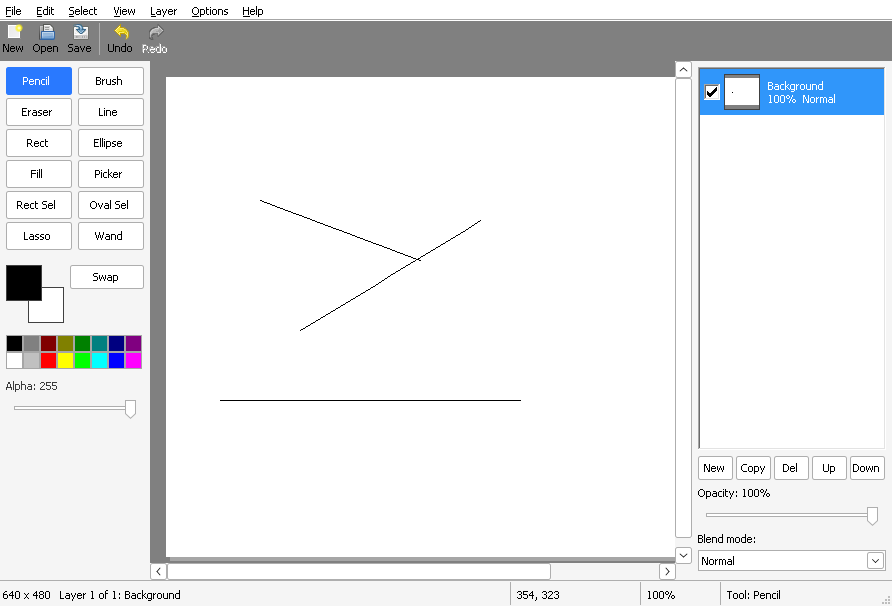

# Chapter 18 - Selections

[< Chapter 17: Layers panel and blend modes](../17-layers-panel-and-blend-modes/README.md)

Until now every tool in DrawLite has changed whatever you pointed it at. That's fine for doodling. It's not fine when you want to recolour a sky without touching the mountains. This chapter adds the thing every paint program has: a way to say "only here".

In this chapter you will

- store a selection as a mask with one byte per pixel,
- build four selection tools (rectangle, ellipse, lasso and magic wand),
- add to a selection with Ctrl and take away from it with Alt,
- make every drawing tool respect the selection,
- draw the marching ants with a timer,
- add Cut, Delete and Select All, Deselect and Invert.

## Before we begin

Four files are new: `selection.c` and `selection.h` hold the mask and the shapes that go into it, and `selops.c` and `selops.h` hold the things you do with a selected area (copy and clear). About a dozen existing files change. The big ones are `tools.c`, `canvas.c`, `fill.c` and `mainwindow.c`. `pixel.h` gets one new function, `Pixel_Lerp`.

Build and run it the same way as before. If you need a refresher on compilers, it's all in [chapter 1](../01-hello-win32/README.md).

```text
cd chapters/18-selections
cmake -S . -B build && cmake --build build
```

There are four new tool buttons (Rect Sel, Oval Sel, Lasso, Wand) and a new **Select** menu. Drag out a rectangle with Rect Sel, switch to the Brush, and scribble all over the picture.



Whoa! The paint stops dead at the marching ants. Let's see how that works.

## Breaking it up

### A selection is a picture

The simplest way to remember what is selected is another picture, the same size as the image, with one byte per pixel. 0 means "not selected". 255 means "fully selected". We call it a mask.

```text
18  // Struct: Selection
19  typedef struct Selection
20  {
21      uint8_t *mask;      // One byte per pixel, or NULL if nothing is selected
22      RECT bounds;        // A rectangle that surrounds every selected pixel
23  } Selection;
```

If `mask` is `NULL` then nothing is selected. That has a handy side effect. Code that asks "may I change this pixel?" can treat `NULL` as "yes, everywhere", and the program behaves exactly as it did in chapter 17 until the user makes a selection. `bounds` is a rectangle around every selected pixel. We keep it so that loops don't have to walk the whole image.

Why bytes and not a GDI region (an `HRGN`)? Because a byte can be 128, which means "half selected". We don't make many half selected pixels in this chapter. But once the mask is just numbers, everything else we need (clipping a brush, copying, inverting) is a simple loop, and it costs nothing to allow the in between values.

Most of the functions in `selection.c` are exactly the loops you'd expect, so I won't walk through all of them. `Sel_Invert` is the nicest example, because it's one line in a loop.

```text
49  BOOL
50  Sel_Invert(Selection *sel, int w, int h)
51  {
52      size_t i, count = (size_t)w * h;
53
54      if (!sel->mask)
55          return Sel_SelectAll(sel, w, h);
56      for (i = 0; i < count; i++)
57          sel->mask[i] = (uint8_t)(255 - sel->mask[i]);
58      Sel_RecalcBounds(sel, w, h);
59      return TRUE;
60  }
```

### Turning a shape into a mask

Each selection tool makes a small mask called a *shape*, covering just the area the user dragged. The three functions are `Sel_ShapeRect`, `Sel_ShapeEllipse` and `Sel_ShapePolygon`. They all return a buffer of bytes (or `NULL` when there's nothing there) and fill in a `RECT` saying where it sits on the image.

```text
68  // Function: Sel_ShapeRect
69  // Makes the coverage of a rectangle: 255 inside, 0 outside. The corners may be
70  // given in any order and may be outside the image. The result is clipped to
71  // the image, its size is returned in *bounds, and it has one byte per pixel
72  // of those bounds. Free it with free(). Returns NULL if empty or out of memory.
73  uint8_t *Sel_ShapeRect(int x0, int y0, int x1, int y1, int w, int h, RECT *bounds);
```

The rectangle is the easy one. It fills a block with 255. Note that it includes both end pixels, so a click without a drag still selects one pixel.

The ellipse asks one question per pixel: is the centre of this pixel inside the ellipse?

```text
182      // A pixel is inside if its centre is inside the ellipse: (dx/rx)^2 + (dy/ry)^2 <= 1
183      for (y = bounds->top; y < bounds->bottom; y++)
184      {
185          for (x = bounds->left; x < bounds->right; x++)
186          {
187              double dx = (x + 0.5 - cx) / rx;
188              double dy = (y + 0.5 - cy) / ry;
189              if (dx * dx + dy * dy <= 1.0)
190                  shape[(size_t)(y - bounds->top) * bw + (x - bounds->left)] = 255;
191          }
192      }
```

If you remember school geometry, `(dx/rx)^2 + (dy/ry)^2 <= 1` is the equation of an ellipse. We just divide by the radii first so that the same test works for an ellipse of any size. There is no smoothing on the edge. A pixel is in or it's out. That is the house style for selections.

The lasso is the tricky one. The user drags out a wobbly outline, and we have to say which pixels are inside it. The trick is a *scanline fill*. For each row of pixels, we find where the outline crosses that row, sort the crossings from left to right, and fill between the first and second, then the third and fourth, and so on.

```text
236      for (y = bounds->top; y < bounds->bottom; y++)
237      {
238          double yc = y + 0.5;
239          int n = 0, k;
240
241          for (i = 0; i < count; i++)
242          {
243              POINT a = points[i], b = points[(i + 1) % count];
244              double ya = a.y + 0.5, yb = b.y + 0.5;
245
246              // Does this edge cross the row? (Half open, so a corner is not counted twice.)
247              if ((ya <= yc && yb > yc) || (yb <= yc && ya > yc))
248                  xs[n++] = a.x + 0.5 + (yc - ya) * (b.x - a.x) / (yb - ya);
249          }
250          qsort(xs, (size_t)n, sizeof(double), Sel_CompareDouble);
251          for (k = 0; k + 1 < n; k += 2)
252          {
253              int xa = (int)ceil(xs[k] - 0.5), xb = (int)floor(xs[k + 1] - 0.5);
254              int x;
255              xa = max(xa, bounds->left);
256              xb = min(xb, bounds->right - 1);
257              for (x = xa; x <= xb; x++)
258                  shape[(size_t)(y - bounds->top) * bw + (x - bounds->left)] = 255;
259          }
260      }
```

The test at [line 247] is written so that when the outline passes exactly through a corner, the crossing is counted once, not twice. If that sounds fiddly, it is. Don't worry if you only follow the general idea. You can always treat `Sel_ShapePolygon` as a black box that turns a list of points into a mask.

### Add and subtract

While you drag, the shape changes every time the mouse moves. If you started with something already selected and Ctrl held down, the result should be "what was there, plus the shape". And as the shape shrinks again, pixels it has left behind must go back to how they were.

So we never edit the mask in place based on the last mouse move. Instead, when the mouse goes down we keep a copy of the selection as it was (`selBase`). On every mouse move we throw the work away and recompute from that copy and the current shape. That is what `Sel_Combine` does, one pixel at a time, using `Sel_Mix`.

```text
265  // Function: Sel_Mix
266  // What one pixel becomes. base is how selected it was before the drag, shape is
267  // how much the shape covers it.
268  static uint8_t
269  Sel_Mix(SelMode mode, uint8_t base, uint8_t shape)
270  {
271      switch (mode)
272      {
273      case SEL_ADD:
274          return base > shape ? base : shape;
275      case SEL_SUBTRACT:
276          return (uint8_t)(base * (255 - shape) / 255);
277      default:
278          return shape;
279      }
280  }
```

Replace uses the shape. Add keeps whichever is bigger. Subtract keeps what was there, scaled down by how much the shape covers it. The mode itself is decided once, when the mouse goes down.

```text
192      // Ctrl adds to the selection, Alt takes away from it
193      st->selMode = (keys & MK_CONTROL) ? SEL_ADD : ((GetKeyState(VK_MENU) & 0x8000) ? SEL_SUBTRACT : SEL_REPLACE);
```

Ctrl arrives in the `keys` that `Canvas` passes along, just like Shift did for the shapes in chapter 10. Alt doesn't arrive that way, so we ask the keyboard directly with `GetKeyState`.

```c
SHORT GetKeyState(int nVirtKey);    // Which key. VK_MENU is the Alt key
// Returns: the top bit (0x8000) is set if the key is held down right now
```

`Sel_Combine` also takes a `region`, which remembers every spot the shape has ever touched during this drag. We recalculate the whole region each time, so a shape that shrinks lets go of the pixels it leaves. (It is also the rectangle we repaint, so we don't redraw the whole image on every mouse move.)

### The selection tools

The four tools all follow the same three steps as the drawing tools: down, move, up. Open `tools.c` and find `Tool_SelectBegin`, `Tool_SelectMove` and `Tool_SelectEnd`.

`Tool_SelectBegin` saves the old mask (that's `selBase`) and makes a fresh one. The fresh mask starts empty, or as a copy of the old one if we are adding or subtracting.

```text
196      // Start from the old selection, unless we are replacing it
197      mask = (uint8_t *)calloc(size, 1);
198      if (!mask)
199      {
200          free(st->selBase);
201          st->selBase = NULL;
202          return;
203      }
204      if (st->selMode != SEL_REPLACE && st->selBase)
205          memcpy(mask, st->selBase, size);
206      st->selRegion = doc->sel.bounds;        // Everything that was selected needs a repaint
207      Sel_Clear(&doc->sel);
208      doc->sel.mask = mask;
209      st->selecting = TRUE;
```

For the rectangle and ellipse the shape is then built from the start point and the mouse position. Shift makes it square or round, using `Tool_Constrain`. I pulled that function out of `Tool_DrawShape` in this chapter, so the shape tools and the selection tools share one piece of code.

The lasso collects points into a growing array. `Tool_SelectMove` doubles the array with `realloc` when it is full, and then rebuilds the polygon from every point so far.

```text
282  // Function: Tool_SelectEnd
283  // The mouse button came up. The selection is final, so remember it for undo.
284  static void
285  Tool_SelectEnd(ToolState *st, Document *doc)
286  {
287      uint8_t *after;
288      BOOL changed;
289
290      // Count the real bounds now. If nothing is selected, this removes the mask.
291      Sel_RecalcBounds(&doc->sel, doc->width, doc->height);
292      after = Sel_CloneMask(&doc->sel, doc->width, doc->height);
293
294      changed = (st->selBase != NULL) != (after != NULL)
295          || (st->selBase && after && memcmp(st->selBase, after, (size_t)doc->width * doc->height) != 0);
296      if (changed)
297      {
298          // The history keeps both masks now
299          History_PushSelection(doc->history, st->selBase, after, doc->width, doc->height);
300      }
301      else
302      {
303          free(st->selBase);
304          free(after);
305      }
306      st->selBase = NULL;
307      st->selecting = FALSE;
308      st->overlay = st->selRegion;
309  }
```

When the button comes up we count the real bounds, and compare the new mask with the old one using `memcmp`. If they differ, both go into the history. If you click once and nothing changes, there is nothing to undo, so nothing is recorded.

The history needs a new kind of item for this, `HIST_SELECTION`. Undoing it just puts the old mask back with `Sel_SetMask`.

```text
281      case HIST_SELECTION:
282          Sel_SetMask(&doc->sel, doc->width, doc->height, forward ? item->selAfter : item->selBefore);
283          break;
```

So Ctrl+Z undoes a selection exactly like it undoes a brush stroke. We built the history in chapter 13 so that any change could use it, and here is the payoff.

### The magic wand

The wand picks a colour and selects everything joined to it that is close enough. That is exactly what the paint bucket does, except that the bucket paints and the wand selects. We didn't want two copies of the flood fill, so in `fill.c` I split the old function in two.

```c
BOOL Fill_FindRegion(const Surface *s,  // The picture to look at
                     int x, int y,      // The pixel to start from
                     int tolerance,     // How different a colour may be, 0 to 255
                     uint8_t *mask,     // w * h bytes, all zero. Reached pixels become 255
                     RECT *bounds);     // Receives a rectangle around the reached pixels
```

`Fill_FindRegion` does the scanline flood fill from chapter 11 and writes into a mask. `Fill_Flood` now calls it and then paints the mask, one run at a time. The wand calls it and keeps the mask as the selection.

```text
227      else if (ts->tool == TOOL_WAND)
228      {
229          // The wand selects everything the flood fill would have filled
230          uint8_t *found = (uint8_t *)calloc(size, 1);
231          RECT whole = { 0, 0, doc->width, doc->height };
232          RECT b;
233
234          if (found)
235          {
236              Fill_FindRegion(Doc_ActiveSurface(doc), x, y, ts->tolerance, found, &b);
237              Tool_SelectApply(st, doc, found, &whole);
238              free(found);
239          }
240      }
```

The wand looks at the active layer only (`Doc_ActiveSurface`), not at what you see on screen. The tolerance is the same one the fill uses, so the Options menu entry is now called "Fill and Wand Tolerance".

### Making the tools obey the selection

Here is the clever bit, and it is tiny. In chapter 8 we built `Edit`, which paints into a coverage mask and combines it with the original pixels. All we need is one more mask to say where painting is allowed. Every drawing tool used to call `Edit_Begin` itself. Now they all call one helper.

```text
46  // Function: Tool_BeginEdit
47  // Starts an edit on the active layer, limited to the selection.
48  static BOOL
49  Tool_BeginEdit(ToolState *st, Document *doc)
50  {
51      st->edit = Edit_Begin(Doc_ActiveSurface(doc));
52      if (!st->edit)
53          return FALSE;
54      // With a selection, tools only change selected pixels. (NULL means everywhere.)
55      Edit_SetClip(st->edit, doc->sel.mask);
56      return TRUE;
57  }
```

`Edit_SetClip` just stores the pointer to the selection mask. Then, at the very end of `Edit_Compose`, after the brush and fill have been worked out, we blend the result back towards the original pixel according to the selection.

```text
138              // Outside the selection the original pixel stays. On the edge, a mix.
139              if (e->clip && e->clip[i] != 255)
140                  p = Pixel_Lerp(e->base->pixels[i], p, e->clip[i]);
141              s->pixels[i] = p;
```

Where the selection is 255 the new pixel wins. Where it is 0 the original comes back. Where it's in between we get a mix. `Pixel_Lerp` is the new function in `pixel.h` that does the mixing. *Lerp* is short for "linear interpolation", which is a posh way to say "slide from a to b". With premultiplied pixels (chapter 7) a plain slide on every channel is the right thing to do.

Because `Edit_Compose` always starts again from the base pixels, it doesn't matter how many times it runs over a pixel. That is why the pencil, the brush, the shapes, the eraser and the bucket all respect the selection with no further changes.

(The edit keeps a pointer to the mask, it doesn't copy it. That's safe because you can't change the selection in the middle of a stroke.)

### Marching ants

The moving dashed outline has a name: marching ants. Two ingredients are needed. Something has to repaint on a timer, and something has to draw dashes that you can slide along.

This is the first time we've used a timer in DrawLite, so here are the two functions.

```c
UINT_PTR SetTimer(HWND hWnd,            // The window that gets WM_TIMER messages
                  UINT_PTR nIDEvent,    // A number of our choosing, to tell timers apart
                  UINT uElapse,         // How often, in milliseconds
                  TIMERPROC lpTimerFunc); // NULL means "just send me WM_TIMER"

BOOL KillTimer(HWND hWnd,               // The same window
               UINT_PTR uIDEvent);      // The same number
```

Windows then posts a `WM_TIMER` message to the window every so often. It's not exact. If the program is busy the ticks are late, and that's fine for dashes. We start the timer in `WM_CREATE` and stop it in `WM_DESTROY`.

```text
254      case WM_CREATE:
255          SetTimer(hwnd, ANTS_TIMER, ANTS_INTERVAL, NULL);
256          return 0;
257      case WM_DESTROY:
258          KillTimer(hwnd, ANTS_TIMER);
259          return 0;
260      case WM_TIMER:
261          if (wParam == ANTS_TIMER)
262          {
263              // Move the ants along and repaint just the part of the picture with the outline
264              if (cv->doc && Sel_IsActive(&cv->doc->sel))
265              {
266                  RECT r = cv->doc->sel.bounds;
267                  InflateRect(&r, 1, 1);
268                  cv->antsPhase = (cv->antsPhase + 2) & 7;
269                  Canvas_InvalidateRect(cv, &r);
270              }
271              return 0;
272          }
```

Every 120 milliseconds `antsPhase` goes up by 2 (and wraps at 8), and we invalidate only the selection's bounds. When nothing is selected the timer does nothing at all.

The outline itself is drawn in `Canvas_DrawSelection`. It walks the pixels that are on screen. Wherever a selected pixel sits next to an unselected one, there's an edge. Neighbouring edge pixels are joined into one straight run, and each run goes to `Ants_Segment`.

```text
745  #define IS_SEL(px, py) ((px) >= 0 && (py) >= 0 && (px) < w && (py) < h && sel->mask[(size_t)(py) * w + (px)] >= 128)
746  #define SX(px) (origin.x + (px) * cv->zoom / 100)
747  #define SY(py) (origin.y + (py) * cv->zoom / 100)
748
749      // Horizontal edges: between row y - 1 and row y
750      for (y = r.top; y <= r.bottom; y++)
751      {
752          runStart = -1;
753          for (x = r.left; x <= r.right; x++)
754          {
755              BOOL edge = x < r.right && IS_SEL(x, y - 1) != IS_SEL(x, y);
756              if (edge && runStart < 0)
757                  runStart = x;
758              else if (!edge && runStart >= 0)
759              {
760                  Ants_Segment(hdc, white, black, cv->antsPhase, SX(runStart), SY(y), SX(x), SY(y));
761                  runStart = -1;
762              }
```

The dashes themselves are drawn in `Ants_Segment`. It first draws the whole run in solid white, then draws short black dashes on top. The pattern repeats every 8 pixels, 4 black and 4 white. The line at [line 691] is the clever one.

```text
672  // Function: Ants_Segment
673  // Draws one straight, horizontal or vertical stretch of the outline: a solid
674  // white line with black dashes on top. The dashes are placed by their position
675  // on screen (plus the phase), so a long edge made of many little pieces still
676  // has even dashes, and changing the phase makes them march.
677  static void
678  Ants_Segment(HDC hdc, HPEN white, HPEN black, int phase, int x0, int y0, int x1, int y1)
679  {
680      BOOL horizontal = (y0 == y1);
681      int a = horizontal ? x0 : y0;
682      int b = horizontal ? x1 : y1;
683      int start;
684
685      SelectObject(hdc, white);
686      MoveToEx(hdc, x0, y0, NULL);
687      LineTo(hdc, x1, y1);
688
689      SelectObject(hdc, black);
690      // The dash pattern repeats every 8 pixels: 4 black, 4 white
691      start = a - ((((a + phase) % 8) + 8) % 8);
692      for (; start < b; start += 8)
693      {
694          int d0 = max(start, a), d1 = min(start + 4, b);
695          if (d0 >= d1)
696              continue;
697          if (horizontal)
698          {
699              MoveToEx(hdc, d0, y0, NULL);
700              LineTo(hdc, d1, y0);
701          }
702          else
703          {
704              MoveToEx(hdc, x0, d0, NULL);
705              LineTo(hdc, x0, d1);
706          }
707      }
708  }
```

The dashes are placed by where they are on screen, plus the phase. So a long edge made of lots of small runs still has even dashes, and changing `phase` slides every dash along by the same amount. That's the march.

It's not the fastest way to do this. It looks at pixels one by one every time it paints. For a selection on a normal sized picture it's plenty quick, and it keeps the code short.

### Copy, cut and delete

`selops.c` is a small file. `SelOps_CopyPixels` makes a new surface the size of the selection's bounds and copies the selected pixels into it. A pixel that is half selected is copied half see-through, because we scale it by the mask.

```text
29      for (y = 0; y < bh; y++)
30      {
31          for (x = 0; x < bw; x++)
32          {
33              size_t i = (size_t)(sel->bounds.top + y) * doc->width + (sel->bounds.left + x);
34              // How selected a pixel is says how much of it we keep
35              out->pixels[(size_t)y * bw + x] = Pixel_Scale(src->pixels[i], sel->mask[i]);
36          }
37      }
```

`SelOps_ClearPixels` does the opposite. It keeps `255 - mask` of each pixel, so a fully selected pixel becomes fully transparent. It first clones the whole layer so the history can remember how it looked before.

`MainWindow_Copy` ties them together. With a selection, Copy puts only the selected part of the active layer on the clipboard. Without one it copies the whole picture, as before. Cut is a copy followed by a clear, and Delete is just the clear.

One more thing. Paste still makes a new layer. It doesn't paste back into the selection, and there's no way to move a selection yet. Both would be good additions.

## An analogy

Painting a room? You put masking tape along the edge of the window frame first. The tape doesn't paint anything. It just decides where paint is allowed to go. Once it's up, you can roll the wall as sloppily as you like and the frame stays clean.

A selection is masking tape. The mask is the tape, `Edit_SetClip` is putting it up, and `Edit_Compose` is the roller that can't go past it. Ctrl and Alt are adding a bit more tape or peeling some off. If you wanted the wall and not the window, you'd press Ctrl+I (Invert) and get the tape the other way round.

## Adding functionality

Let's make Esc deselect. Open `res/drawlite.rc` and find the accelerator table.

```text
103      "C", IDM_EDIT_COPY, VIRTKEY, CONTROL
104      "X", IDM_EDIT_CUT, VIRTKEY, CONTROL
105      VK_DELETE, IDM_EDIT_DELETE, VIRTKEY
106      "A", IDM_SEL_ALL, VIRTKEY, CONTROL
107      "D", IDM_SEL_NONE, VIRTKEY, CONTROL
108      "I", IDM_SEL_INVERT, VIRTKEY, CONTROL
109      "V", IDM_EDIT_PASTE, VIRTKEY, CONTROL
```

Add this line after the one for Invert [line 108]:

```text
    VK_ESCAPE, IDM_SEL_NONE, VIRTKEY
```

Rebuild, make a selection and press Esc. It goes into the history, so Ctrl+Z brings it back. (In the next chapter we get a text box that wants Esc for itself, so we'll have to be careful.)

## Exercise

Add a "global" mode to the wand: when Shift is held, select every pixel in the layer that is close in colour to the one you clicked, even if it isn't joined to it. (Think of choosing every blue pixel in a photo.)

*Hint: `Fill_Close` in `fill.c` already compares two colours with a tolerance. Loop over every pixel instead of flood filling.*

## That's it

Congratulations! You can now say where, as well as how. Next we add the first tool that doesn't draw with the mouse at all: you type.

[Chapter 19: The text tool](../19-text-tool/README.md)
