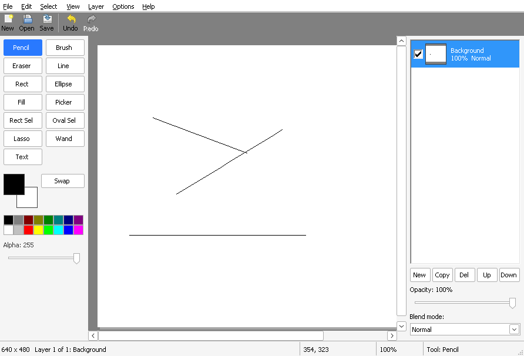

# Chapter 19 - The text tool

[< Chapter 18: Selections](../18-selections/README.md)

Every paint program lets you type on the picture. It sounds like the easiest tool of the lot, and it's actually one of the fiddliest. You need a caret, a way to move around, Backspace, copy and paste, maybe several lines. Writing all that yourself would take a chapter of its own, and a worse one than the one Windows already ships.

So we won't write it. We borrow a real text box for the typing, and do the drawing ourselves.

In this chapter you will

- float an `EDIT` control over the canvas,
- subclass it, so that Ctrl+Enter and Esc mean something,
- colour it with `WM_CTLCOLOREDIT`,
- turn the finished text into pixels with GDI, and paint them so that undo works,
- let the user pick a font with the standard font dialog.

## Before we begin

`texttool.c` and `texttool.h` are new. They hold the floating text box and the code that draws text into a mask. Around them, a few files change: `tools.c` gets `Tool_PaintText`, `edit.c` gets `Edit_AddCoverage`, `canvas.c` starts and finishes text boxes, `main.c` learns to leave the keyboard alone while you type, and `mainwindow.c` gets the font dialog.

Build and run it as usual. Chapter 1 explains the compilers, in case you skipped it: [chapter 1](../01-hello-win32/README.md).

```text
cd chapters/19-text-tool
cmake -S . -B build && cmake --build build
```

Choose the **Text** button, click on the picture and type. Enter starts a new line. When you're happy, press **Ctrl+Enter** or click somewhere else. **Esc** throws the text away. A right click starts the text in your second colour. The font is in **Options, Text Font...**



## Breaking it up

There are two halves to this chapter. While you type, the text lives in an `EDIT` control that floats over the canvas. When you finish, we destroy the control, draw the text ourselves into a mask, and paint the picture through that mask. After that moment the text is just pixels on a layer, the same as a brush stroke.

### The floating edit control

Every window in Windows is made from a *window class*. We registered our own in chapter 2. Windows also ships a few ready made ones, and `EDIT` is the one for typing. It already knows how to show a caret, select text with the mouse and the keyboard, cut and paste, and handle Backspace. We create one with `CreateWindowExW`, just as we did in chapter 2, using the canvas as its parent.

```text
127      tb->hwnd = CreateWindowExW(0, L"EDIT", L"",
128          WS_CHILD | WS_VISIBLE | WS_BORDER | ES_MULTILINE | ES_AUTOHSCROLL | ES_AUTOVSCROLL | ES_WANTRETURN,
129          winX - 1, winY - 1, 40, 40, canvas, (HMENU)(INT_PTR)1000, hInstance, NULL);
```

The styles do the work.

- `WS_CHILD` makes it live inside the canvas, so it moves and clips with it.
- `ES_MULTILINE` allows more than one line.
- `ES_WANTRETURN` asks for Enter to start a new line.
- `ES_AUTOHSCROLL` and `ES_AUTOVSCROLL` let it scroll when the text is bigger than the box.

`winX - 1` and `winY - 1` pull the box up and left by one pixel. The border takes up a pixel, so this puts the first letter exactly on the image pixel you clicked.

Once it exists we give it a font and take away the margin.

```c
SendMessageW(hwnd,                  // The edit control
             WM_SETFONT,            // Use this font from now on
             (WPARAM)font,          // An HFONT
             TRUE);                 // Redraw straight away

SendMessageW(hwnd,                  // The edit control
             EM_SETMARGINS,         // Change the space between the border and the text
             EC_LEFTMARGIN | EC_RIGHTMARGIN,  // Which margins
             0);                    // New size. Zero means the text touches the border
```

The text you see while typing is not drawn by us at all. It's drawn by the control, with the font we gave it. And that font is scaled by the zoom level [line 117], so at 400% zoom the text in the box is four times as big as the final text will be. That way what you see roughly lines up with the pixels it will end up on.

```text
115      // The font we show while editing is the final font, scaled by the zoom
116      shown = *logFont;
117      shown.lfHeight = -max(6, abs(logFont->lfHeight) * zoom / 100);
118      tb->font = CreateFontIndirectW(&shown);
```

(Roughly is the word. The box is drawn by Windows at the zoomed size. The final text is drawn at 100% and then magnified like the rest of the picture. At unusual zoom levels the letters can land a pixel or two from where the box showed them. Close enough, but I wanted to say so.)

### Colouring the edit control

An `EDIT` can't be see-through. It always paints its own background. If you type white text onto a white box you see nothing, so we pick a background that won't hide the text: dark behind light text, and white behind dark text.

```text
120      // An edit control cannot be see-through. So choose a background that
121      // will not hide the text: light text gets a dark background and the other way round.
122      tb->textColor = RGB(PIX_R(color), PIX_G(color), PIX_B(color));
123      lum = (int)(PIX_R(color) * 30 + PIX_G(color) * 59 + PIX_B(color) * 11) / 100;
124      tb->backColor = lum > 140 ? RGB(60, 60, 60) : RGB(255, 255, 255);
125      tb->background = CreateSolidBrush(tb->backColor);
```

The `lum` line is a quick measure of brightness. Green counts for the most, blue for the least, because that's how our eyes work. Anything brighter than 140 gets a dark grey box.

Now how does the control actually use these colours? Before an edit control paints itself, it sends its **parent** a message, `WM_CTLCOLOREDIT`, which says "what colours should I use?". The parent is our canvas, so the answer comes from `Canvas_WndProc`.

```text
286      case WM_CTLCOLOREDIT:
287          // The edit control asks us what colours to use. Hand it the ones for the text colour.
288          if (cv->text && (HWND)lParam == cv->text->hwnd)
289          {
290              SetTextColor((HDC)wParam, cv->text->textColor);
291              SetBkColor((HDC)wParam, cv->text->backColor);
292              return (LRESULT)cv->text->background;
293          }
294          break;
295      case WM_NCDESTROY:
296          // The very last message a window receives. Time to free our state.
```

For this message `wParam` is the device context the control is about to draw with, and `lParam` is the control's handle. We set the text colour and the background colour on that DC, then return a brush. The control paints its background with the brush. Because the canvas could have other controls one day, the check on `lParam` makes sure we only answer for our own.

### Subclassing

Now we need to know when the user presses Ctrl+Enter or Esc. But the keystrokes go to the edit control, and it's Windows' window procedure, not ours. We can't change its code.

We can put our own in front of it. That is *subclassing*. Windows lets you slip a function between the messages and the control. The function sees every message first. It can handle some, and pass the rest down the line.

```c
BOOL SetWindowSubclass(HWND hWnd,               // The window to subclass
                       SUBCLASSPROC pfnSubclass, // Our function
                       UINT_PTR uIdSubclass,    // A number to tell our subclass apart from others
                       DWORD_PTR dwRefData);    // Any pointer we like. It is handed back to us

LRESULT DefSubclassProc(HWND hWnd, UINT uMsg,   // Pass the message on to the next one in line
                        WPARAM wParam, LPARAM lParam);

BOOL RemoveWindowSubclass(HWND hWnd,            // The window
                          SUBCLASSPROC pfnSubclass,  // Which function
                          UINT_PTR uIdSubclass);     // And which id
```

`dwRefData` is the same trick as `GWLP_USERDATA` from chapter 6. We hand it our `TextBox` pointer, and it comes back to our function as the last parameter. `DefSubclassProc` is like the `DefWindowProcW` of chapter 2, but for subclasses. Whatever we don't want to deal with goes there.

Here is our function.

```text
54  // Function: Text_SubclassProc
55  // "Subclassing" means putting our own window procedure in front of the control's,
56  // so that we see its messages first. We use it to catch the keys that mean
57  // "finished" and to notice when the control loses the keyboard.
58  static LRESULT CALLBACK
59  Text_SubclassProc(HWND hwnd, UINT msg, WPARAM wParam, LPARAM lParam, UINT_PTR id, DWORD_PTR refData)
60  {
61      TextBox *tb = (TextBox *)refData;
62
63      UNREFERENCED_PARAMETER(id);
64      switch (msg)
65      {
66      case WM_KEYDOWN:
67          if (wParam == VK_ESCAPE)
68          {
69              // Posted, not sent: we must not destroy the window from inside its own message
70              PostMessageW(tb->canvas, WMU_TEXT_DONE, tb->serial, FALSE);
71              return 0;
72          }
73          if (wParam == VK_RETURN && (GetKeyState(VK_CONTROL) & 0x8000))
74          {
75              PostMessageW(tb->canvas, WMU_TEXT_DONE, tb->serial, TRUE);
76              return 0;
77          }
78          break;
79      case WM_CHAR:
80          // Ctrl+Enter makes a line feed character, which would beep. We handled it above.
81          if (wParam == '\n')
82              return 0;
83          break;
84      case WM_KILLFOCUS:
85          // Clicking somewhere else finishes the text
86          PostMessageW(tb->canvas, WMU_TEXT_DONE, tb->serial, TRUE);
87          break;
88      case WM_NCDESTROY:
89          RemoveWindowSubclass(hwnd, Text_SubclassProc, SUBCLASS_ID);
90          break;
91      }
92      return DefSubclassProc(hwnd, msg, wParam, lParam);
93  }
```

Take it a message at a time.

`WM_KEYDOWN` with `VK_ESCAPE` means cancel, and Ctrl and Enter together mean finish. In both cases we `return 0` and the control never sees the key. Notice that we don't act on it ourselves. We use `PostMessageW` to send a custom message, `WMU_TEXT_DONE`, to the canvas. Why? Because finishing means destroying the edit control. And destroying a window from inside one of its own messages is a good way to crash. Posting makes the message wait in the queue until the control has finished what it was doing.

`WM_CHAR` is there to tidy up after Ctrl+Enter. That key combination also produces a line feed character (`'\n'`), and the control would beep at it. We swallow it.

`WM_KILLFOCUS` arrives when the control loses the keyboard. That happens when you click a button on the toolbar or the palette, or switch to another program, so we treat it as "finished, keep the text".

`WM_NCDESTROY` is the last message the control gets. We take our subclass off and carry on down the line.

### One box at a time

Look at what gets posted: `tb->serial`. Every text box gets a number that goes up by one (`g_serial`). The canvas ignores a `WMU_TEXT_DONE` from a box it doesn't have any more.

Why bother? Think about clicking somewhere else on the picture with the text tool. The canvas finishes the old box and starts a new one. But destroying the old box takes the keyboard away from it, and that sends `WM_KILLFOCUS`, which posts "done". By the time that posted message arrives, the old box has gone and a new one exists. Without the serial number, the old "done" could shut down the new box before you typed a single letter.

```text
565  // Function: Canvas_FinishText
566  // Ends the text box. If keep is TRUE what was typed is painted onto the active
567  // layer as one undo step, otherwise it is thrown away.
568  static void
569  Canvas_FinishText(Canvas *cv, BOOL keep)
570  {
571      TextBox *tb = cv->text;
572      wchar_t *str;
573      uint8_t *mask;
574      int w, h;
575      BOOL changed = FALSE;
576
577      if (!tb)
578          return;
579      // Take the box out of the canvas first. Destroying it moves the keyboard focus,
580      // which would tell us to finish it again.
581      cv->text = NULL;
582      str = keep ? Text_GetString(tb) : NULL;
583      if (str)
584      {
585          mask = Text_Rasterize(&tb->logFont, str, &w, &h);
586          if (mask)
587          {
588              ToolSettings tmp = *cv->settings;
589              tmp.primary = tb->color;
590              changed = Tool_PaintText(&cv->tool, cv->doc, &tmp, FALSE, tb->imageX, tb->imageY, w, h, mask);
591              free(mask);
592          }
593          free(str);
594      }
595      Text_Destroy(tb);
596      SetFocus(cv->hwnd);
597      if (changed)
598      {
599          Canvas_RepaintDirty(cv);
600          SendMessageW(GetParent(cv->hwnd), WMU_DOC_CHANGED, 0, 0);
601      }
602  }
```

Look at [line 581]. We take the box out of `cv->text` *before* destroying it. Destroying it moves the keyboard focus, which would trigger another `WM_KILLFOCUS`, which would call us again. With the pointer already cleared, that second call finds nothing to do.

If `keep` is TRUE we ask the box for its string, rasterise it (next section), paint it, and tell the main window the document changed. Otherwise the text is simply dropped.

### Commit before anything else

What if you type some text and then pick Save, or Undo, or a different layer? The text is still just a box, not part of the picture yet. So `Canvas_CommitText` exists. It finishes the text box if there is one, and the first line of `MainWindow_OnCommand` calls it.

```text
313  static void
314  MainWindow_OnCommand(MainWindow *mw, int id)
315  {
316      // Any command finishes the text being typed, so it is in the picture before we act
317      Canvas_CommitText(mw->hCanvas);
```

Every menu item and toolbar button goes through that function, so every command starts with the text safely in the picture. The canvas also finishes the box itself when you scroll, zoom or switch documents, because the box is sized for one zoom level and one scroll position only.

### Whose keys are they?

There is one more problem. Our menu has accelerators: Ctrl+C is Copy, Ctrl+Z is Undo, Ctrl+A is Select All. While you're typing, you want Ctrl+C to copy text, not the picture. But accelerators are handled in `main.c`, in the message loop, before the message gets anywhere near the edit control.

```text
44      while (GetMessageW(&msg, NULL, 0, 0) > 0)
45      {
46          // While someone is typing in the text box, Ctrl+C, Ctrl+Z and friends belong to the
47          // edit control, not to our menu.
48          wchar_t cls[16] = L"";
49          GetClassNameW(GetFocus(), cls, ARRAYSIZE(cls));
50          if (lstrcmpiW(cls, L"Edit") == 0 ||
51              !TranslateAcceleratorW(MainWindow_GetHwnd(mainWindow), hAccel, &msg))
52          {
53              TranslateMessage(&msg);
54              DispatchMessageW(&msg);
55          }
56      }
```

So before translating accelerators we ask who has the keyboard with `GetFocus`, and `GetClassNameW` tells us what kind of window it is. If it's an `Edit`, we skip the accelerators and send the message on to the control as it is.

That is simple, and it means *no* accelerator works while a text box is open. Ctrl+S won't save until you finish the text. The menu still works, though, and clicking it finishes the text first.

### Why we draw the text ourselves

You could stop here. The edit control already shows pretty text. Why not take a screenshot of it?

Because we want the text to behave like paint. It should respect the selection from chapter 18. It should have the alpha of your colour. It should undo with one Ctrl+Z. And it must be made of ordinary pixels in our layer, not whatever the screen happened to show.

All of that already works for a brush stroke, because of `Edit`. A brush stroke is a coverage mask (how much of the colour each pixel gets) plus a colour. So all we need is a coverage mask of the text. `Text_Rasterize` makes one.

```text
185      dc = CreateCompatibleDC(NULL);
186      // GRAYSCALE anti-aliasing: ClearType colours the edges red and blue, which
187      // is no use to us. We want a plain "how much ink" number for each pixel.
188      lf.lfQuality = ANTIALIASED_QUALITY;
189      font = CreateFontIndirectW(&lf);
190      oldFont = (HFONT)SelectObject(dc, font);
191
192      // First measure, then draw
193      DrawTextW(dc, text, -1, &r, DT_CALCRECT | (int)flags);
194      GetTextMetricsW(dc, &tm);
195      // Italic letters can hang over the edge of the measured box, so add some room
196      width = r.right + tm.tmHeight / 4 + 2;
197      height = r.bottom + 2;
```

The idea is simple. Make a bitmap. Fill it with black. Draw the text in white. Then the brightness of each pixel is how much ink it has. White ink on black paper, read back as a number from 0 to 255.

```c
int DrawTextW(HDC hdc,          // Where to draw
              LPCWSTR lpchText, // The text. -1 for the length means "it ends with a zero"
              int cchText,      // How many characters, or -1
              LPRECT lprc,      // The rectangle to draw in (or to measure, see DT_CALCRECT)
              UINT format);     // How to draw it. A mix of DT_ flags
```

We call it twice. First with `DT_CALCRECT`, which draws nothing but works out how big the text will be. Then we make a bitmap of that size and call it again for real.

The bitmap is a `CreateDIBSection`, the same top down 32 bit kind as our `Surface` from chapter 7, so we can read its memory directly. We draw into it, and then copy one byte of each pixel into our mask.

```text
199      ZeroMemory(&bi, sizeof(bi));
200      bi.bmiHeader.biSize = sizeof(BITMAPINFOHEADER);
201      bi.bmiHeader.biWidth = width;
202      bi.bmiHeader.biHeight = -height;
203      bi.bmiHeader.biPlanes = 1;
204      bi.bmiHeader.biBitCount = 32;
205      bi.bmiHeader.biCompression = BI_RGB;
206      dib = CreateDIBSection(dc, &bi, DIB_RGB_COLORS, &bits, NULL, 0);
207      if (dib && bits)
208      {
209          oldBitmap = (HBITMAP)SelectObject(dc, dib);
210          memset(bits, 0, (size_t)width * height * 4);     // Black paper
211          SetBkMode(dc, TRANSPARENT);
212          SetTextColor(dc, RGB(255, 255, 255));            // White ink
213          DrawTextW(dc, text, -1, &r, flags);
214          GdiFlush();     // Make sure GDI has finished drawing before we read the memory
215
216          mask = (uint8_t *)malloc((size_t)width * height);
217          if (mask)
218          {
219              const uint32_t *px = (const uint32_t *)bits;
220              // White ink on black paper: the brightness of a pixel is how much ink is in it
221              for (i = 0; i < width * height; i++)
222                  mask[i] = (uint8_t)(px[i] & 0xFF);
223              *w = width;
224              *h = height;
```

Two details are worth a closer look.

`lfQuality = ANTIALIASED_QUALITY` [line 188] asks for plain grey smoothing at the edges of the letters. The other kind, ClearType, smooths by colouring the edges red and blue, which looks lovely on a screen and is useless for a coverage mask. We want one number per pixel. Grey is the right kind of blur.

`GdiFlush` [line 214] makes sure GDI has finished drawing before we read the memory. GDI is allowed to batch up its work, and without that line you can read the bitmap half drawn.

We read one byte of each pixel (`px[i] & 0xFF`, the blue channel). White ink has the same value in every channel, so any would do.

The text is drawn with a font whose `lfHeight` is in image pixels, and the zoom is not involved. That's why a bigger zoom shows bigger letters but the final picture has the same size letters.

### Painting through the mask

`Edit_AddCoverage` is the new function in `edit.c` that takes the mask and feeds it into the edit's own mask.

```text
221  void
222  Edit_AddCoverage(Edit *e, int x, int y, int w, int h, const uint8_t *coverage)
223  {
224      RECT area;
225      int px, py;
226
227      SetRect(&area, x, y, x + w, y + h);
228      Edit_Clip(e, &area);
229      if (IsRectEmpty(&area))
230          return;
231
232      for (py = area.top; py < area.bottom; py++)
233      {
234          for (px = area.left; px < area.right; px++)
235          {
236              size_t i = (size_t)py * e->target->width + px;
237              uint8_t m = coverage[(size_t)(py - y) * w + (px - x)];
238              if (m > e->mask[i])
239                  e->mask[i] = m;
240          }
241      }
242      Edit_Compose(e, &area);
243      Edit_Touch(e, &area);
244  }
```

It copies each value in, keeping the larger one if there's already something there. Then `Edit_Compose` (the one that got the selection in chapter 18) works out the final pixels. Since the edit has the selection as its clip, text typed into a selection stays inside it.

`Tool_PaintText` does the rest, in the same shape as every other tool: begin an edit, paint, push the change on the history.

```text
444  BOOL
445  Tool_PaintText(ToolState *st, Document *doc, ToolSettings *ts, BOOL useSecond,
446      int x, int y, int w, int h, const uint8_t *coverage)
447  {
448      if (!Tool_BeginEdit(st, doc))
449          return FALSE;
450      Edit_SetBrush(st->edit, useSecond ? ts->secondary : ts->primary, 1, FALSE);
451      Edit_AddCoverage(st->edit, x, y, w, h, coverage);
452
453      Tool_Collect(st);
454      if (IsRectEmpty(&st->edit->bounds))
455      {
456          Edit_End(st->edit);
457          st->edit = NULL;
458          return FALSE;
459      }
460      doc->modified = TRUE;
461      History_PushPixels(doc->history, doc->active, st->edit->base, Doc_ActiveSurface(doc), &st->edit->bounds);
462      Edit_End(st->edit);
463      st->edit = NULL;
464      return TRUE;
465  }
```

One change, one `History_PushPixels`, one undo step, however many letters. If the text came out empty (it was only spaces, say) there's nothing to record and the function returns `FALSE`.

### The font dialog

Windows has a standard font chooser, so we don't have to build one.

```c
BOOL ChooseFontW(LPCHOOSEFONTW lpcf);   // Fill in a CHOOSEFONTW and give us its address
// Returns: TRUE if the user pressed OK, FALSE if they cancelled
```

The interesting fields of `CHOOSEFONTW` are `lpLogFont` (a `LOGFONTW` it reads from and writes into), `hwndOwner` and `Flags`.

```text
319      if (id == IDM_OPT_FONT)
320      {
321          CHOOSEFONTW cf;
322          LOGFONTW lf = mw->settings.font;
323          UINT dpi = GetDpiForWindow(mw->hwnd);
324
325          // The dialog thinks in screen pixels at the current DPI, we think in image pixels.
326          lf.lfHeight = MulDiv(lf.lfHeight, (int)dpi, 96);
327          ZeroMemory(&cf, sizeof(cf));
328          cf.lStructSize = sizeof(cf);
329          cf.hwndOwner = mw->hwnd;
330          cf.lpLogFont = &lf;
331          cf.Flags = CF_SCREENFONTS | CF_INITTOLOGFONTSTRUCT | CF_NOVERTFONTS | CF_NOSCRIPTSEL;
332          if (ChooseFontW(&cf))
333          {
334              lf.lfHeight = MulDiv(lf.lfHeight, 96, (int)dpi);
335              lf.lfQuality = ANTIALIASED_QUALITY;
336              mw->settings.font = lf;
337          }
338          return;
```

`CF_INITTOLOGFONTSTRUCT` tells the dialog to start with the font we give it. `CF_SCREENFONTS` lists fonts the screen can show, and the other two flags hide the vertical fonts and the script list, which we don't need.

The `MulDiv` lines are the DPI part. Our `lfHeight` is in *image pixels*, as we said. A 24 pixel font should make letters 24 pixels tall in the picture, whether the monitor is 100% or 200%. But the font dialog talks in screen pixels, so on the way in we scale by `dpi / 96` and on the way out we scale back. `MulDiv(a, b, c)` is `a * b / c`, rounded, and it won't overflow the way writing `a * b / c` in plain C could.

I could only test this with MinGW and Wine, so I can't promise how the dialog behaves on every combination of monitors and scaling. If the sizes look odd on your machine, this is the first place to look.

## An analogy

Think of a rubber stamp. Before you stamp, you can arrange the letters in the holder, check the spelling and swap one for another. That's the edit control: a place where mistakes are cheap. When you press the stamp onto the paper, the letters leave ink behind and the holder is no good for editing any more. That's `Canvas_FinishText`.

`Text_Rasterize` is the machine that cuts the stamp from your letters. Once we have a stamp (the coverage mask), the ink goes where we say, in the colour we say, and one Ctrl+Z lifts the whole print off.

## Adding functionality

Try typing a long line. The box doesn't grow, does it? It stays small and scrolls instead.

`Text_SizeToFit` is there for exactly this. It measures the text with `DrawTextW` and `DT_CALCRECT` and resizes the control. But it's only called once, when the box is made. Let's call it after every character. In `Text_SubclassProc`, find the `WM_CHAR` case.

```text
79      case WM_CHAR:
80          // Ctrl+Enter makes a line feed character, which would beep. We handled it above.
81          if (wParam == '\n')
82              return 0;
83          break;
```

Replace it with this.

```c
    case WM_CHAR:
        if (wParam == '\n')
            return 0;
        {
            // Let the control take the character first, then measure again
            LRESULT result = DefSubclassProc(hwnd, msg, wParam, lParam);
            Text_SizeToFit(tb);
            return result;
        }
```

Rebuild, type and watch the box grow with the words. Backspace works too, because it also arrives as a `WM_CHAR`.

## Exercise

The Delete key and Ctrl+V don't make the box resize, because neither of them is a `WM_CHAR`. Fix that.

*Hint: Paste arrives as a `WM_PASTE` message, so handle it in the subclass the same way. For Delete, watch for `WM_KEYDOWN` with `VK_DELETE`, and measure after `DefSubclassProc` has done the deleting.*

## That's it

Congratulations! You can now put words on a picture. Next, the last chapter: effects that change thousands of pixels at once, and a progress box for when they take a while.

[Chapter 20: Effects](../20-effects/README.md)
