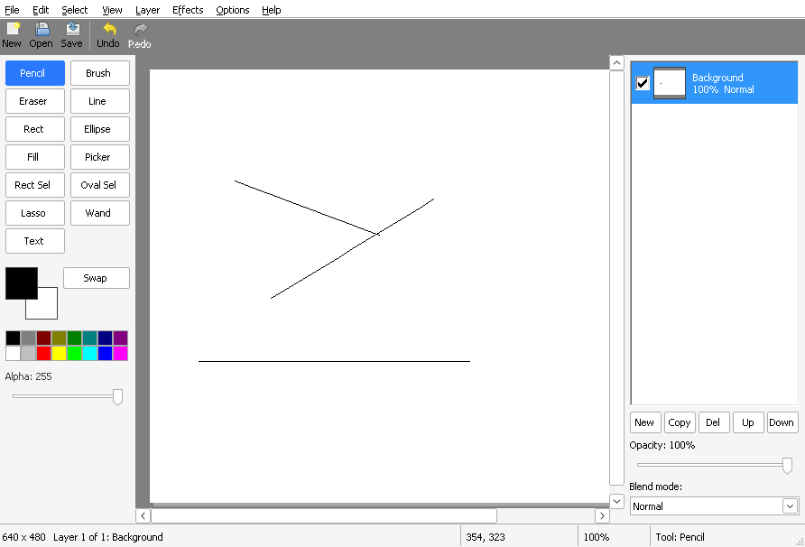

# Chapter 20 - Effects

[< Chapter 19: The text tool](../19-text-tool/README.md)

This is the last chapter, and it's a fun one. We add an **Effects** menu: invert, grayscale, sepia, brighter, darker, blur and pixelate. The effects themselves are short. The interesting part is what to do when one of them takes a long time, because up to now everything DrawLite has done has been over in a blink.

In this chapter you will

- run slow work on a second thread with `_beginthreadex`,
- share a struct between two threads, safely, with the `Interlocked` functions,
- show a progress box with a Cancel button, but only if the wait is longer than 250 milliseconds,
- write a box blur that costs the same for any radius,
- apply an effect inside a selection, and undo it in one step.

## Before we begin

`effects.c` and `effects.h` are new. `mainwindow.c` gets a function that turns menu items into effects, `resource.h` and `drawlite.rc` get the new menu and a small progress dialog, and `InitCommonControlsEx` is asked for the progress bar class as well (`ICC_PROGRESS_CLASS`).

Build and run it the way you always do. Compilers are in [chapter 1](../01-hello-win32/README.md) if you need them.

```text
cd chapters/20-effects
cmake -S . -B build && cmake --build build
```

Open a picture (or draw something), select part of it with the Rect Sel tool from chapter 18, and try **Effects, Blur, Medium**.



Only the selected part blurs. Ctrl+Z puts it back.

## Breaking it up

### Why a second thread?

Windows decides that a program has hung when it hasn't answered its messages for a few seconds. The window goes pale, the title bar says "(Not Responding)" and Windows offers to kill it. A big blur on a big picture can easily take that long.

So far every function has run on the one thread that also runs the message loop. While it works, nothing is repainted, no button responds and the progress bar can't move, because the progress bar is a window and windows need the message loop. The cure is to put the slow work on a second thread. The first thread goes on handling messages. The second one crunches pixels.

### The golden rule

A second thread brings one big danger. If two threads change the same memory at the same time, nobody can say what the result is. We avoid it with a rule that is easy to remember: **the worker never touches the real layer.**

Take a look at the start of `Effect_Run`.

```text
284  BOOL
285  Effect_Run(HINSTANCE hInstance, HWND hParent, Document *doc, EffectId id, int param, RECT *area)
286  {
287      Surface *layer = Doc_ActiveSurface(doc);
288      Surface *before = Surface_Clone(layer);
289      Surface *after = Surface_Clone(layer);
290      const Selection *sel = &doc->sel;
291      Job job;
292      uintptr_t thread;
293      BOOL ok = FALSE;
294      int x, y;
295
296      if (!before || !after)
297          goto done;
298
299      ZeroMemory(&job, sizeof(job));
300      job.id = id;
301      job.param = param;
302      job.src = before;
303      job.dst = after;
304      SetRect(&job.area, 0, 0, doc->width, doc->height);
305      if (Sel_IsActive(sel))
306          job.area = sel->bounds;
307      job.total = Job_StepCount(&job);
308
309      thread = _beginthreadex(NULL, 0, Job_Thread, &job, 0, NULL);
310      if (!thread)
311          goto done;
```

We make two copies of the layer. `before` is read only: the worker reads from it. `after` is where the worker writes. The real layer is untouched until the work has finished and we are back on the main thread. That means the user can't see half a blur, and cancelling is free. We throw the copies away.

### Starting a thread

```c
uintptr_t _beginthreadex(void *security,        // Security attributes. NULL for the default
                         unsigned stack_size,   // Stack size in bytes. 0 for the default
                         unsigned (__stdcall *start)(void *),  // The function the thread runs
                         void *arglist,         // One pointer, handed to that function
                         unsigned initflag,     // 0 means "start running now"
                         unsigned *thrdaddr);   // Receives the thread id. NULL if we don't care
// Returns: a handle to the thread, or 0 if it failed
```

You may have heard of `CreateThread`, which is the Windows function underneath. `_beginthreadex` is the one to use from C, because it also sets up the C library's own per thread data. (That's why we include `<process.h>`.)

The function our thread runs has to have exactly this shape: it takes one `void *` and returns an `unsigned`. We pass it the address of a `Job`, which is a struct we invent to hold everything the worker needs.

### The Job struct

```text
24  typedef struct Job
25  {
26      EffectId id;
27      int param;
28      const Surface *src;     // The layer as it was. Read only.
29      Surface *dst;           // The result. The worker writes here.
30      RECT area;              // The only part we need to compute
31      LONG total;             // How many steps there are (rows, mostly)
32      volatile LONG done;     // How many are finished
33      volatile LONG cancel;   // Set to 1 by the main thread to say "stop"
34      volatile LONG finished; // Set to 1 by the worker as its very last act
35  } Job;
```

The top half is what we give the worker: which effect, its parameter, the two surfaces, and the rectangle it should work on. The bottom half is how the two threads talk to each other.

- `done` counts finished steps (usually rows). The progress bar reads it.
- `cancel` is set to 1 by the main thread to say "stop, please".
- `finished` is set to 1 by the worker, as the very last thing it does.

These three are `volatile`, which tells the compiler not to keep them in a register and assume nobody else changes them. And whenever we *change* one, we use an `Interlocked` function.

```c
LONG InterlockedIncrement(volatile LONG *Addend);           // Adds one. Nobody can sneak in halfway
LONG InterlockedExchange(volatile LONG *Target, LONG Value);   // Sets a new value, returns the old
LONG InterlockedCompareExchange(volatile LONG *Destination,    // The variable
                                LONG Exchange,                 // The new value, if...
                                LONG Comparand);               // ...it currently equals this
```

Why do we need them? Even `done++` is really three steps: read, add, write. If the other thread jumps in between, one of the updates is lost. The `Interlocked` functions do it in one indivisible step.

The worker calls `Job_Step` after every row.

```text
37  // Function: Job_Step
38  // Called by the worker after each row. Returns FALSE if we should give up.
39  static BOOL
40  Job_Step(Job *job)
41  {
42      InterlockedIncrement(&job->done);
43      return InterlockedCompareExchange(&job->cancel, 0, 0) == 0;
44  }
```

It adds one to `done`, and then looks at `cancel`. There isn't an "Interlocked read", so we use a small trick: `InterlockedCompareExchange(&x, 0, 0)` says "if it is 0, set it to 0", which changes nothing and hands back the current value. If `cancel` has been set, `Job_Step` returns `FALSE` and the effect stops early.

Don't worry if threads feel slippery. They're famous for it. We keep the sharing very small (three numbers) on purpose.

### The worker

```text
203  // Function: Job_Thread
204  // The worker thread's main function.
205  static unsigned __stdcall
206  Job_Thread(void *arg)
207  {
208      Job *job = (Job *)arg;
209      BOOL ok;
210
211      switch (job->id)
212      {
213      case FX_BLUR:       ok = Fx_Blur(job); break;
214      case FX_PIXELATE:   ok = Fx_Pixelate(job); break;
215      default:            ok = Fx_PerPixel(job); break;
216      }
217      if (!ok)
218          InterlockedExchange(&job->cancel, 1);   // Tell the main thread not to use the result
219      // This must be the very last thing: the main thread may free the job the moment it sees it
220      InterlockedExchange(&job->finished, 1);
221      return 0;
222  }
```

It picks the effect, runs it, and if it failed or was cancelled it sets `cancel` too, so the main thread knows not to use the result. (A slightly confusing name, I admit. Think of it as "don't use this".) Then, as the very last act, it sets `finished`. The comment at [line 219] is the reason. The moment the main thread sees `finished`, it may free the `Job`. So the worker must not touch the job after that.

### Waiting, and the 250 millisecond rule

Back in `Effect_Run`, after we start the thread, we wait for it.

```c
DWORD WaitForSingleObject(HANDLE hHandle,       // What to wait for. A thread handle becomes
                                                // "signalled" when the thread ends
                          DWORD dwMilliseconds);// How long to wait, or INFINITE
// Returns: WAIT_OBJECT_0 if it finished, WAIT_TIMEOUT if the time ran out
```

Most effects on most pictures finish almost at once. Popping up a dialog for something that takes a tenth of a second is annoying. A box that flashes on screen and vanishes feels like a glitch. So we wait up to 250 milliseconds first. Only if the thread is still running do we show the progress box.

```text
313      // Most effects on most pictures are over in a blink. Only if we are still
314      // waiting after a quarter of a second do we put up the progress box.
315      if (WaitForSingleObject((HANDLE)thread, SHOW_PROGRESS_AFTER_MS) == WAIT_TIMEOUT)
316          DialogBoxParamW(hInstance, MAKEINTRESOURCEW(IDD_PROGRESS), hParent, Progress_Proc, (LPARAM)&job);
317      WaitForSingleObject((HANDLE)thread, INFINITE);    // Never free what a running thread uses
318      CloseHandle((HANDLE)thread);
```

(For that first quarter of a second the main thread is just sitting in `WaitForSingleObject` and answers no messages. That's fine, it's short. It's the long waits that matter.)

`DialogBoxParamW` is the same call that shows the About box from chapter 3. A modal dialog has its own little message loop, so the program stays alive while the box is up. And because the box is modal, the user can't do anything else to the document while the effect is running. Our last line waits with `INFINITE`, which makes sure the thread has really stopped before we free what it uses, and then closes the handle.

### The progress box

`Progress_Proc` is a dialog procedure, like the About box one from chapter 3. It sets the box up, keeps it up to date, and handles Cancel.

```text
245  static INT_PTR CALLBACK
246  Progress_Proc(HWND hDlg, UINT msg, WPARAM wParam, LPARAM lParam)
247  {
248      Job *job;
249
250      switch (msg)
251      {
252      case WM_INITDIALOG:
253          job = (Job *)lParam;
254          SetWindowLongPtrW(hDlg, DWLP_USER, lParam);
255          SendDlgItemMessageW(hDlg, IDC_PROGRESS_BAR, PBM_SETRANGE32, 0, job->total);
256          // The worker cannot tell us "I have finished" with a message, because the box does
257          // not exist yet when a fast job ends. So we simply look every so often.
258          SetTimer(hDlg, 1, 50, NULL);
259          return TRUE;
260      case WM_TIMER:
261          job = (Job *)GetWindowLongPtrW(hDlg, DWLP_USER);
262          SendDlgItemMessageW(hDlg, IDC_PROGRESS_BAR, PBM_SETPOS, (WPARAM)job->done, 0);
263          if (job->finished)
264          {
265              KillTimer(hDlg, 1);
266              EndDialog(hDlg, IDOK);
267          }
268          return TRUE;
269      case WM_COMMAND:
270          if (LOWORD(wParam) == IDCANCEL)
271          {
272              // Do not close the box yet. Ask the worker to stop, and the timer closes it
273              // when the worker has really stopped.
274              job = (Job *)GetWindowLongPtrW(hDlg, DWLP_USER);
275              InterlockedExchange(&job->cancel, 1);
276              EnableWindow(GetDlgItem(hDlg, IDCANCEL), FALSE);
277              return TRUE;
278          }
279          break;
280      }
281      return FALSE;
282  }
```

In `WM_INITDIALOG` we get the `Job` pointer through `lParam` (it's the last parameter of `DialogBoxParamW`), keep it with `DWLP_USER` (the dialog's version of `GWLP_USERDATA`) and set the range of the progress bar. Then we start a timer that fires every 50 milliseconds.

Every time it fires, `WM_TIMER` moves the bar to match `done`, and checks `finished`. When the worker is done, the dialog closes itself. We use a timer rather than a message from the worker because the dialog might not exist yet when a fast job ends. Looking every 50 milliseconds always works.

The progress bar needs its window class registered, which `ICC_PROGRESS_CLASS` in `MainWindow_Create` does for us. The dialog itself is in the resource file.

```text
183  IDD_PROGRESS DIALOGEX 0, 0, 180, 54
184  STYLE DS_MODALFRAME | DS_SHELLFONT | DS_CENTER | WS_POPUP | WS_CAPTION
185  CAPTION "Working"
186  FONT 9, "Segoe UI"
187  BEGIN
188      LTEXT           "Applying effect...", IDC_STATIC, 10, 8, 160, 8
189      CONTROL         "", IDC_PROGRESS_BAR, "msctls_progress32", 0, 10, 20, 160, 10
190      PUSHBUTTON      "Cancel", IDCANCEL, 65, 36, 50, 14
191  END
192
```

`CONTROL ... "msctls_progress32"` is how you put a progress bar in a dialog template.

`IDCANCEL` is the Cancel button, and also what Esc does in any dialog. Look at what we *don't* do. We don't close the dialog. We set `cancel`, grey out the button so you can't press it twice, and wait. The worker sees the flag at its next `Job_Step`, stops, sets `finished`, and the timer then closes the box. If we closed the dialog straight away we would carry on freeing things while the worker was still using them.

### Effects, one pixel at a time

The simple effects look at one pixel and decide what it becomes. They all go through `Fx_Pixel`.

```text
48  static uint32_t
49  Fx_Pixel(EffectId id, int param, uint32_t p)
50  {
51      // Colour maths is easier on "straight" colours, so undo the premultiplying and redo it after
52      uint32_t c = Pixel_Unpremultiply(p);
53      int r = (int)PIX_R(c), g = (int)PIX_G(c), b = (int)PIX_B(c);
54      int gray;
55
56      switch (id)
57      {
58      case FX_INVERT:
59          r = 255 - r; g = 255 - g; b = 255 - b;
60          break;
61      case FX_GRAYSCALE:
62          // The eye likes green best and blue least
63          gray = (r * 77 + g * 151 + b * 28) >> 8;
64          r = g = b = gray;
65          break;
66      case FX_SEPIA:
67      {
68          int nr = (r * 101 + g * 197 + b * 48) >> 8;
69          int ng = (r * 89 + g * 175 + b * 43) >> 8;
70          int nb = (r * 70 + g * 137 + b * 33) >> 8;
71          r = nr; g = ng; b = nb;
72          break;
73      }
74      case FX_BRIGHTEN:
75          r += param; g += param; b += param;
76          break;
77      default:
78          break;
79      }
80      r = r < 0 ? 0 : (r > 255 ? 255 : r);
81      g = g < 0 ? 0 : (g > 255 ? 255 : g);
82      b = b < 0 ? 0 : (b > 255 ? 255 : b);
83      return Pixel_Premultiply(PIX_MAKE(PIX_A(c), (uint32_t)r, (uint32_t)g, (uint32_t)b));
84  }
```

Our pixels are premultiplied (chapter 7), and colour maths is easier on plain colours. So `Fx_Pixel` first unpremultiplies, does its sums, clamps each channel into 0 to 255, and premultiplies again. The alpha is left alone.

Invert is `255 - value`. Grayscale mixes the three channels using weights of roughly 0.30, 0.59 and 0.11, written as 77, 151 and 28 out of 256 so that `>> 8` does the dividing. Our eyes like green most and blue least, so the three weights are not equal. Sepia is the same idea with a different mix for each output channel. Brighten just adds a number, and Brighter and Darker use +40 and -40.

`Fx_PerPixel` loops over the rectangle, row by row, and calls `Job_Step` at the end of each row.

```text
86  static BOOL
87  Fx_PerPixel(Job *job)
88  {
89      int x, y, w = job->src->width;
90
91      for (y = job->area.top; y < job->area.bottom; y++)
92      {
93          for (x = job->area.left; x < job->area.right; x++)
94              job->dst->pixels[(size_t)y * w + x] = Fx_Pixel(job->id, job->param, job->src->pixels[(size_t)y * w + x]);
95          if (!Job_Step(job))
96              return FALSE;
97      }
98      return TRUE;
99  }
```

### The box blur

Blurring is averaging. Every pixel becomes the average of the pixels around it, in a square of side `2r + 1`. Done the obvious way, that is `(2r + 1)` squared additions per pixel. For a radius of 16, that's over a thousand per pixel. Too slow.

There are two tricks. First, the square can be done in two passes: blur along each row, then blur the result down each column. That already cuts the work to `2 * (2r + 1)` additions. Second, each pass can keep a *running total*. As the window slides one pixel along, a new pixel comes in on the right and one leaves on the left. So we add the one that came in, subtract the one that left, and divide. That costs the same whatever the radius.

```text
108  static void
109  Fx_BlurLine(const uint32_t *in, uint32_t *out, int count, int stride, int from, int to, int r)
110  {
111      // in and out are the first pixel of a row (stride 1) or a column (stride = width)
112      int64_t a = 0, rr = 0, g = 0, b = 0;
113      int k, x;
114      int window = 2 * r + 1;
115
116      #define CLAMPED(i)  in[(size_t)((i) < 0 ? 0 : ((i) >= count ? count - 1 : (i))) * stride]
117      for (k = from - r; k <= from + r; k++)
118      {
119          uint32_t p = CLAMPED(k);
120          a += PIX_A(p); rr += PIX_R(p); g += PIX_G(p); b += PIX_B(p);
121      }
122      for (x = from; x < to; x++)
123      {
124          out[(size_t)x * stride] = PIX_MAKE((uint32_t)((a + window / 2) / window), (uint32_t)((rr + window / 2) / window),
125              (uint32_t)((g + window / 2) / window), (uint32_t)((b + window / 2) / window));
126          {
127              uint32_t leaving = CLAMPED(x - r);
128              uint32_t entering = CLAMPED(x + r + 1);
129              a += (int64_t)PIX_A(entering) - PIX_A(leaving);
130              rr += (int64_t)PIX_R(entering) - PIX_R(leaving);
131              g += (int64_t)PIX_G(entering) - PIX_G(leaving);
132              b += (int64_t)PIX_B(entering) - PIX_B(leaving);
133          }
134      }
135      #undef CLAMPED
136  }
```

`stride` is how far to step to reach the next pixel in the line: 1 for a row, the image width for a column. That lets one function do both passes. The `CLAMPED` macro handles the edges. Beyond the picture, we pretend the edge pixel carries on forever.

All four channels (alpha too) are averaged separately. This is correct with premultiplied pixels, so there's no unpremultiply here.

`Fx_Blur` runs the two passes.

```text
138  static BOOL
139  Fx_Blur(Job *job)
140  {
141      int w = job->src->width, h = job->src->height;
142      int r = job->param;
143      int y, x;
144      int top = max(0, job->area.top - r), bottom = min(h, job->area.bottom + r);
145      uint32_t *tmp = (uint32_t *)calloc((size_t)w * h, sizeof(uint32_t));
146      BOOL ok = TRUE;
147
148      if (!tmp)
149          return FALSE;
150      // Pass one: along the rows. We need rows a little above and below the area
151      // too, because the second pass will pull from them.
152      for (y = top; y < bottom && ok; y++)
153      {
154          Fx_BlurLine(job->src->pixels + (size_t)y * w, tmp + (size_t)y * w, w, 1, job->area.left, job->area.right, r);
155          ok = Job_Step(job);
156      }
157      // Pass two: down the columns
158      for (x = job->area.left; x < job->area.right && ok; x++)
159      {
160          Fx_BlurLine(tmp + x, job->dst->pixels + x, h, w, job->area.top, job->area.bottom, r);
161          ok = Job_Step(job);
162      }
163      free(tmp);
164      return ok;
165  }
```

Pass one blurs rows into a temporary picture, `tmp`. It has to do some rows above and below the target area as well [line 144], because pass two will pull from them. Pass two blurs `tmp` down into `dst`. Both passes call `Job_Step`, so a cancel stops either.

A *box* blur gives every pixel in the window the same weight. That's quick, and it's fine, but it isn't as smooth as the Gaussian blur you may have seen in other programs. If you want it smoother, run it twice.

### Pixelate

`Fx_Pixelate` splits the area into square blocks (8 pixels, from the menu) and fills each block with its average colour. It works from the `before` copy and only writes inside the area, even when a block sticks out of it. It's the simplest of the lot, so I'll leave it for you to read.

### Putting it back, through the selection

When the thread has finished and `cancel` is clear, we're back in safe territory. The worker has gone, so the main thread can write to the real layer.

```text
323      // Success. Move the result into the layer. Where there is a selection, a pixel
324      // that is only partly selected is only partly changed.
325      for (y = job.area.top; y < job.area.bottom; y++)
326      {
327          for (x = job.area.left; x < job.area.right; x++)
328          {
329              size_t i = (size_t)y * doc->width + x;
330              layer->pixels[i] = sel->mask ? Pixel_Lerp(before->pixels[i], after->pixels[i], sel->mask[i]) : after->pixels[i];
331          }
332      }
333      History_PushPixels(doc->history, doc->active, before, layer, &job.area);
334      Doc_UpdateView(doc, &job.area);
335      doc->modified = TRUE;
336      *area = job.area;
337      ok = TRUE;
338
```

This is where chapter 18 pays off again. `job.area` is the selection's bounding box (or the whole image if there's no selection). Inside it, `Pixel_Lerp` mixes the old pixel and the new one by how selected the pixel is. A pixel with no selection keeps its old value. A pixel fully selected gets the new one. The edge of a lasso or an ellipse, if it was half selected, gets a half and half result.

Then one call to `History_PushPixels` records the `before` and `after` of the whole rectangle. That's the only line that talks to the history, so the whole effect is one undo step, however many thousands of pixels it changed.

`Doc_UpdateView` refreshes what the canvas shows. The caller (`MainWindow_ApplyEffect`) invalidates the same area so it gets repainted.

### The menu

Finally, the menu command that sets it all off.

```text
315  // Function: MainWindow_ApplyEffect
316  // Runs one of the Effects menu items on the active layer.
317  static void
318  MainWindow_ApplyEffect(MainWindow *mw, int id)
319  {
320      EffectId fx;
321      int param = 0;
322      RECT area;
323
324      if (!mw->doc || Canvas_IsBusy(mw->hCanvas))
325          return;
326      switch (id)
327      {
328      case IDM_FX_INVERT:         fx = FX_INVERT; break;
329      case IDM_FX_GRAYSCALE:      fx = FX_GRAYSCALE; break;
330      case IDM_FX_SEPIA:          fx = FX_SEPIA; break;
331      case IDM_FX_BRIGHTER:       fx = FX_BRIGHTEN; param = 40; break;
332      case IDM_FX_DARKER:         fx = FX_BRIGHTEN; param = -40; break;
333      case IDM_FX_BLUR_SMALL:     fx = FX_BLUR; param = 2; break;
334      case IDM_FX_BLUR_MEDIUM:    fx = FX_BLUR; param = 6; break;
335      case IDM_FX_BLUR_LARGE:     fx = FX_BLUR; param = 16; break;
336      case IDM_FX_PIXELATE:       fx = FX_PIXELATE; param = 8; break;
337      default:                    return;
338      }
339
340      // Effects can take a while. Show the hourglass for the short ones.
341      SetCursor(LoadCursorW(NULL, IDC_WAIT));
342      if (Effect_Run(mw->hInstance, mw->hwnd, mw->doc, fx, param, &area))
343      {
344          Canvas_InvalidateImageRect(mw->hCanvas, &area);
345          MainWindow_DocChanged(mw);
346      }
347      SetCursor(LoadCursorW(NULL, IDC_ARROW));
348  }
```

Each menu item maps to an effect and a number. Blur small, medium and large use a radius of 2, 6 and 16. Pixelate uses blocks of 8. The effects need no dialog to ask for those numbers. They're fixed in the menu, which keeps the code small. Adding a settings box would be a good project, and it's one you now know all the pieces for.

## An analogy

Think of dropping a photograph off at a photo lab. You hand it over the counter, and the person at the front desk (the main thread) carries on serving customers. In the back room, someone else (the worker) works on a *copy* of your photo. Your original stays safe in its envelope the whole time.

If the job is quick, you get your photo back before you've finished reading the notice board. If it's slow, after a short while the desk gives you a ticket saying "this will take a bit" (the progress box). You can change your mind, and the back room bins the copy. Only when the work is complete does the lab swap your original for the finished one, and not before. And if you asked them to do just the sky, they paste only the sky into the original.

## Adding functionality

Let's add a huge blur, big enough that you'll see the progress box on a large picture. Three small changes.

First, `src/resource.h`. Add a new id after `IDM_FX_PIXELATE`, and move `IDM_FX_LAST` up to match, because `MainWindow_OnCommand` uses it to decide what's an effect.

```text
114  #define IDM_FX_BLUR_LARGE   707
115  #define IDM_FX_PIXELATE     708
116  #define IDM_FX_LAST         708
```

```text
#define IDM_FX_BLUR_HUGE    709
#define IDM_FX_LAST         709
```

Second, `res/drawlite.rc`. Add a line to the Blur submenu, after the Large item [line 75].

```text
71          POPUP "B&lur"
72          BEGIN
73              MENUITEM "&Small (2 pixels)",   IDM_FX_BLUR_SMALL
74              MENUITEM "&Medium (6 pixels)",  IDM_FX_BLUR_MEDIUM
75              MENUITEM "&Large (16 pixels)",  IDM_FX_BLUR_LARGE
76          END
```

```text
            MENUITEM "&Huge (40 pixels)",   IDM_FX_BLUR_HUGE
```

Third, `MainWindow_ApplyEffect`. Add a case next to the other blurs.

```c
    case IDM_FX_BLUR_HUGE:      fx = FX_BLUR; param = 40; break;
```

Build it, open a big picture and try it. Press Cancel while the bar is moving. Nothing changes and nothing is added to the undo history.

## Exercise

Add a new effect called Threshold: every pixel becomes black or white, depending on whether its gray value is above 128.

*Hint: Add a name to `EffectId` before `FX_COUNT`, a case in `Fx_Pixel` that reuses the grayscale sum, and a menu item like the one you just added.*

## That's it, and where next

Whew. That was a lot, and you've come a long way. In the first chapter you called `MessageBoxW`. Now you have a drawing program with layers, blend modes, selections, text, undo, loading and saving, and effects that run on their own thread. All in plain C and the Windows API, with no framework in sight. Congratulations!

If you want to keep going, here are some places to take DrawLite.

- **Crop and move selection.** There is no way yet to crop the picture to a selection, or to pick up the selected pixels and drag them. Both fit the design: a selection already knows its bounds, and `SelOps_CopyPixels` already lifts pixels out.
- **Curves and levels.** The effects here take one fixed number. A dialog with a slider (or a curve you drag) is the next step, and a live preview on the worker thread would use everything in this chapter.
- **More file formats.** Chapter 15 gave us PNG and JPEG through Windows' own imaging components. DrawLite can already open GIF and TIFF files, but it only saves `.dlt`, `.png`, `.jpg` and `.bmp`. Saving another format means finding its identifier and adding it to the save code.
- **An installer.** Right now DrawLite is an exe you send to a friend. Packaging it so that it appears in the Start menu and can be uninstalled is a project of its own, with tools like WiX, Inno Setup or NSIS.

Or just break it, fix it and make it yours. That's how I learned.

Thank you for reading all twenty chapters. I hope this was the tutorial I wish I'd had, and that you had fun. If you build something with it, I'd love to see it.

Happy coding!

Pravin
